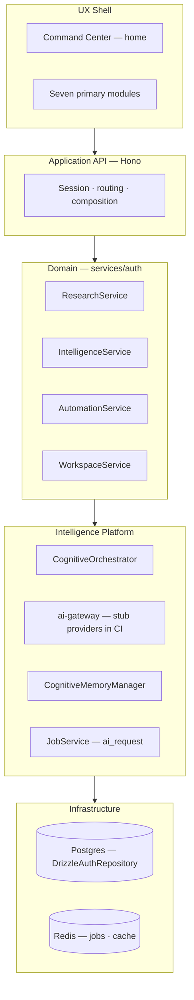
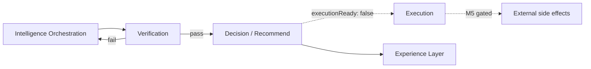
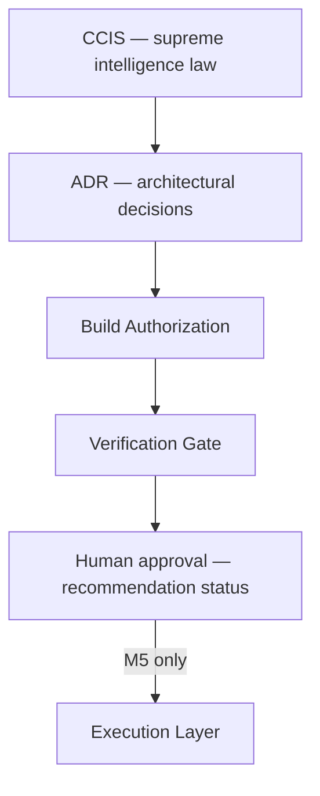
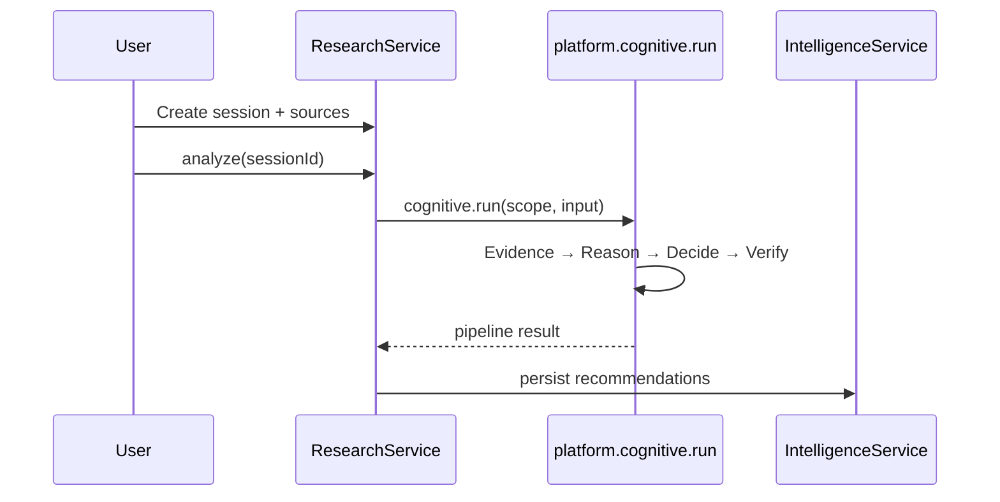
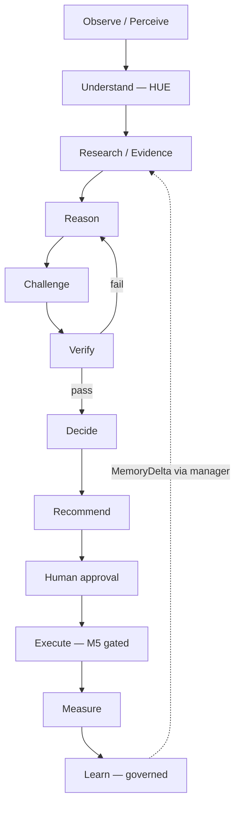

# Intelligence Philosophy Manual

**Institutional Memory Corpus — Document 02**

**Status:** Canonical intelligence reasoning guide  
**Baseline:** Build-2 M4 complete · `platform.cognitive.run` · stub ai-gateway · `executionReady: false`  
**Authority:** Subordinate to [CCIS](../architecture/ccis.md); operationalizes [Project Brain 03](../project-brain/03-intelligence-model.md) and [cognitive-pipeline.md](../architecture/cognitive-pipeline.md)  
**Companion:** [01 Conquest Constitution](./01-conquest-constitution.md) · [Project Brain 08](../project-brain/08-cognitive-architecture.md) · [how-conquest-thinks.md](../architecture/how-conquest-thinks.md)

---

## Introduction

This manual explains **how Conquest is intended to think** — not as metaphor, but as engineered behavior. A developer who reads only API routes and React components will conclude Conquest is a multi-tenant SaaS app with an LLM integration. That conclusion is **wrong** and dangerous: it produces chat UIs, fake seeds, verification skips, and autonomous execution — every anti-pattern Recovery Phase 3 was built to correct.

Conquest thinks through **structured artifacts**, **governed pipelines**, and **human authorization** — with the LLM as one instrument behind `@conquest/ai-gateway`, not as the mind of the system.

---

## Part 1 — Intelligence OS vs AI Wrapper

### 1.1 The category distinction

An **AI wrapper** is a thin application where:

1. User input → single LLM API call → display text
2. No evidence model or lineage
3. No verification gate before user sees output
4. No tenant-scoped memory governance
5. No execution boundaries — action may follow generation immediately
6. Provider SDK embedded in frontend or scattered across handlers

Conquest **explicitly forbids** this architecture. The decisive tests:

| Question | AI wrapper | Conquest (M4) |
|----------|------------|---------------|
| Where is the verification gate? | Nowhere | `DecisionEngine` + ADR-0006; VRF in orchestrator |
| Where is evidence lineage? | Nowhere | `EvidenceEngine`; `evidenceRefs` on recommendations |
| What happens on manual automation run? | Executes action | **Audit record only** — `auth_executions` deferred message |
| Where do memory writes go? | Anywhere / chat history | `CognitiveMemoryManager` only |
| How does UI get intelligence? | Direct SDK or embedded key | `fetch('/api/...')` → domain → `platform.cognitive.run` |

### 1.2 Operating system metaphor — literal, not marketing

Conquest as **Strategic Intelligence Operating System (CIOS)** means:



| OS concept | Conquest implementation |
|------------|-------------------------|
| Kernel | `platform.cognitive.run` / `CognitiveOrchestrator` |
| System calls | `POST .../analyze`, intelligence feed APIs, automation CRUD |
| Processes | Workspace-scoped research sessions, recommendation workflows |
| Memory subsystem | `CognitiveMemoryManager` — not raw DB |
| Security model | Org → workspace isolation; `session.orgId === workspace.orgId` |
| Shell | Command Center synthesizes decision zones — not chat thread |

### 1.3 Why engineers mistake Conquest for a wrapper

| Observation | Wrong conclusion | Correct reading |
|-------------|------------------|-----------------|
| `services/ai-gateway` exists | "It's an LLM app" | Gateway is **abstraction** — swap providers without rewriting domain |
| `ResearchService.analyze` triggers cognitive | "Just prompt engineering" | Analyze runs orchestrator → evidence → reasoning → decision → verification |
| Stub AI providers in dev/CI | "No real intelligence" | Stubs enforce boundary; deterministic pipeline still runs; 278 tests prove structure |
| React frontend | "CRUD + chat UI" | UXMD shell; presentation has **no** cognitive imports |
| `IntelligenceService` empty state | "Mock data service" | Cognitive-backed via `IntelligenceCognitiveProvider`; empty is **honest** post-M1 seed removal |

### 1.4 The orchestra principle

> **The LLM is one instrument in an orchestra — not the orchestra.**

| Instrument | Role |
|------------|------|
| EvidenceEngine | Classifies inputs before inference |
| ReasoningEngine | Transforms evidence into candidate conclusions |
| DecisionEngine | Produces recommendations; `executionReady: false` until M5 |
| Verification gate | Blocks unverified release |
| ai-gateway | Provider calls when orchestrator requires augmentation |
| Human user | Approves, defers, rejects — authoritative per PDD D7 |

Removing any instrument does not turn the remainder into "the mind." Replacing all instruments with one LLM call destroys verifiability.

### 1.5 What Conquest optimizes

From CCIS §I.3:

- **Accuracy** — conclusions align with verified reality
- **Reliability** — similar inputs → consistent quality (deterministic engines + stub gateway in CI)
- **Consistency** — standards across domains and time
- **Verifiability** — every conclusion traces to evidence
- **Outcome success** — decisions measurably improve results

### 1.6 What Conquest refuses to optimize

- Conversational charm for its own sake
- Token throughput
- "Looks intelligent" without verification
- Autonomous action without human authorization
- Single-model dependency without gateway abstraction

---

## Part 2 — The Ten-Phase Cognitive Loop

### 2.1 Runtime expression vs CCIS

The **ten-phase pipeline** (`docs/architecture/cognitive-pipeline.md`) is the canonical **runtime expression**, subordinate to CCIS twelve-stage loop and [ADR-0007](../architecture/adr/0007-ccis-cognitive-lifecycle-order.md).

```
Perception → Human Understanding → Context Reconstruction → Goal Reasoning
  → Strategy Planning → Intelligence Orchestration → Verification → Execution
  → Reflection → Memory Evolution
```

CCIS expresses a twelve-stage loop including Research, Challenge, Decide, Recommend, Measure, Learn, Improve. Where ordering conflicts, **CCIS and AMD IV §69 prevail**.

Stages may be **compressed** for low-risk tasks via documented routing rules. They may **never** be skipped silently.

### 2.2 Phase catalog with artifact ownership

| Phase | Question | Primary owner | Output artifact | M4 build reality |
|-------|----------|---------------|-----------------|------------------|
| 1. Perception | What exists? | Platform / ingress | `ObservationContext` | API normalizes request + workspace state |
| 2. Human Understanding | Who am I helping? | HUE (Human Understanding Engine) | `HumanContext`, `CommunicationStrategy` | Structured — not permanent user labels |
| 3. Context Reconstruction | What is the full situation? | Context services | `ReconstructedContext` | `cognitiveScope()` attaches tenant + workspace |
| 4. Goal Reasoning | What is success? | Planning layer | `SuccessCriteria` | Research analyze goal from session |
| 5. Strategy Planning | What should happen next? | Planning layer | `ExecutionPlan` | Orchestrator routing plan |
| 6. Intelligence Orchestration | Who should do the work? | `CognitiveOrchestrator` | `OrchestrationResult` | Evidence → Reason → Decide engines |
| 7. Verification | Is it correct? | Verification gate (VRF) | `VerificationReport` | Blocks release on failure — ADR-0006 |
| 8. Execution | Can it be done? | Execution Layer (L5E) | `ExecutionResult` | **Disabled** — `executionReady: false` |
| 9. Reflection | What did we learn? | Reflection (governed) | `ReflectionRecord` | Internal — not raw critique to users |
| 10. Memory Evolution | What should we retain? | `CognitiveMemoryManager` | `MemoryDelta` | Sole write path — ADR-0008 |

### 2.3 M4 API path (what actually runs on analyze)

```
ResearchService.analyze(sessionId)
  → platform.cognitive.run(scope, input)
    → CognitiveOrchestrator
      → EvidenceEngine
      → ReasoningEngine
      → DecisionEngine (executionReady: false)
      → Verification gate
  → IntelligenceService persists recommendations
```

**Not on API path:** legacy `services/orchestrator` `PipelineRunner`.

### 2.4 Verification failure routing

Verification failure **reroutes upstream** — typically to Planning or Orchestration — with specific failure reasons. It never:

- Silently skips to user release
- Delivers unverified output as fact
- Auto-executes because "close enough"



### 2.5 Async path

When `async: true`, cognitive work enqueues `ai_request` via `JobService`:

- Redis store with DLQ, retry, timeout (M4)
- In-memory fallback
- Worker health in ops status

Async does not bypass verification — it defers completion, not standards.

---

## Part 3 — Evidence-First Reasoning Philosophy

### 3.1 Core commitment

**No conclusion without classified evidence** ([ADR-0031](../architecture/adr/0031-evidence-first-reasoning.md)).

Evidence hierarchy (CCIS §III):

```
verified fact
  → supported inference
    → hypothesis
      → prediction
```

Reasoning **consumes** evidence artifacts — not raw user text alone. The LLM context window is **not** evidence.

### 3.2 Evidence engine placement

`EvidenceEngine` runs **before** `ReasoningEngine` in orchestrator order. This is structural — not configurable per feature because "this one doesn't need it."

### 3.3 Research as evidence intake

Research module is **structured inquiry**, not chat:

| Artifact | Storage | Role |
|----------|---------|------|
| Research session | `auth_research_sessions` | Scoped inquiry container |
| Sources | Session payload / documents | Evidence intake |
| Analyze request | API → cognitive pipeline | Triggers full loop |

Flow: User creates session → adds sources → `POST .../analyze` → recommendations appear in intelligence feed with `evidenceRefs`.

### 3.4 Recommendation lineage

Every recommendation should answer:

- **What** is recommended?
- **Why** — which evidence refs support it?
- **How confident** — calibrated score, not model verbosity?
- **What if I approve** — status workflow; execution still blocked in M4?

### 3.5 Anti-patterns in evidence thinking

| Mistake | Why wrong |
|---------|-----------|
| "The model read the PDF" | No structured EVD artifact — no lineage |
| Drop evidence to save latency | Violates verifiability metric |
| Prompt-only answers | No portfolio for verification |
| Seed fake recommendations | M1 explicitly removed — honest empty |

---

## Part 4 — Deterministic and LLM Complementarity

### 4.1 Why deterministic today

| Reason | Detail |
|--------|--------|
| Testability | 278 Vitest tests assert pipeline without API keys |
| Governance | B-28 learning boundary tests require predictable paths |
| Safety | No surprise provider behavior in CI |
| Stubs | `createStubProviders()` returns `[stub:providerId] response` |

**Deterministic ≠ fake product.** Structure is real; provider is instrument.

### 4.2 Division of labor

| Task type | Primary engine | LLM role (when authorized) |
|-----------|----------------|------------------------------|
| Evidence classification | EvidenceEngine (deterministic) | May augment classification via gateway |
| Inference chains | ReasoningEngine | May augment specific steps — not replace trace |
| Recommendation formation | DecisionEngine | Does not call providers directly |
| Verification | VRF gate | Independent of model fluency |
| Release decision | Verification + human status | Model confidence does not bypass VRF |

### 4.3 Gateway call chain (when LLM is used)

```
Domain service
  → platform.cognitive.run()
    → orchestrator decides if gateway needed
      → ai-gateway.complete() / stream()
        → prompt-management resolves template
          → prompt-security screens input
            → ai-audit logs classified record (redacted by default)
```

**Never:** `openai.chat.completions` in `apps/api` or `apps/web`.

### 4.4 Stub providers as architectural enforcement

`services/ai-gateway/src/stub-providers.ts` registers stub implementations for OpenAI, Anthropic, Gemini, Azure OpenAI, Grok, and DeepSeek. CI proves gateway contract without secrets. Production will swap adapters — domain unchanged.

### 4.5 Forbidden evolution path

| Forbidden | Why |
|-----------|-----|
| Replace engines with end-to-end LLM | Opaque; untestable; verification collapse |
| Remove verification because "model is smarter" | ADR-0006 non-negotiable |
| More parameters, less structure | Loses artifact chain |

---

## Part 5 — Memory Lifecycle Philosophy

### 5.1 Memory is compression, not storage

Conquest stores:

- Patterns, goals, preferences, workflows
- Failures and verified knowledge
- User corrections

Conquest does **not** treat raw conversation archives as authoritative memory.

### 5.2 Sole write authority

All writes through `CognitiveMemoryManager` ([ADR-0008](../architecture/adr/0008-memory-governance.md)). Engines produce **candidates**; memory manager governs promotion.

### 5.3 Lifecycle states

```
Proposed → Active → Expired → Archived → Deleted
```

AMD III governs transitions. User corrections **override** inferred memory (CCIS M3).

### 5.4 Memory vs chat history

| Chat history | Cognitive memory |
|--------------|------------------|
| Ephemeral UX convenience | Governed persistence |
| Not evidence | May inform context pointers |
| Not tenant security boundary | Scoped org/workspace |
| Grows unbounded | Compression and lifecycle |

Workspace context for cognitive runs: `cognitiveScope()` attaches tenant + workspace — **not** raw chat as sole context.

### 5.5 Persistence layer interaction

Domain tables (`auth_*`) persist sessions, recommendations, workflows via `DrizzleAuthRepository`. Cognitive memory evolution is **separate concern** — governed writes through memory manager, not ad-hoc engine SQL.

---

## Part 6 — Verification and Governance Philosophy

### 6.1 Verification as differentiator

Conquest's core differentiator is **trustworthy intelligence**. Releasing unverified conclusions destroys user trust and violates CCIS engineering laws ([ADR-0006](../architecture/adr/0006-verification-before-release.md)).

Verification tests:

- Evidentiary sufficiency
- Logical validity
- Policy compliance
- Confidence calibration

Verification is **distinct from Challenge** (which tests plausibility adversarially).

### 6.2 Governance layers



### 6.3 B-25–B-28 governance rows (M5 gate)

| Row | Concern | M4 state |
|-----|---------|----------|
| B-25 | Stage order contract tests | Open — M5 |
| B-26 | VRF bypass tests | Open — M5 |
| B-27 | Provider boundary static analysis | Open — M5 |
| B-28 | Learning → execution isolation | Open — M5 |

M4 ships with `executionReady: false` **because** these rows are not closed — not because verification is unimplemented.

### 6.4 Intelligence evolution decision tree

```
Proposed intelligence improvement
  ├─ Does it improve evidence, reasoning, verification, or memory governance?
  │    ├─ Yes → ADR if architectural → implement in platform/cognitive
  │    └─ No → Reject or reframe
  ├─ Does it bypass gateway or registry?
  │    └─ Yes → REJECT
  ├─ Does it reduce explainability?
  │    └─ Yes → REJECT
  └─ Does it require execution?
       └─ Yes → BAR + M5 path only
```

---

## Part 7 — Human-in-the-Loop Decision Philosophy

### 7.1 Human authority

Users **approve** recommendations. Conquest does **not** act alone on major decisions. Human decision is **authoritative** per PDD D7.

| Action | API | Effect |
|--------|-----|--------|
| Approve | `POST .../recommendations/:id/status` | Status → approved |
| Defer | same | Status → deferred |
| Reject | same | Status → rejected |

High model confidence does **not** auto-approve. High confidence is input to human judgment — not replacement.

### 7.2 Execution separation

Even approved recommendations do **not** execute in M4:

- `DecisionEngine` sets `executionReady: false`
- Execution Layer (L5E) is separate from intelligence engines ([ADR-0015](../architecture/adr/0015-execution-layer-separation.md))
- M5 requires BAR — approval → execute workflow is future capability

### 7.3 Automation manual run today

`AutomationService.manualRun`:

- Writes `auth_executions` audit record
- Returns deferred message — no external side effects
- Prepares authorization trail for M5 execution engine

Users expecting "Run workflow" to fire webhooks in M4 are experiencing **intentional governance friction** — not a bug.

### 7.4 Stakes and BH-9

Human authority on high-stakes decisions is behavioral law (BH-9). Engineering must not encode "helpful" autonomous shortcuts.

---

## Part 8 — Learning Boundary Philosophy

### 8.1 Learning proposes; governance approves

[ADR-0009](../architecture/adr/0009-learning-boundary.md): self-improvement loop may autonomously optimize routing, planning, prompts, workflows, caching, memory weighting, tool orchestration — within governance.

It **must not** autonomously rewrite or deploy production code without explicit human approval and testing.

### 8.2 Reflection is internal

Reflection produces optimization records for Learning and Memory Evolution. It never exposes raw self-critique to users.

### 8.3 Learning never triggers execution

| Path | Allowed? |
|------|----------|
| Reflection → prompt registry proposal → human review | Yes (governed) |
| Reflection → auto webhook execute | **No** |
| Learning → deploy code to main | **No** |
| Learning → flip `executionReady` | **No** |

Related: [ADR-0032](../architecture/adr/0032-reflection-governance.md), [ADR-0033](../architecture/adr/0033-learning-proposal-governance.md).

### 8.4 First Law interaction

> Conquest is never finished. Every interaction improves the OS.

Improvement is **governed evolution** — not autonomous mutation. Every correction becomes permanent knowledge (ADRs, Project Brain) unless disproven.

---

## Part 9 — How Intelligence Improves (The Right Levers)

### 9.1 Permitted improvement levers

Future intelligence quality MUST flow through:

| Lever | Meaning | Example |
|-------|---------|---------|
| **Better context** | Richer workspace state, research sources, operational signals | More source types in research session |
| **Better memory** | Governed promotion, user correction precedence | Memory manager lifecycle rules |
| **Better evidence** | Classification, lineage, source quality | EvidenceEngine hierarchy refinement |
| **Better reasoning** | Engine logic, challenge stage, multi-step inference | ReasoningEngine rule expansion |
| **Better confidence** | Calibration tied to evidence — not verbosity | DecisionEngine scoring model |
| **Better governance** | BAR, ADRs, verification tests | Close B-25–B-28 for M5 |

### 9.2 Forbidden improvement paths

| Path | Why forbidden |
|------|---------------|
| Bigger model replaces engines | Opaque; untestable |
| More parameters, less structure | Artifact chain collapse |
| Auto-execution on better model | Permission-driven execution unchanged |
| Self-modifying prompts in prod without review | Learning boundary violation |
| Fake data for demo impressiveness | M1 seed removal permanent |

### 9.3 Improvement without opacity

Intelligence should get **more explainable** as it improves — not less. If a change cannot answer what/why/confidence/approve-consequences, it is display — not intelligence.

---

## Part 10 — Per-Subsystem Thinking Models

### 10.1 Research — structured inquiry

**Question owned:** What evidence do we have about this topic?

| Thinks like | Not like |
|-------------|----------|
| Analyst building a case file | Chat thread with AI |
| Session with sources and analyze trigger | Single prompt box |
| Evidence intake for pipeline | Summary generator |

**Service:** `ResearchService` in `services/auth`  
**Does not own:** Reasoning conclusions, verification, execution



### 10.2 Intelligence — verified feed

**Question owned:** What recommendations and alerts should the user see?

| Thinks like | Not like |
|-------------|----------|
| Editorial desk with status workflow | Notification firehose |
| Cognitive-backed feed with honest empty | Seeded demo dashboard |
| CRUD on recommendations with evidence drill-down | Static JSON mock |

**Service:** `IntelligenceService` + `IntelligenceCognitiveProvider`  
**Does not own:** Pipeline internals, engine logic

Post-M1: recommendations **only** from cognitive pipeline — never `ensureSeed`.

### 10.3 Command Center — decision cockpit

**Question owned:** What does the user need to decide **today**?

| Thinks like | Not like |
|-------------|----------|
| Daily cockpit synthesizing zones | Chart wallpaper |
| Decision zones with deep links | Infinite scroll feed |
| Honest empty when no pipeline output | Fake "3 new insights" |

**Service:** `WorkspaceService` + dashboard builder  
**Does not own:** Cognitive engines

```
┌─────────────────────────────────────────────────────────┐
│ PRIMARY NAV (7) — workspace context in chrome          │
├─────────────────────────────────────────────────────────┤
│ DECISION ZONES                                         │
│  • Recommendations → actionable, evidence-backed        │
│  • Alerts → acknowledgment or drill-down               │
│  • Status → operational truth                          │
├─────────────────────────────────────────────────────────┤
│ DEEP LINKS → Intelligence, Research, Automation         │
└─────────────────────────────────────────────────────────┘
```

### 10.4 Automation — governed workflows

**Question owned:** What recurring processes exist — and when may they act?

| Thinks like | Not like |
|-------------|----------|
| Workflow registry with approval gates | Zapier trigger→action |
| Audit trail for future execution | Immediate side effects |
| Consumer of intelligence | Replacement for reasoning |

**Service:** `AutomationService`  
**M4:** CRUD + `manualRun` audit only  
**M5 (gated):** Approve → execute via execution engine

### 10.5 Operations — honest system pulse

**Question owned:** Is the platform healthy?

| Thinks like | Not like |
|-------------|----------|
| Live telemetry — queue, cache, providers | Vanity uptime badge |
| `/api/ops/degradation` dependency truth | Green dashboard hiding failures |
| Correlation-aware incident data | Log dumps without trace IDs |

**M4 delivered:** Redis job health, cache probes, degradation endpoint.

### 10.6 Platform cognitive — orchestration brain

**Question owned:** How do engines cooperate for this scoped run?

| Thinks like | Not like |
|-------------|----------|
| Conductor coordinating sections | Solo performer |
| Routes work; does not conclude | Mega-function that does everything |
| Testable without HTTP | Hidden in API handler |

**Package:** `@conquest/cognitive` via `services/platform` composition  
**Entry:** `platform.cognitive.run()`

### 10.7 RACI summary

| Activity | Domain (auth) | Platform | Presentation |
|----------|---------------|----------|--------------|
| Trigger analyze | A | R | I |
| Run pipeline | I | A/R | — |
| Show feed | A | C | R |
| Approve recommendation | A | I | R |
| Execute workflow | A (future) | R (future) | I |

A = Accountable, R = Responsible, C = Consulted, I = Informed

---

## Part 11 — Common Cognitive Mistakes

### 11.1 Mistake catalog

| # | Mistake | Symptom | Correction |
|---|---------|---------|------------|
| 1 | **Chat-primary UX** | Thread as home | Command Center home; structured research |
| 2 | **Wrapper routing** | User prompt → gateway → display | Full pipeline with artifacts |
| 3 | **Evidence skip** | Prompt-only recommendations | EvidenceEngine first |
| 4 | **Verification skip** | Ship on model confidence | VRF gate; ADR-0006 |
| 5 | **Memory anywhere** | Engine writes Postgres | CognitiveMemoryManager only |
| 6 | **Execution collapse** | Approve → webhook fires | `executionReady: false`; M5 BAR |
| 7 | **Fake intelligence** | Seed data for demos | M1 removal; honest empty |
| 8 | **Orchestrator concludes** | Routing logic makes decisions | DecisionEngine owns recommendations |
| 9 | **UI reasoning** | Cognitive imports in React | fetch API only |
| 10 | **Provider in domain** | OpenAI in ResearchService | ai-gateway only |
| 11 | **Context = chat log** | Messages array drives all | Workspace + evidence + memory |
| 12 | **Learning executes** | Reflection triggers action | ADR-0009 boundary |
| 13 | **Stub denial** | "CI stubs mean no architecture" | 278 tests prove structure |
| 14 | **Confidence = logprob** | Raw model score shown | Calibrated confidence field |
| 15 | **Parallel ownership** | Two services update workflows | Single accountable owner |

### 11.2 Diagnostic questions

Before shipping any intelligence feature, answer:

1. Where is the verification gate?
2. Where is evidence lineage?
3. Who owns the artifact at each phase?
4. What happens if verification fails?
5. Can this execute without human approval? (Must be **no** in M4)
6. Does UI import any cognitive package? (Must be **no**)
7. Would removing this feature leave a bounded breakage surface?

### 11.3 Continuity test

See [architectural-continuity-test.md](../project-brain/architectural-continuity-test.md). Agents must cite `executionReady: false`, BAR, and B-25–B-28 when discussing execution.

---

## Part 12 — Synthesis: One Continuous Loop

Conquest does not "call GPT and return text." It runs a **continuous intelligence loop**:

```
Observe → Understand → Research → Reason → Challenge → Verify
  → Decide → Recommend → [Execute when authorized] → Measure → Learn
```

Each stage produces **structured artifacts** — evidence refs, reasoning traces, decision records, verification reports — that constrain the next stage.



**M4 reality:** The Execute node exists in architecture but is **hard-disabled** at `DecisionEngine`. Human approval updates recommendation status — it does not trigger side effects. Automation `manualRun` writes audit only.

**M5 future:** BAR closes B-25–B-28; execution engine enforces authorization records; `executionReady` governance lifts under VRF + human decision path.

---

## Part 13 — Reading Order for Deep Study

| Order | Document | Why |
|-------|----------|-----|
| 1 | [CCIS](../architecture/ccis.md) §I–III | Supreme intelligence identity |
| 2 | [01 Philosophy](../project-brain/01-philosophy-and-identity.md) | Category error prevention |
| 3 | [03 Intelligence Model](../project-brain/03-intelligence-model.md) | Subsystem catalog |
| 4 | [08 Cognitive Architecture](../project-brain/08-cognitive-architecture.md) | M4 as-built path |
| 5 | [cognitive-pipeline.md](../architecture/cognitive-pipeline.md) | Ten phases in detail |
| 6 | [18 Decision Framework](../project-brain/18-architectural-decision-framework.md) | Judgment for new features |
| 7 | [01 Constitution](./01-conquest-constitution.md) | Engineering law |

---

## Changelog

| Date | Change |
|------|--------|
| 2026-06-29 | Initial institutional memory expansion — Recovery Phase 4 |

---

*Previous: [01 Conquest Constitution](./01-conquest-constitution.md) · Index: [README](./README.md) · Supreme authority: [CCIS](../architecture/ccis.md)*
