# Engineering Decision Encyclopedia

**Institutional memory — all 38 Architecture Decision Records (ADR-0001 through ADR-0038)**

This encyclopedia translates frozen ADRs into **operational judgment**: why each decision exists, how it manifests in the as-built repository, what was rejected, and how to avoid violating intent during Build-2 and beyond.

**Authority chain:** ADRs supplement — never override — CCIS → AMD → PDD → UXMD → SDD. See [ADR-0001](#adr-0001-document-authority-hierarchy).

**As-built reference:** [`docs/project-brain/06-repository-architecture.md`](../project-brain/06-repository-architecture.md), [`07-runtime-architecture.md`](../project-brain/07-runtime-architecture.md).

**Source ADRs:** [`docs/architecture/adr/`](../architecture/adr/)

---

## How to read an entry

Each ADR entry follows the same schema:

| Field | Meaning |
|-------|---------|
| **Why** | Problem the ADR solved |
| **Today** | How the decision appears in code and docs now |
| **Rejected** | Alternatives considered and why they lost |
| **Tradeoffs** | Costs consciously accepted |
| **Integration** | Services, packages, and routes touched |
| **Evolution** | When to revisit or amend |
| **Mistakes** | Common violations agents and engineers make |
| **Example** | Concrete file paths |
| **Depends on** | Upstream ADR dependencies |
| **Operations** | Runtime, deploy, and incident notes |
| **Future** | Expected expansion path |

---

## Theme index

| Theme | ADRs |
|-------|------|
| [Document authority](#theme-document-authority) | 0001, 0013 |
| [Product / UX](#theme-product--ux) | 0002, 0003, 0004, 0005, 0012, 0036 |
| [Cognitive](#theme-cognitive) | 0006, 0007, 0008, 0026, 0027, 0029, 0031, 0032, 0037, 0038 |
| [AI](#theme-ai) | 0011, 0028, 0030, 0034, 0035 |
| [Security](#theme-security) | 0016, 0017, 0018, 0019, 0020, 0024 |
| [Infrastructure](#theme-infrastructure) | 0010, 0015, 0021, 0022, 0023 |
| [Governance](#theme-governance) | 0009, 0014, 0025, 0033 |

---

## Theme: Document authority

### ADR-0001: Document Authority Hierarchy

| | |
|---|---|
| **Status** | Accepted — Architecture Freeze v1.0 Frozen |
| **Date** | 2026-06-21 |

**Why:** Conquest spans CCIS, AMD, PDD, UXMD, and SDD volumes. Without a single conflict-resolution chain, teams and AI agents implement contradictory behavior — especially where product, experience, and engineering overlap.

**Today:** `AGENTS.md`, `docs/architecture/ARCHITECTURE-FREEZE.md`, and every governance doc cite `CCIS > AMD > PDD > UXMD > SDD`. Cursor rules (`conquest-cios.mdc`, `conquest-design.mdc`) enforce this at edit time. Implementation disputes escalate upward in the chain.

**Rejected:** SDD-first hierarchy (engineering redefines product); UXMD over PDD (experience cannot override behavioral law); flat peer documents (no resolver); CCIS-only with no elaboration (insufficient for modules and screens).

**Tradeoffs:** PDD-I v2.0 rejection required Authority Bridge (ADR-0013) rather than hierarchy change. README metadata must stay synchronized with SDD-I.

**Integration:** All `docs/` corpora; `AGENTS.md`; `.cursor/rules/`; CI governance checks.

**Evolution:** Revisit when a new document family is introduced (e.g., API Design Authority) or CCIS v2.0 ships — requires superseding ADR and full program review.

**Mistakes:** Treating `apps/` spike code as authority over UXMD; citing archived `docs/archive/design-pre-uxmd/` for UI decisions; letting SDD-II ordering errata override CCIS without ADR amendment.

**Example:** `docs/architecture/adr/0001-document-authority-hierarchy.md`; `docs/architecture/ARCHITECTURE-FREEZE.md` §2.3.

**Depends on:** None (root governance ADR).

**Operations:** Class A change control for any Accepted ADR amendment per freeze. Agents must read Project Brain before code.

**Future:** Document X and Build Authorization records slot below UXMD and above SDD in operational practice — hierarchy ADR may need explicit BAR placement.

---

### ADR-0013: Authority Bridge

| | |
|---|---|
| **Status** | Accepted — Frozen |
| **Date** | 2026-06-21 |

**Why:** PDD Volume I v2.0 was **Rejected** (58%) while UXMD I–III and SDD I–II proceeded. Without formal reconciliation, dual authority over product behavior would block SDD and create implementation conflicts.

**Today:** The PDD Authority Bridge document governs conditional PDD-I authority. UXMD is authoritative for user-facing gaps (screens, GIS, per-screen states). Open PDD-I v2.1 items block **Build** for affected subsystems — not SDD III authoring. Build-1 proceeded under Bridge rules with UXMD-approved screens.

**Rejected:** Block all SDD until PDD re-approved (serial bottleneck); ignore PDD rejection (loses behavioral laws); UXMD supersedes PDD entirely (wrong layer).

**Tradeoffs:** Conditional authority requires agent awareness. PDD-I v2.1 still required before full memory/cognitive behavioral specs.

**Integration:** `docs/pdd/`; UXMD screen inventory; RTM gap matrix; Build Authorization gates.

**Evolution:** Close Bridge sections when PDD-I v2.1 is sealed. New PDD rejection requires new Bridge or v2.2 track.

**Mistakes:** Assuming PDD-I rejection voids BH laws; implementing memory type behavior without PDD-I v2.1; citing Bridge to skip UXMD GIS.

**Example:** PDD Authority Bridge document in `docs/pdd/`; `docs/architecture/ARCHITECTURE-FREEZE.md` §3.3.

**Depends on:** ADR-0001.

**Operations:** Build gates reference Bridge open items explicitly in BAR records.

**Future:** Bridge may deprecate sections as PDD-I v2.1 closes — track in Project Brain Ch. 13.

---

## Theme: Product / UX

### ADR-0002: Command Center as Home

| | |
|---|---|
| **Status** | Accepted — Frozen |
| **Date** | 2026-06-21 |

**Why:** Conquest is a Strategic Intelligence Operating System — not a chatbot or passive dashboard. Users need a daily operational destination synthesizing live intelligence into decision-ready awareness.

**Today:** Post-auth routing lands authenticated users in Command Center (`apps/web/src/routes/`). Primary nav item #1 in `@conquest/gis` nav constants. Intelligence feed and dashboard widgets consume domain services — not raw cognitive APIs from the browser.

**Rejected:** Generic Dashboard home; Chat/Ask as home; Strategy Center as home; Intelligence Center nav label.

**Tradeoffs:** Widget complexity managed via progressive disclosure. Deep drill-downs route to Strategy Center or screen detail — not new nav items.

**Integration:** `apps/web/src/features/command-center/`; `@conquest/presentation` Command Center views; `services/auth` intelligence feed services; `@conquest/gis` nav.

**Evolution:** User research showing home failure requires UXMD-I amendment + ADR amendment for nav position change (Class A).

**Mistakes:** Building a generic admin dashboard with sidebar+cards+charts; making Ask Conquest a chat UI; demoting Command Center from nav #1.

**Example:** `packages/gis/src/nav.ts`; `apps/web/src/routes/index.tsx` default authenticated path.

**Depends on:** ADR-0005.

**Operations:** Empty workspace shows honest GIS `S-EMPTY` — not fake data.

**Future:** Live intelligence density increases in Build-2 as cognitive pipeline feeds Command Center projections.

---

### ADR-0003: Workspace as Context

| | |
|---|---|
| **Status** | Accepted — Frozen |
| **Date** | 2026-06-21 |

**Why:** Organizations operate multiple business contexts (brands, divisions, clients). Intelligence, memory, automation, and reports must be scoped without fragmenting navigation.

**Today:** `workspace_id` in `TenantScope` (`@conquest/core`) scopes all domain and platform operations. Workspace selector in utility bar — not primary nav. API routes use `/api/workspaces/:workspaceId/...`. Session binds `active_workspace_id` (ADR-0017).

**Rejected:** Workspace as 8th nav item; org-only scoping; per-tab implicit workspace; single hidden workspace.

**Tradeoffs:** Mid-cycle workspace switch requires graceful handling and cache invalidation.

**Integration:** `services/auth` workspace services; `apps/api` workspace-scoped routes; `@conquest/gis` `parseWorkspaceModulePath`; cognitive `scope.workspaceId` checks.

**Evolution:** Federated cross-workspace intelligence requires new ADR — must not break isolation without governance.

**Mistakes:** Adding Workspace to primary nav; accepting `workspaceId` from client body without session validation; cross-workspace queries.

**Example:** `services/cognitive/src/cognitive-orchestrator.ts` — workspace scope mismatch throws; `packages/gis/src/modules.ts`.

**Depends on:** ADR-0005, ADR-0016.

**Operations:** Projection caches invalidate on workspace switch per SDD-II.

**Future:** Postgres RLS (P1) will reinforce workspace boundaries at data layer.

---

### ADR-0004: Strategy Center Separation

| | |
|---|---|
| **Status** | Accepted — Frozen |
| **Date** | 2026-06-21 |

**Why:** Command Center delivers synthesized operational intelligence. Strategic users need depth — initiative tracking, opportunity analysis, prediction monitoring — without overloading the home cockpit.

**Today:** Primary nav item #5. `apps/web/src/features/strategy/` screens. Strategic signals surface as cards in Command Center with cross-links to Strategy Center detail (STR-* screen family per UXMD-II).

**Rejected:** All strategy in Command Center drill-downs only; Strategy in Settings; separate Prediction nav item.

**Tradeoffs:** Some intelligence appears at two depths — requires consistent data lineage.

**Integration:** `services/auth` strategy-related domain services; `@conquest/presentation` strategy views; module ID `strategy` per ADR-0014.

**Evolution:** Merge with Command Center is Class A — rejected unless mission changes.

**Mistakes:** Exposing Prediction or Strategic intelligence as nav labels; duplicating Command Center layout in Strategy Center.

**Example:** `packages/gis/src/nav.ts` item 5; UXMD-II STR-* screen specs.

**Depends on:** ADR-0002, ADR-0005.

**Operations:** Cross-module links must preserve workspace context in URLs.

**Future:** Cognitive recommendations with `recommendedActions` may surface in both modules at different depth.

---

### ADR-0005: Seven-Item Primary Navigation

| | |
|---|---|
| **Status** | Accepted — Frozen |
| **Date** | 2026-06-21 |

**Why:** Exposing internal intelligence systems (Research, Reasoning, Memory, Models) as menu items makes Conquest feel like machinery catalog rather than Intelligence Command Center.

**Today:** Frozen seven items in `@conquest/gis`: Command Center, Reports, Automation, Knowledge, Strategy Center, Marketplace, Settings. Intelligence, Operations, Administration reached from Command Center or Settings — not primary nav (ADR-0036). `canAccessModuleRead` enforces GIS role matrix.

**Rejected:** Unlimited role-based nav; Intelligence Center nav; Dashboard + Command Center duplicate; Models in primary nav; five-item minimal nav.

**Tradeoffs:** Deeper routes required — 102 screens in UXMD-II. Mobile collapses presentation, not item count.

**Integration:** `packages/gis/src/nav.ts`, `permissions.ts`, `modules.ts`; `apps/web/src/layouts/RootLayout.tsx`; `apps/web/src/auth/route-access.ts`.

**Evolution:** Eighth nav item requires UXMD amendment + Class A + new ADR.

**Mistakes:** Adding Research, Memory, or Ops to sidebar; treating Marketplace extensions as nav items; intelligence machinery as navigation.

**Example:** `packages/gis/src/nav.ts` — `PRIMARY_NAV_ITEMS` length === 7.

**Depends on:** ADR-0002, 0003, 0004.

**Operations:** Nav changes are freeze violations — escalate before implementing.

**Future:** Marketplace extensions add capability without nav expansion.

---

### ADR-0012: GIS Inheritance

| | |
|---|---|
| **Status** | Accepted — Frozen |
| **Date** | 2026-06-21 |

**Why:** 102 UXMD-II screens would duplicate loading, empty, error, permission, accessibility, and mobile standards without a single inherited contract.

**Today:** `@conquest/gis` exports tokens, nav, permissions, route parsers. `@conquest/presentation` implements GIS-bound views. Global states (`S-LOAD`, `S-EMPTY`, `S-ERROR`, etc.) enforced in presentation components. WCAG 2.2 AA is mandatory (ENG-23 gate).

**Rejected:** Per-screen duplicate standards; GIS as optional guidelines; SDD-defined UX standards; component library as standards source.

**Tradeoffs:** Override discipline required — `GIS Override: [standard] — [reason]` syntax in screen specs.

**Integration:** `packages/gis/`; `packages/presentation/`; `apps/web` feature screens; ENG-23 accessibility gate.

**Evolution:** WCAG 3.0 transition requires GIS amendment + SDD V gate update.

**Mistakes:** Hardcoded colors/spacing in feature code; skipping keyboard/screen reader support; using archived pre-UXMD design tokens.

**Example:** `packages/gis/src/tokens.ts`; `packages/gis/src/permissions.ts` — role hierarchy Owner > Admin > Manager > Member > Viewer.

**Depends on:** ADR-0001 (UXMD authority).

**Operations:** a11y verification required before Build authorization for UI work.

**Future:** GIS tokens centralize further as Build-2 screen inventory grows.

---

### ADR-0036: Intelligence Platform Module Foundations (Build-1 Phase 9)

| | |
|---|---|
| **Status** | Accepted — Amends implementation scope only |
| **Date** | 2026-06-27 |

**Why:** Phase 9 replaced module placeholders with production foundations while preserving seven-item nav freeze. Intelligence, research, operations, and administration are logical modules — not primary nav items.

**Today:** Contracts in `@conquest/contracts`; application services in `services/auth`; presentation in `@conquest/presentation`; API routes in `apps/api`; visualization config in `@conquest/visualization-config` (charts deferred). Advisory recommendations include `rationale`, `evidenceRefs`, `recommendedActions`.

**Rejected:** Microservices per module; prototype innerHTML chart generators; intelligence in primary nav.

**Tradeoffs:** Chart rendering deferred to Build-2 consumers of visualization-config. Cognitive integration remains Build-2 per RTM-INT.

**Integration:** `services/auth` (intelligence, research, ops, administration); `apps/api` module routes; `@conquest/contracts` INT/RES/OPS schemas.

**Evolution:** RTM-INT-001–010 cognitive integration in Build-2.

**Mistakes:** Adding intelligence to sidebar; embedding chart generators in Reports; bypassing contracts for cross-layer types.

**Example:** `services/auth/src/intelligence/`; `packages/contracts/src/intelligence.ts`.

**Depends on:** ADR-0005, ADR-0014.

**Operations:** Operations module aggregates telemetry from `@conquest/platform` (cache, jobs, AI gateway).

**Future:** Full cognitive pipeline feeds replace seeded data in intelligence surfaces.

---

## Theme: Cognitive

### ADR-0006: Verification Before Release

| | |
|---|---|
| **Status** | Accepted — Frozen |
| **Date** | 2026-06-21 |

**Why:** Conquest's differentiator is trustworthy intelligence. Unverified conclusions destroy enterprise trust and violate CCIS engineering laws.

**Today:** `CognitiveOrchestrator` runs evidence → reasoning → decision with verification semantics in `services/cognitive/`. `executionReady` remains `false` on all decisions (ADR-0038). Major conclusions do not reach Experience layer without passing verification gate logic. VRF failure blocks release and reroutes upstream.

**Rejected:** Verify after Execute; Challenge replacing Verify; user self-verification only; verify only for high-stakes with silent skip elsewhere.

**Tradeoffs:** Latency on full verification cycles. Stakes-compressed paths need documented rules — no silent skip.

**Integration:** `services/cognitive/`; `@conquest/contracts` verification artifacts; `apps/api` cognitive routes.

**Evolution:** Optimize engines under load — do not remove gate. SDD-II v1.2 errata aligns §5.6–5.8 with ADR-0007.

**Mistakes:** Surfacing recommendations before verification; skipping VRF on "simple" queries; treating Challenge as sufficient for release.

**Example:** `services/cognitive/src/cognitive-orchestrator.ts` — pipeline includes verification phase before decision release.

**Depends on:** ADR-0007, ADR-0027.

**Operations:** VRF bypass attempts should alert per ADR-0023.

**Future:** Dedicated Verification Agent issues formal VRF artifacts (SDD-IV Part 9).

---

### ADR-0007: CCIS Cognitive Lifecycle Order

| | |
|---|---|
| **Status** | Accepted — Frozen |
| **Date** | 2026-06-21 |

**Why:** CCIS twelve stages, cognitive-pipeline ten phases, AMD IV, and SDD-II Part 5 expressed conflicting order — especially Decide before Verify in SDD-II v1.1 errata.

**Today:** Canonical order frozen: `Observe → Understand → Research → Reason → Challenge → Verify → Decide → Recommend → Execute → Measure → Learn → Improve`. Critical rule: `Challenge → Verify → Decide → Recommend`. `cognitive-pipeline.md` is subordinate expression mapped in `AGENTS.md`. Legacy `PipelineRunner` (`services/orchestrator`) uses ten-phase model — **not on API path**; production uses `CognitiveOrchestrator`.

**Rejected:** Decide → Verify → Recommend; Cognitive Pipeline as supreme authority; silent Verify skip on low stakes; merging Learn and Improve.

**Tradeoffs:** SDD-II v1.2 errata required. Planning optional between Decide and Verify for complex paths.

**Integration:** `services/cognitive/`; `docs/architecture/cognitive-pipeline.md`; `AGENTS.md` cognitive loop table.

**Evolution:** CCIS v2.0 loop change requires superseding ADR + full program review.

**Mistakes:** Using `services/orchestrator/PipelineRunner` for production paths; implementing Decide before Verify; treating ten-phase pipeline as overriding CCIS.

**Example:** `services/orchestrator/src/pipeline-runner.ts` (legacy reference); `services/cognitive/src/cognitive-orchestrator.ts` (production).

**Depends on:** ADR-0001 (CCIS supremacy).

**Operations:** Audit chains must preserve stage order even under stakes compression.

**Future:** SDD-IV Part 2 orchestration routing table becomes runtime source of truth.

---

### ADR-0008: Memory Governance

| | |
|---|---|
| **Status** | Accepted — Frozen |
| **Date** | 2026-06-21 |

**Why:** Ungoverned memory writes create inconsistent conclusions, security leaks, and irreversible corruption. Multiple engines produce memory candidates — one authority must govern persistence.

**Today:** `CognitiveMemoryManager` + `MemoryPlatform` (`services/memory/`) are sole write path for cognitive memory. All writes go through manager — no engine direct store access. Memory categories and lifecycle per AMD III. UAC lineage required on intelligence artifacts.

**Rejected:** Per-engine memory stores; application cache as authority; client-side persistence; direct graph writes from Reasoning.

**Tradeoffs:** Memory Manager is critical path — must scale. Promotion workflow latency.

**Integration:** `services/memory/`; `services/platform` wires `cognitiveMemory`; `@conquest/contracts` memory schemas.

**Evolution:** New memory category requires AMD III amendment + ADR if architectural.

**Mistakes:** ReasoningEngine writing directly to Postgres; bypassing manager for "performance"; storing raw conversation archives as memory.

**Example:** `services/memory/src/cognitive-memory-manager.ts`; `services/platform/src/index.ts` — `cognitiveMemory` injection.

**Depends on:** ADR-0009, ADR-0029.

**Operations:** Retrieval caches (15m TTL) allowed — writes still governed.

**Future:** Business Memory Graph integration per AMD III.

---

### ADR-0026: Cognitive Pipeline Authority

| | |
|---|---|
| **Status** | Accepted — Amends orchestration authority |
| **Date** | 2026-06-21 |

**Why:** SDD-II, cognitive-pipeline.md, and AMD IV expressed the loop with minor ordering differences. SDD-IV must be orchestration authority for runtime stage routing.

**Today:** `CognitiveOrchestrator` implements deterministic pipeline: memory → prompt → evidence → reasoning → decision → persistence → audit. SDD-IV Part 2 is normative target; as-built orchestrator coordinates engines without business logic in coordinator class.

**Rejected:** SDD-II errata order (Decide before Verify); Cognitive Pipeline as supreme; ad-hoc per-feature pipelines.

**Tradeoffs:** SDD-II v1.2 errata required for Part 5 alignment.

**Integration:** `services/cognitive/`; `services/platform/src/index.ts`; SDD-IV Part 2 spec.

**Evolution:** CCIS v2.0 loop change supersedes.

**Mistakes:** Adding business logic inside orchestrator; creating alternate pipelines per feature without ADR; ignoring stakes compression audit rules.

**Example:** `services/cognitive/src/cognitive-orchestrator.ts` class docstring: "coordinates services only, contains no business logic."

**Depends on:** ADR-0007, ADR-0006.

**Operations:** Integration tests must assert stage order.

**Future:** Full SDD-IV routing table with Challenge, Verify, Reflection sub-stages.

---

### ADR-0027: Verification Gate Ownership

| | |
|---|---|
| **Status** | Accepted — Amends orchestration |
| **Date** | 2026-06-21 |

**Why:** Without sole VRF ownership, Orchestration, Experience, Execution, and Reports could inconsistently bypass release gates.

**Today:** Orchestration enforces verification — does not self-issue VRF. No layer marks `release_authorized` without verification pass. `DecisionEngine` outputs decisions with `executionReady: false` until future execution authorization.

**Rejected:** Orchestration self-verifies; application releases on timeout; provider self-certifies output.

**Tradeoffs:** Verification Agent availability on critical path. Lighter VRF profile for minor stakes class — documented in routing profile.

**Integration:** `services/cognitive/` decision and verification flow; future Verification Agent per SDD-IV Part 9.

**Evolution:** New release surfaces (public API) extend gate checklist.

**Mistakes:** Application layer marking content as verified; timeout-based auto-release; conflating Challenge pass with VRF pass.

**Example:** ADR-0038 — `executionReady` remains `false` on all decisions.

**Depends on:** ADR-0006, ADR-0007.

**Operations:** VRF bypass attempt alerts per ADR-0023.

**Future:** Formal Verification Intelligence agent issues VRF artifacts.

---

### ADR-0029: Memory Read/Write Authority

| | |
|---|---|
| **Status** | Accepted — Frozen elaboration of ADR-0008 |
| **Date** | 2026-06-21 |

**Why:** Cognitive agents need memory access. Ungoverned reads leak cross-scope data; ungoverned writes corrupt intelligence.

**Today:** All reads via `CognitiveMemoryManager` governed retrieval. Writes only from validated learning proposals or governed promotion. Tenant-scoped segments via `MemoryPlatform`. Role-filtered queries at manager API.

**Rejected:** Agent-local caches as truth; per-engine read/write; client memory authority.

**Tradeoffs:** Manager latency on hot paths — read-through cache allowed.

**Integration:** `services/memory/`; `services/cognitive/` memory phase; `@conquest/core` `TenantScope`.

**Evolution:** New memory category extends Manager API.

**Mistakes:** Direct Drizzle writes from cognitive engines; cross-tenant memory queries; user corrections written without Application → Manager path.

**Example:** `services/memory/src/memory-platform.ts`; orchestrator memory phase in `cognitive-orchestrator.ts`.

**Depends on:** ADR-0008, ADR-0009.

**Operations:** Memory operation metadata only at info log level per ADR-0023.

**Future:** Knowledge Agent assists retrieval without bypassing writes.

---

### ADR-0031: Evidence-First Reasoning

| | |
|---|---|
| **Status** | Accepted — Amends reasoning |
| **Date** | 2026-06-21 |

**Why:** LLM systems produce fluent conclusions without evidence. CCIS requires evidence hierarchy and citation.

**Today:** `EvidenceEngine` collects, normalizes, dedupes, ranks evidence. `ReasoningEngine` produces explainable chains with `evidenceRefs`. `DecisionEngine` scores deterministically from evidence — no narrative-first conclusions. Research path builds cognitive input before analyze.

**Rejected:** Post-hoc citation generation; model confidence as sole gate; skipping Research on "simple" queries.

**Tradeoffs:** Higher latency for evidence acquisition.

**Integration:** `services/cognitive/src/evidence-engine.ts`; `reasoning-engine.ts`; `decision-engine.ts`; `services/auth` research analyze route.

**Evolution:** New evidence class requires AMD III + VRF rules update.

**Mistakes:** Releasing recommendations without `evidenceRefs`; averaging contradictions silently; fabricating historical parallels.

**Example:** `POST /api/workspaces/:id/research/sessions/:sid/analyze` → `platform.cognitive.run()`.

**Depends on:** ADR-0006, ADR-0007.

**Operations:** Evidence count surfaced in `CognitiveResponseView`.

**Future:** External research domain integration per SDD-II.

---

### ADR-0032: Reflection Governance

| | |
|---|---|
| **Status** | Accepted — Amends learning path |
| **Date** | 2026-06-21 |

**Why:** Reflection could incorrectly trigger immediate memory updates or execution changes. REF artifacts must feed governed learning — not direct action.

**Today:** Reflection is internal — produces optimization records, not user-visible self-critique. Legacy `PipelineRunner` has `reflect()` phase; production path defers full reflection integration to Build-2. No auto-apply of reflection insights.

**Rejected:** Auto-apply reflection insights; skip reflection on success; reflection triggers re-release.

**Tradeoffs:** Delayed learning apply until Learning Boundary validation.

**Integration:** `services/orchestrator/` reflection phase (legacy); future Reflection Agent per SDD-IV.

**Evolution:** Real-time reflection only for documented stakes-class policy.

**Mistakes:** Reflection writing directly to memory; altering VRF outcomes retroactively; exposing raw self-critique to users.

**Example:** `services/orchestrator/src/pipeline-runner.ts` — `reflect(ctx, telemetry)` feeds learner, not user output.

**Depends on:** ADR-0009, ADR-0033.

**Operations:** REF required for outcome-based LRN on major cycles.

**Future:** Reflection Agent produces REF artifacts feeding Learning Boundary.

---

### ADR-0037: Cognitive Intelligence Foundation (Build-1 Phase 10)

| | |
|---|---|
| **Status** | Accepted — Amends implementation scope |
| **Date** | 2026-06-27 |

**Why:** Phase 10 introduced first production cognitive foundation: orchestrated, deterministic, explainable, auditable pipelines without autonomous execution.

**Today:** `createPlatformServices()` wires `CognitiveOrchestrator`, `EvidenceEngine`, `ReasoningEngine`, `DecisionEngine`, `CognitiveMemoryManager`, `PromptRegistry`, `AiProviderOrchestrator` on `AiGateway`. All provider access through gateway with prompt security and audit. Legacy `PipelineRunner` not on API path.

**Rejected:** Direct provider SDK in application; business logic in orchestrator; autonomous execution in Phase 10.

**Tradeoffs:** Execution pipelines and autonomous agents remain future phases.

**Integration:** `services/platform/src/index.ts`; `services/cognitive/`; `services/ai-gateway/`; `packages/prompt-management/`; `packages/prompt-security/`.

**Evolution:** Build-2 adds execution engines after Phase 11 verification complete.

**Mistakes:** Calling OpenAI/Anthropic from `apps/web` or `apps/api` handlers; using `PipelineRunner` in production; skipping AI audit logging.

**Example:** `services/platform/src/index.ts` — `createPlatformServices()` composition root.

**Depends on:** ADR-0011, ADR-0026, ADR-0008.

**Operations:** Cognitive API session-gated, rate-limited, correlation-ID aware.

**Future:** Execution authorization when `executionReady` becomes conditionally true.

---

### ADR-0038: Cognitive Platform Hardening (Build-1 Phase 11)

| | |
|---|---|
| **Status** | Accepted — Hardens Phase 10 |
| **Date** | 2026-06-27 |

**Why:** Before Build-2 autonomous execution, cognitive stack must be production-hardened: E2E verified, observable, resilient, performance-profiled.

**Today:** Slices 11A–11G delivered: E2E pipeline tests, prompt render cache, graceful cache degradation, `CognitiveMetricsCollector`, chaos tests, prompt delimiter enforcement, Redis cache factory, `ai_request` job handler registration. `/api/health` includes platform dependency checks. `executionReady` remains `false`.

**Rejected:** Adding execution capabilities during hardening phase; aborting pipeline on cache outage.

**Tradeoffs:** Build-2 execution engines blocked until Phase 11 verification complete.

**Integration:** `services/cognitive/` tests; `@conquest/performance`; `services/jobs/`; `apps/api` health endpoints; `tools/load-testing/`.

**Evolution:** M5 BAR unlocks Build-2 execution after human gate.

**Mistakes:** Enabling execution during hardening; treating cache as required hard dependency; skipping correlation ID propagation.

**Example:** `services/cognitive/src/cognitive-orchestrator.test.ts` — Phase 11A scenarios; `services/platform/src/index.ts` — `jobs.registerHandler` for `ai_request`.

**Depends on:** ADR-0037, ADR-0034, ADR-0023.

**Operations:** Cache failures degrade gracefully; async cognitive completes via job handler.

**Future:** Phase 12+ execution engines per Build-2 roadmap.

---

## Theme: AI

### ADR-0011: AI Provider Abstraction

| | |
|---|---|
| **Status** | Accepted — Frozen |
| **Date** | 2026-06-21 |

**Why:** Direct provider SDK usage couples product code to vendors, leaks credentials, and prevents failover. Enterprise requires provider flexibility and data handling controls.

**Today:** `AiGateway` (`services/ai-gateway/`) abstracts providers. `AiProviderOrchestrator` routes by task type. `AiAuditService` logs calls. Application and Presentation never import provider SDKs. Credentials in environment/integration custody only.

**Rejected:** Client-side model calls; per-module provider SDK; single hardcoded provider; provider logic in Orchestration.

**Tradeoffs:** Abstraction layer engineering; latency indirection.

**Integration:** `services/ai-gateway/`; `services/ai-audit/`; `services/platform`; `@conquest/prompt-security`.

**Evolution:** Multi-provider routing policy may need SDD IV + ADR. On-prem models need boundary extension ADR.

**Mistakes:** `fetch('https://api.openai.com')` from `apps/api` route handlers; API keys in `apps/web`; bypassing gateway for "quick tests."

**Example:** `services/ai-gateway/src/ai-gateway.ts`; `services/platform/src/index.ts` — `aiGateway`, `aiProvider`.

**Depends on:** ADR-0014, ADR-0019.

**Operations:** Circuit breaker per provider; structured degradation on outage.

**Future:** Netlify AI Gateway or equivalent must comply with abstraction rules — not bypass them.

---

### ADR-0028: Agent Isolation

| | |
|---|---|
| **Status** | Accepted — Amends agents |
| **Date** | 2026-06-21 |

**Why:** Specialist agents without isolation could exceed intelligence authority, call providers directly, or write memory.

**Today:** Engines (`EvidenceEngine`, `ReasoningEngine`, `DecisionEngine`) are bounded specialists — not autonomous agents with direct external access. Agent registry pattern deferred to SDD-IV Part 4. Execution agents belong in Execution Layer — not Cognitive.

**Rejected:** General-purpose super-agent; per-module agents with direct UI; shared runtime without registry.

**Tradeoffs:** More agent types to operate when fully implemented.

**Integration:** Future agent registry in SDD-IV; current engine boundaries in `services/cognitive/`.

**Evolution:** New specialist domain requires registry entry + scope ADR if cross-authority.

**Mistakes:** Giving engines direct Postgres or provider access; treating Memory Manager as autonomous agent; UI-coupled agents.

**Example:** `services/cognitive/src/` — engines consume deps, no direct `AiGateway` from Reasoning (orchestrator mediates).

**Depends on:** ADR-0014, ADR-0011, ADR-0029.

**Operations:** Security review per agent type at introduction.

**Future:** Full AMD IV agent catalog with registry enforcement.

---

### ADR-0030: Multi-Agent Coordination

| | |
|---|---|
| **Status** | Accepted — Amends orchestration |
| **Date** | 2026-06-21 |

**Why:** Peer-to-peer agent messaging creates emergent behavior and audit gaps. Conquest requires deterministic, auditable cycles.

**Today:** `CognitiveOrchestrator` acts as System Coordinator — mediates all engine calls. No conversational agent mesh. Parallel work via orchestrator fan-out/merge pattern. Structured packets via `@conquest/contracts`. Conflicts escalated — not averaged silently.

**Rejected:** Agent peer discovery; shared blackboard without coordinator; single monolithic agent.

**Tradeoffs:** Coordinator scalability — horizontal cycle shards if SPOF evidence emerges.

**Integration:** `services/cognitive/src/cognitive-orchestrator.ts`; `@conquest/contracts` cognitive schemas; `services/jobs` for async fan-out.

**Evolution:** Shard coordinator by org/cycle partition if needed.

**Mistakes:** Engine-to-engine direct calls bypassing orchestrator; peer routing tables; silent conflict averaging.

**Example:** `CognitiveOrchestrator.run()` — single entry, sequential pipeline phases with correlation ID ownership.

**Depends on:** ADR-0026, ADR-0028.

**Operations:** `correlation_id` propagated from Gateway through coordinator.

**Future:** SDD-IV Part 3 coordinator specification as runtime contract.

---

### ADR-0034: AI Failure Recovery

| | |
|---|---|
| **Status** | Accepted — Amends orchestration |
| **Date** | 2026-06-21 |

**Why:** Intelligence cycles fail from provider outage, timeout, logic cannot-conclude, VRF fail, and agent crash. Recovery must preserve audit chain and user trust.

**Today:** `CognitiveOrchestrator` implements safe cache get (graceful degradation on cache failure). Async path queues to `JobService` with DLQ. Provider failures route through gateway degradation. No silent retry loops. Partial artifacts retained in lifecycle records.

**Rejected:** Unlimited retries; discard failed cycles; return best-effort guess.

**Tradeoffs:** DLQ and checkpoint storage cost.

**Integration:** `services/cognitive/`; `services/jobs/`; `services/ai-gateway/`; chaos tests in Phase 11C.

**Evolution:** New failure modes update runbooks and routing.

**Mistakes:** Infinite retry on provider 429; dropping audit on failure; presenting degraded output as verified.

**Example:** `cognitive-orchestrator.ts` — `safeCacheGet`; async `jobs.enqueue` with `ai_request` type.

**Depends on:** ADR-0022, ADR-0035.

**Operations:** User messaging per GIS degraded states (BH-7).

**Future:** Formal classified recovery table in SDD-IV Part 3 per stage.

---

### ADR-0035: AI Safety Boundaries

| | |
|---|---|
| **Status** | Accepted — Amends safety |
| **Date** | 2026-06-21 |

**Why:** AI orchestration introduces hallucination, prompt injection, unsafe recommendations, and runaway execution. Safety must be architectural — not prompt-only.

**Today:** `@conquest/prompt-security` enforces delimiter rules and injection checks. Evidence-first reasoning (ADR-0031). Rate limits on API (120/min/IP). `executionReady: false` blocks execution. Emergency stop/kill switches specified in SDD-III INF-22 — ops runbooks in `docs/operations/`.

**Rejected:** Prompt-only safety; post-hoc moderation only; disabling Challenge for speed.

**Tradeoffs:** Latency from Challenge + Verify layers when fully implemented.

**Integration:** `packages/prompt-security/`; `apps/api` middleware rate limit; `services/cognitive/`; future kill switches.

**Evolution:** New attack class updates SDD-IV Part 12 + runbooks.

**Mistakes:** Trusting model refusals as safety layer; skipping ingress sanitization; enabling execution without human gate on high stakes.

**Example:** `packages/prompt-security/` — USER layer isolation verified in Phase 11E.

**Depends on:** ADR-0006, ADR-0007, ADR-0027, ADR-0031.

**Operations:** Red-team program in SDD V; AI-25 production gate complements INF-25.

**Future:** Full Challenge stage in production orchestrator routing.

---

## Theme: Security

### ADR-0016: Tenant Isolation Strategy

| | |
|---|---|
| **Status** | Accepted — Amends infrastructure |
| **Date** | 2026-06-21 |

**Why:** Multi-tenant enterprise software requires hard boundaries — organizations must never observe another org's data, events, logs, or secrets.

**Today:** `org_id` in `TenantScope` scopes all persistence. API derives org from session — never trusts client body alone. Drizzle queries filter by `orgId`. Workspace scopes within org. Cross-org events forbidden (EP-6). E2E tests verify tenant isolation (Phase 11A).

**Rejected:** Workspace as tenant; schema-per-tenant only without app guards; optional shared-table filters; RLS as sole control.

**Tradeoffs:** Every query carries `org_id` — engineering discipline required.

**Integration:** `@conquest/core` `TenantScope`; `services/auth` repositories; `services/database` schema; all platform services.

**Evolution:** Regulated data residency per org needs region-pinning ADR. Cell-based sharding amends ADR-0016.

**Mistakes:** Accepting `orgId` from request JSON; missing org filter in new repository method; cross-org analytics without anonymization.

**Example:** `services/cognitive/src/cognitive-orchestrator.ts` — `workspaceId` scope check; session `orgId` in API middleware.

**Depends on:** ADR-0003, ADR-0017.

**Operations:** Penetration test scope per org boundary. Backups org-partitioned.

**Future:** Postgres RLS (P1) as defense-in-depth layer.

---

### ADR-0017: Identity & Session Model

| | |
|---|---|
| **Status** | Accepted — Amends infrastructure |
| **Date** | 2026-06-21 |

**Why:** GIS defines RBAC and fail-closed permission behavior. SDD-III must specify server-side sessions without altering UX flows.

**Today:** httpOnly session cookie. Store: `auth_server_sessions` in Postgres or memory CI (`MEMORY_REPO=true`). Session binds `user_id`, `org_id`, `active_workspace_id`, `auth_strength`, `device_id`. `apps/web/src/auth/` — `fetchSession`, route guards. Sliding TTL with refresh rotation.

**Rejected:** Pure stateless JWT; client-side session state; per-module auth; long-lived tokens without rotation.

**Tradeoffs:** Session store availability is critical path. Shared session store enables horizontal scale.

**Integration:** `services/auth/`; `apps/api` session middleware; `apps/web/src/auth/`; `@conquest/gis` permissions.

**Evolution:** Passkey-only enterprise needs GIS + auth amendment.

**Mistakes:** Storing session in localStorage; skipping MFA step-up for high-stakes ops; guest access to intelligence API.

**Example:** `apps/web/src/auth/route-access.ts`; `apps/web/src/main.tsx` — AuthProvider.

**Depends on:** ADR-0012.

**Operations:** Immediate revocation on security events. Mass session revoke for SEV-1.

**Future:** SSO via Integration IdP per org policy.

---

### ADR-0018: Encryption & Key Custody

| | |
|---|---|
| **Status** | Accepted — Amends infrastructure |
| **Date** | 2026-06-21 |

**Why:** Enterprise requires encryption in transit and at rest with tenant key isolation.

**Today:** TLS for external transit. Postgres at rest via cloud provider or docker volume in dev. Envelope encryption model specified — KEK in KMS, org-scoped DEKs. Full production KMS integration is Build-2+ ops work; architecture is frozen.

**Rejected:** Single platform DEK; application-managed keys; encrypt PII fields only; client-side encryption breaking memory governance.

**Tradeoffs:** Key rotation operational overhead. KMS dependency for production.

**Integration:** `services/database/` backups; Netlify/deploy TLS; future Security service key APIs.

**Evolution:** Customer-managed keys (CMK) need enterprise ADR extension.

**Mistakes:** Storing DEKs in application config; shared encryption key across orgs; unencrypted backup blobs.

**Example:** `services/database/` backup utilities; `docker-compose.yml` Postgres volume.

**Depends on:** ADR-0016.

**Operations:** Backup encryption keys distinct from operational DEK. Quarterly restore drills.

**Future:** Field-level encryption for special categories per AMD III.

---

### ADR-0019: Secrets Management Strategy

| | |
|---|---|
| **Status** | Accepted — Amends infrastructure |
| **Date** | 2026-06-21 |

**Why:** AI providers, payments, email, and webhooks require credentials that must not appear in client, logs, or intelligence artifacts.

**Today:** Secrets in environment variables for deploy targets (Netlify env, docker). AI keys never in `apps/web`. `@conquest/config` validates env without logging values. Provider credentials resolved at runtime in gateway/integration layer. Dev namespaces isolated from production keys.

**Rejected:** Plaintext env in containers without rotation; secrets in database plaintext; shared prod keys per developer; client-held integration keys.

**Tradeoffs:** Security service availability critical when fully implemented. Local dev complexity.

**Integration:** `@conquest/config`; `services/ai-gateway/`; Netlify env per deploy skill; `NotificationService` email providers.

**Evolution:** Hardware security module requirement amends custody ADR. BYOK secrets for enterprise.

**Mistakes:** Committing `.env` files; logging secret values; embedding API keys in frontend bundles.

**Example:** `@conquest/config` env validation; `Netlify.env.get()` pattern for functions.

**Depends on:** ADR-0011, ADR-0018.

**Operations:** Rotation via dual-key overlap. Revocation < 60s SLA target.

**Future:** Centralized Security service secret resolution by ID.

---

### ADR-0020: Infrastructure Trust Boundaries

| | |
|---|---|
| **Status** | Accepted — Amends infrastructure |
| **Date** | 2026-06-21 |

**Why:** SDD-I logical layers need network and service boundary mapping without redefining responsibilities.

**Today:** Zero-trust zones implemented logically: Browser (untrusted) → API Gateway (validation) → Domain/Platform services → Data. Hard prohibitions enforced by dependency rules: `apps/web` cannot import `services/cognitive` or `services/platform`. API routes go through `apps/api` middleware stack.

**Rejected:** Flat trusted internal network; client direct to intelligence API; shared superuser service account.

**Tradeoffs:** mTLS/service identity operational cost when fully deployed.

**Integration:** `apps/api/src/app.ts` middleware; `pnpm-workspace.yaml` package boundaries; forbidden imports in Project Brain Ch. 06.

**Evolution:** New tier (edge functions) requires zone ADR amendment.

**Mistakes:** `apps/web` → `@conquest/platform` import; cognitive → integration direct call; learning → execution direct path.

**Example:** `docs/project-brain/06-repository-architecture.md` §8 — forbidden dependency flows.

**Depends on:** ADR-0014, ADR-0015.

**Operations:** Penetration test perimeters align to zones.

**Future:** mTLS between internal services in production topology.

---

### ADR-0024: Security Incident Response

| | |
|---|---|
| **Status** | Accepted — Amends infrastructure |
| **Date** | 2026-06-21 |

**Why:** Enterprise customers require defined incident handling for cross-tenant exposure, auth compromise, and execution runaway.

**Today:** Severity levels SEV-1 through SEV-4 defined. Runbooks in `docs/operations/`. Kill switches specified in SDD-III INF-22. Session mass revoke capability per ADR-0017. Post-incident review feeds learning proposals — not code auto-deploy.

**Rejected:** Ad-hoc response; no kill switches; hiding incidents from audit.

**Tradeoffs:** Ops training overhead. Quarterly tabletop exercises.

**Integration:** `apps/api` ops endpoints; auth session revocation; future execution kill switches.

**Evolution:** First production SEV-1 updates runbook within 48h.

**Mistakes:** No on-call for Friday deploys; skipping post-incident review; break-glass without audit.

**Example:** `docs/operations/` runbooks; ADR-0025 production gate requires runbooks published.

**Depends on:** ADR-0017, ADR-0025.

**Operations:** SEV-1 triggers emergency lock + mass session revoke + exec notify.

**Future:** Automated cross-tenant denial spike alerting per ADR-0023.

---

## Theme: Infrastructure

### ADR-0010: Event-Driven Architecture

| | |
|---|---|
| **Status** | Accepted — Frozen |
| **Date** | 2026-06-21 |

**Why:** Long intelligence cycles, async ingestion, and cross-module reactions require decoupling. Synchronous coupling blocks UX and prevents audit lineage.

**Today:** `JobService` (`services/jobs/`) provides async queue with Redis or in-memory fallback. Cognitive async path enqueues `ai_request` jobs. Event envelope fields (`correlation_id`, `org_id`, `workspace_id`) propagated in API middleware. Domain services emit audit records. Full event bus transport deferred to SDD III technology choice.

**Rejected:** Synchronous RPC between all modules; shared database as integration; direct engine calls from Application; event-driven only for ingestion.

**Tradeoffs:** Eventual consistency — explicit freshness required (BH-7, GIS-S6). Idempotency discipline.

**Integration:** `services/jobs/`; `apps/api` correlation middleware; `@conquest/observability`.

**Evolution:** Event schema breaking change requires version increment + migration ADR.

**Mistakes:** Direct cognitive invocation from domain service without orchestration; missing `correlation_id`; cross-org event publishing.

**Example:** `services/jobs/src/job-service.ts`; `cognitive-orchestrator.ts` async enqueue.

**Depends on:** ADR-0014.

**Operations:** At-least-once delivery — consumers must be idempotent.

**Future:** Full event bus with categories per SDD-I §5.1.

---

### ADR-0015: Execution Layer Separation

| | |
|---|---|
| **Status** | Accepted — Frozen |
| **Date** | 2026-06-21 |

**Why:** Collapsing execution into intelligence engines allows unconcluded actions and bypasses human gates.

**Today:** `AutomationService.manualRun` writes `auth_executions` audit record and returns deferred-execution message — **no side effects**. `executionReady: false` on all cognitive decisions. Execution Layer is platform capability — Automation module is product surface.

**Rejected:** Intelligence engines execute directly; application modules call integrations directly; execute before verify; merge Execution into Automation module.

**Tradeoffs:** Additional handoff latency Orchestration → Execution when enabled. Idempotency per step.

**Integration:** `services/auth` automation services; `auth_executions` table; future Execution Layer in SDD III.

**Evolution:** Autonomous execution without human gate requires new ADR + BH-9 review.

**Mistakes:** Implementing workflow side effects in Build-2 before BAR; calling external APIs from ReasoningEngine; skipping authorization record.

**Example:** `docs/project-brain/07-runtime-architecture.md` §6 — automation audit-only path.

**Depends on:** ADR-0006, ADR-0007, ADR-0009.

**Operations:** Rollback path required for reversible automations.

**Future:** Execution Layer capability registry and integration adapters.

---

### ADR-0021: Disaster Recovery Strategy

| | |
|---|---|
| **Status** | Accepted — Amends infrastructure |
| **Date** | 2026-06-21 |

**Why:** Governed memory, immutable reports, and audit logs require credible RTO/RPO for enterprise trust.

**Today:** `services/database/` migrations and backup utilities. Org-scoped backup model specified. `docker-compose.yml` Postgres volume for local dev. Quarterly restore drills required before production (INF-20). Event log replay supplements store recovery.

**Rejected:** Backup without restore testing; global backup blob; no event replay; synchronous cross-region every write.

**Tradeoffs:** Storage and ops cost. Drill time.

**Integration:** `services/database/`; `docker-compose.prod.yml`; `docs/operations/` DR runbooks.

**Evolution:** 99.99% SLA customer amends RTO/RPO. Multi-region active-active needs new ADR.

**Mistakes:** Untested backups; cross-tenant restore procedures; skipping audit log sync replicate priority.

**Example:** `services/database/` backup scripts; `pnpm db:migrate`.

**Depends on:** ADR-0016, ADR-0018.

**Operations:** Tier-class RTO/RPO — Auth < 15 min, audit log RPO 0.

**Future:** Regional active-passive minimum in production.

---

### ADR-0022: High Availability Model

| | |
|---|---|
| **Status** | Accepted — Amends infrastructure |
| **Date** | 2026-06-21 |

**Why:** Auth/Gateway outages block all users. Intelligence outages should not block read-only access to last verified projections.

**Today:** API stateless — horizontal scale ready. Redis optional for cache/jobs with in-memory fallback. Intelligence failure degrades to read-only projections per BH-7. Circuit breaker pattern on AI gateway. Per-org fairness scheduling specified for shared workers.

**Rejected:** Single instance all tiers; intelligence blocks all reads; active-active all regions day one.

**Tradeoffs:** Stale read complexity in Experience layer. Queue backlog monitoring required.

**Integration:** `apps/api`; `services/platform` cache factory; `GET /api/ops/degradation`.

**Evolution:** SLO miss triggers tier target tuning. Dedicated enterprise cells extend HA model.

**Mistakes:** Hard dependency on Redis without fallback; blocking reads when cognitive is down; missing circuit breaker on provider calls.

**Example:** `services/platform/src/cache-provider-factory.ts`; `apps/api` degradation endpoint.

**Depends on:** ADR-0021.

**Operations:** Gateway + Auth N+2 minimum in production target.

**Future:** Queue-driven intelligence workers scale on depth.

---

### ADR-0023: Monitoring & Observability Strategy

| | |
|---|---|
| **Status** | Accepted — Amends infrastructure |
| **Date** | 2026-06-21 |

**Why:** CCIS requires observable intelligence cycles. Support needs end-to-end traces without leaking prompt content in default ops views.

**Today:** `x-correlation-id`, `x-trace-id`, `x-request-id` headers from API middleware. `@conquest/observability` trace hooks. `CognitiveMetricsCollector` and `PlatformMetricsCollector` in `@conquest/performance`. AI audit metadata without raw prompts in default ops. Partial distributed sink — full sink deferred (B2-P2-07).

**Rejected:** Logs only; full prompt logging in ops; per-module disconnected telemetry; client-only analytics.

**Tradeoffs:** Trace storage cost. PII classification discipline.

**Integration:** `apps/api/src/app.ts` middleware; `@conquest/observability`; `@conquest/performance`; `services/ai-audit/`.

**Evolution:** Regulated prompt retention needs classification ADR.

**Mistakes:** Logging full prompts at info level; missing correlation ID propagation; no alerts on VRF bypass attempts.

**Example:** `apps/api` middleware stack; `CognitiveOrchestrator.attachTelemetry()`.

**Depends on:** ADR-0006, ADR-0027.

**Operations:** SLO dashboards for Gateway, auth, intelligence p95.

**Future:** Full distributed trace sink attachment.

---

## Theme: Governance

### ADR-0009: Learning Boundary

| | |
|---|---|
| **Status** | Accepted — Frozen |
| **Date** | 2026-06-21 |

**Why:** Unchecked learning could mutate production code, bypass verification, or corrupt memory. Learning must be governed — not emergent side effect.

**Today:** Learning Boundary is architectural — not yet a standalone runtime service. Legacy `PipelineRunner` `learner.apply()` demonstrates proposal path in prototype. Production path: no auto-apply; `executionReady: false`; memory writes only through `CognitiveMemoryManager`. Code deploy requires human approval per AGENTS.md Evolution Safety Boundary.

**Rejected:** Engines write learning directly; learning triggers auto-execution; self-modifying production code; implicit learning in Orchestration without audit.

**Tradeoffs:** Additional orchestration step for proposal validation. Sample thresholds before apply.

**Integration:** `services/orchestrator/` learner (legacy); future Learning Boundary service; `services/memory/`.

**Evolution:** Auto-apply without human review needs new ADR — high bar, stakes-dependent.

**Mistakes:** Autonomous code deploy by agents; immediate memory overwrite from user corrections; OPT changes that weaken VRF.

**Example:** `AGENTS.md` Evolution Safety Boundary; `services/orchestrator/src/pipeline-runner.ts` — learner separated from execution.

**Depends on:** ADR-0008.

**Operations:** User corrections feed proposals — not immediate overwrite.

**Future:** Dedicated Learning Boundary validation service per SDD-I §3.13.

---

### ADR-0014: Module Boundaries

| | |
|---|---|
| **Status** | Accepted — Frozen |
| **Date** | 2026-06-21 |

**Why:** Blurred boundaries cause direct engine calls from UI, payment data in intelligence paths, and orchestration bypass.

**Today:** Nine product modules mapped in SDD-I with seven in primary nav. `services/auth` hosts domain services per module. `apps/web/src/features/` organized by module. Modules communicate via domain commands and API — not direct cognitive imports. Marketplace extensions subscribe to events — no nav expansion.

**Rejected:** Monolith application module; per-engine product modules; microservice per screen; shared intelligence service from UI.

**Tradeoffs:** Cross-module workflows require orchestration by design.

**Integration:** `services/auth/src/` module services; `apps/web/src/features/`; `@conquest/gis` module parsers; `apps/api` route groups.

**Evolution:** Tenth product module requires ADR-0005 nav amendment.

**Mistakes:** Intelligence logic in `@conquest/presentation`; billing altering intelligence (PD-12); new nav item for internal system.

**Example:** `packages/gis/src/modules.ts` — `command-center`, `reports`, `automation`, etc.

**Depends on:** ADR-0005, ADR-0010, ADR-0015.

**Operations:** Part K interaction matrix must stay current in PDD-II.

**Future:** Physical deployment may colocate modules — logical boundaries frozen.

---

### ADR-0025: Production Readiness Gate

| | |
|---|---|
| **Status** | Accepted — Amends infrastructure |
| **Date** | 2026-06-21 |

**Why:** Build authorization does not eliminate need for infrastructure verification before production tenant traffic.

**Today:** Build-1 authorized per BAR. Build-2 M4 complete; M5 gated (BAR, B-25–B-28). INF-25 checklist items partially satisfied — DR drills, runbooks, kill switches, pen test, observability dashboards tracked in build-2 blockers. CI: build, typecheck, test, e2e in `.github/workflows/`. No Friday production deploy without on-call.

**Rejected:** Deploy first harden later; manual CEO approval only; identical gate for preview and prod.

**Tradeoffs:** Slower first production deploy. Gate maintenance in SDD V.

**Integration:** `docs/governance/` BAR records; `docs/build-2/production-blockers.md`; `.github/workflows/`; `docs/operations/`.

**Evolution:** First production deploy retrospective on gate items. New INF law adds gate item.

**Mistakes:** Treating Build-1 BAR as production deploy authorization; skipping pen test; deploying without runbooks.

**Example:** `docs/governance/build-authorization-record-build-1-2026-06-26.md`; `docs/build-2/production-blockers.md`.

**Depends on:** ADR-0021, ADR-0024.

**Operations:** Explicit build authorization required for production (item 10).

**Future:** SDD V CI pipeline attached as gate item 9.

---

### ADR-0033: Learning Proposal Governance

| | |
|---|---|
| **Status** | Accepted — Amends learning |
| **Date** | 2026-06-21 |

**Why:** Learning agents could propose changes weakening verification, skipping stages, or applying without sample validation.

**Today:** Architectural rules frozen — runtime Learning Boundary validation service not fully built. Memory versioning via Manager specified. No production code mutation (BH-6). Proposals cannot weaken VRF thresholds. Critical domain requires human approval per GIS.

**Rejected:** Online learning without gate; user-blind auto-apply; learning triggers execution.

**Tradeoffs:** Slower improvement velocity.

**Integration:** Future Learning Boundary; `services/memory/` versioning; ADR-0009 separation.

**Evolution:** Federated learning across orgs needs privacy ADR.

**Mistakes:** Auto-applying routing changes; weakening verification thresholds via OPT; code deploy disguised as "routing parameter."

**Example:** `AGENTS.md` — "Learning Boundary — no autonomous code deploy."

**Depends on:** ADR-0009, ADR-0032.

**Operations:** Rollback via Memory versioning through Manager.

**Future:** LRN/OPT proposal queue with sample threshold + holdout validation.

---

## Cross-ADR dependency graph (summary)

```mermaid
flowchart TB
  ADR0001[0001 Authority Hierarchy] --> ADR0013[0013 Authority Bridge]
  ADR0001 --> ADR0005[0005 Seven Nav]
  ADR0005 --> ADR0002[0002 Command Center]
  ADR0005 --> ADR0003[0003 Workspace Context]
  ADR0005 --> ADR0004[0004 Strategy Center]
  ADR0005 --> ADR0036[0036 Module Foundations]
  ADR0007[0007 Lifecycle Order] --> ADR0006[0006 Verify Before Release]
  ADR0006 --> ADR0027[0027 VRF Ownership]
  ADR0007 --> ADR0026[0026 Pipeline Authority]
  ADR0008[0008 Memory Governance] --> ADR0029[0029 Read/Write Authority]
  ADR0009[0009 Learning Boundary] --> ADR0032[0032 Reflection]
  ADR0009 --> ADR0033[0033 Proposal Governance]
  ADR0011[0011 AI Abstraction] --> ADR0037[0037 Cognitive Foundation]
  ADR0037 --> ADR0038[0038 Hardening]
  ADR0016[0016 Tenant Isolation] --> ADR0017[0017 Identity]
  ADR0016 --> ADR0018[0018 Encryption]
  ADR0021[0021 DR] --> ADR0022[0022 HA]
  ADR0024[0024 Incident Response] --> ADR0025[0025 Prod Readiness]
```

---

## Amendment procedure

1. Copy `docs/architecture/adr/template.md` to `NNNN-short-title.md`
2. Program review against freeze and CCIS
3. Update `docs/architecture/adr/README.md` index
4. Amend authoritative documents if frozen text changes
5. Update **this encyclopedia** and [Visual Architecture Atlas](./05-visual-architecture-atlas.md)
6. Class A change control for Accepted ADR modifications

---

*Institutional Memory — Recovery Phase 4. Source: ADR program v1.2 + ADR-0036–0038 (Build-1 Phases 9–11).*
