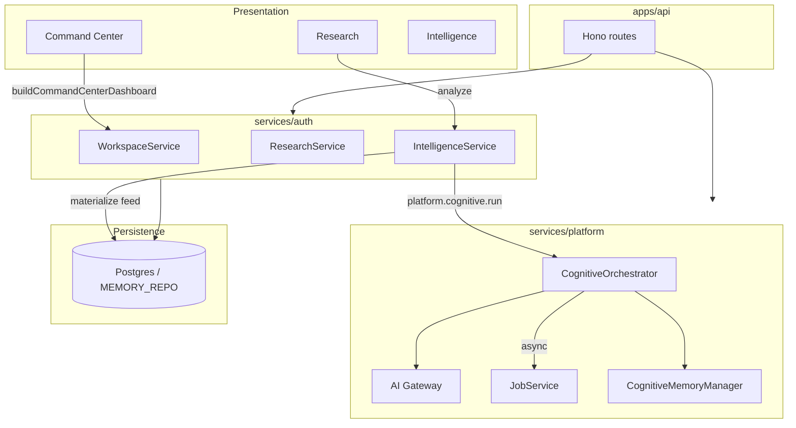

# Domain Encyclopedia

**Institutional Memory Corpus 04 — Self-contained deep dives for every Conquest runtime domain.**

Each file in this encyclopedia is written so a cold-start engineer or AI agent can understand one subsystem **without** reading the entire repository. Cross-links point to [Project Brain](../../project-brain/README.md) chapters 05–08 and 10 for normative architecture; this corpus explains **as-built behavior**.

---

## Authority

```
CCIS → AMD → PDD → UXMD → SDD → Build Authorization → Build
                              ↓
              docs/project-brain/ (supreme engineering memory)
                              ↓
              docs/institutional-memory/04-domain-encyclopedia/ (this corpus)
                              ↓
              apps/ · packages/ · services/ (runtime)
```

When normative docs and as-built code diverge, **normative docs prevail** until an ADR and BAR authorize the change. This encyclopedia documents what runs today (Build-2 M4 complete).

---

## Read order

| Audience | Path |
|----------|------|
| New AI agent | [Project Brain Ch 01 + 16 + 18](../../project-brain/README.md) → this README → domain for your task |
| Product engineer | [05-product-architecture](../../project-brain/05-product-architecture.md) → relevant domain file |
| Platform engineer | [07-runtime-architecture](../../project-brain/07-runtime-architecture.md) → [platform-infrastructure](./platform-infrastructure.md) → [api-and-runtime](./api-and-runtime.md) |
| Data engineer | [10-data-architecture](../../project-brain/10-data-architecture.md) → [data-persistence](./data-persistence.md) |
| Cognitive engineer | [08-cognitive-architecture](../../project-brain/08-cognitive-architecture.md) → [cognitive-pipeline](./cognitive-pipeline.md) |

---

## Domain index

### Identity & tenancy

| File | Primary code | Question answered |
|------|--------------|-------------------|
| [identity-and-tenancy.md](./identity-and-tenancy.md) | `services/auth/src/identity-service.ts`, `create-repository.ts` | Who is the user, which org/workspace, and how is data isolated? |

### Product modules (UXMD-aligned)

| File | Primary code | Question answered |
|------|--------------|-------------------|
| [command-center.md](./command-center.md) | `command-center-integration.ts`, `workspace-service.ts` | How does the home dashboard synthesize intelligence? |
| [research.md](./research.md) | `research-service.ts` | How do research sessions feed the cognitive pipeline? |
| [intelligence.md](./intelligence.md) | `intelligence-service.ts` | How are feed items and recommendations produced and approved? |
| [automation.md](./automation.md) | `automation-service.ts` | How do workflows work today vs M5? |
| [operations.md](./operations.md) | `operations-service.ts` | How is platform telemetry surfaced? |
| [settings-and-administration.md](./settings-and-administration.md) | `settings-service.ts`, `administration-service.ts` | How do the 18 settings screens and admin controls work? |

### Intelligence platform

| File | Primary code | Question answered |
|------|--------------|-------------------|
| [cognitive-pipeline.md](./cognitive-pipeline.md) | `services/cognitive/` | How does `CognitiveOrchestrator` run evidence → reasoning → decision? |
| [ai-gateway-and-audit.md](./ai-gateway-and-audit.md) | `services/ai-gateway/`, `services/ai-audit/` | How are AI providers routed, stubbed, and audited? |
| [jobs-and-async.md](./jobs-and-async.md) | `services/jobs/` | How does async cognitive execution queue and retry? |
| [memory-system.md](./memory-system.md) | `services/memory/` | How does `CognitiveMemoryManager` govern writes? |

### Presentation & infrastructure

| File | Primary code | Question answered |
|------|--------------|-------------------|
| [presentation-and-gis.md](./presentation-and-gis.md) | `apps/web/`, `packages/presentation/`, `packages/gis/` | How does the web shell enforce UXMD and GIS? |
| [platform-infrastructure.md](./platform-infrastructure.md) | `services/platform/` | How does `createPlatformServices` compose the stack? |
| [data-persistence.md](./data-persistence.md) | `packages/database/` | What are the 15 tables and repository pattern? |
| [api-and-runtime.md](./api-and-runtime.md) | `apps/api/` | How does Hono wire domain + platform services? |

---

## Cross-domain flows



---

## Conventions used in every domain file

Each domain document includes these sections in order:

1. **Why this domain exists** — product and architectural rationale
2. **How it works** — detailed runtime behavior
3. **Why alternatives were rejected** — institutional judgment
4. **How it integrates with other domains** — dependency map
5. **How it evolves** — M5+ and long-horizon
6. **Common mistakes** — misconceptions from Project Brain Ch 16
7. **Implementation examples** — real file paths
8. **Architectural diagram** — mermaid
9. **Dependencies** — packages and services
10. **Operational considerations** — health, degradation, CI
11. **Future expansion** — gated capabilities

---

## Related institutional memory

| Corpus | Link |
|--------|------|
| Constitution | [01-conquest-constitution.md](../01-conquest-constitution.md) |
| Decision encyclopedia | [03-engineering-decision-encyclopedia.md](../03-engineering-decision-encyclopedia.md) |
| Failure encyclopedia | [08-failure-encyclopedia.md](../08-failure-encyclopedia.md) |
| Living knowledge graph | [10-living-knowledge-graph.md](../10-living-knowledge-graph.md) |

---

*Build-2 M4 complete. M5 gated (BAR, B-25–B-28). Documentation does not block M5.*
