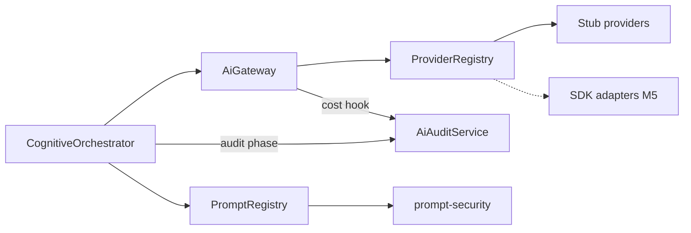

# AI Gateway and Audit

**Domain:** Provider abstraction, stub providers, prompt registry integration, classified audit logging.

**Primary surfaces:** `AiGateway`, `AiProviderOrchestrator`, `AiAuditService`, `PromptRegistry`, `createStubProviders`.

---

## Why this domain exists

Conquest must never scatter `openai.chat.completions` calls across `apps/api` or `apps/web`. The AI Gateway centralizes provider selection, timeout, retry, fallback, and kill switches. AI Audit provides **classified, append-only records** of every AI-related operation for governance and cost tracking.

This domain answers: *Which provider handles this request, and what audit trail proves it happened?*

---

## How it works (detailed)

### AiGateway

`AiGateway` (`services/ai-gateway/src/gateway.ts`) extends `AiServiceBase`:

| Policy | Default |
|--------|---------|
| `timeoutMs` | `AI_GATEWAY_CONSTANTS.DEFAULT_TIMEOUT_MS` |
| `maxRetries` | Config constant |
| `retryBackoffMs` | Config constant |
| `fallbackChain` | `["openai", "anthropic", "gemini"]` |

**`complete(request)`** flow:

1. `getKillSwitchRegistry().assertOpen("ai_gateway")`
2. Build provider chain from request + fallback policy
3. For each provider × retry attempt:
   - Skip if provider status !== `available`
   - Call `provider.complete`
   - Emit telemetry hooks
   - Record cost hook on success
4. Throw if all providers fail

### Stub providers (M4)

`createStubProviders` (`services/ai-gateway/src/stub-providers.ts`) registers deterministic providers:

- Return synthetic completions without network
- Status always `available` for CI
- Swapped for SDK adapters when M5 enables live providers

Registry: `AiProviderRegistry` (`provider-registry.ts`).

### AiProviderOrchestrator

`AiProviderOrchestrator` (`provider-orchestrator.ts`) — higher-level routing for agent messages and pipeline context. Used when cognitive path needs structured provider selection beyond raw completion.

### Cognitive orchestrator integration

M4 cognitive pipeline:

- `provider_route` phase lists registry — does not call `complete()` for deterministic engines
- Audit still records `provider: "cognitive-orchestrator", model: "deterministic"`
- When LLM enrichment added M5, orchestrator will call `aiGateway.complete()`

### AiAuditService

`AiAuditService` (`services/ai-audit/src/ai-audit-service.ts`):

```typescript
record({
  provider, model, orgId, workspaceId?,
  tokenCount, estimatedCostUsd, latencyMs,
  success, correlationId
}): AuditRecord
```

- In-memory store M4 — production will persist to audit table
- Called from gateway cost hook and cognitive orchestrator
- Classified records — no raw prompt content in audit M4

### Prompt registry

`PromptRegistry` (`@conquest/prompt-management`):

- `ensureDefaults()` — loads built-in templates including `cognitive.reasoning`
- `render({ templateId, variables, userInput })` — resolves template
- Integrated in cognitive `prompt_compile` phase

### Prompt security

`@conquest/prompt-security` screens user input before render (cognitive path). Injection checks per governance.

### Kill switches

`@conquest/config` `getKillSwitchRegistry()` — `ai_gateway` switch can disable all provider calls at runtime.

---

## Why alternatives were rejected

| Alternative | Rejection |
|-------------|-----------|
| Direct SDK in domain services | B-27 provider boundary violation |
| No audit trail | Governance requires classified logging |
| Single provider lock-in | Fallback chain for resilience |
| Storing raw prompts in audit | Security — classified metadata only |
| Netlify AI gateway in api/web | Conquest gateway is platform abstraction layer |

---

## How it integrates with other domains

| Domain | Integration |
|--------|-------------|
| Platform | Gateway + audit wired at composition |
| Cognitive | Provider route + audit phases |
| Operations | Provider status in dashboard |
| Administration | `ai_gateway` feature flag |
| Settings | AI controls (future policy injection) |
| Performance | Latency metrics via telemetry hook |

---

## How it evolves

| Phase | Change |
|-------|--------|
| M4 | Stubs, in-memory audit |
| M5 | Live OpenAI/Anthropic/Gemini SDK adapters |
| P1 | Persistent `ai_audit` Postgres table |
| P2 | Cost budgets enforced at gateway |

See `docs/project-brain/09-ai-provider-architecture.md` for provider strategy.

---

## Common mistakes

1. **Importing OpenAI in apps/api** — use gateway only |
2. **Skipping audit on failure paths** — orchestrator audits failures |
3. **Disabling stubs without adapters** — providers unavailable |
4. **Raw prompt logging** — security violation |
5. **Ignoring kill switch** — ops incident response tool |

---

## Implementation examples (real file paths)

| Path | Role |
|------|------|
| `services/ai-gateway/src/gateway.ts` | Main gateway |
| `services/ai-gateway/src/stub-providers.ts` | M4 stubs |
| `services/ai-gateway/src/provider-registry.ts` | Provider registry |
| `services/ai-gateway/src/provider-orchestrator.ts` | High-level routing |
| `services/ai-audit/src/ai-audit-service.ts` | Audit logging |
| `packages/prompt-management/` | Prompt registry |
| `packages/prompt-security/` | Injection screening |
| `services/platform/src/index.ts` | Hook wiring |

---

## Architectural diagram



---

## Dependencies

| Package | Usage |
|---------|-------|
| `@conquest/config` | Constants, kill switches |
| `@conquest/core` | Service response types |
| `@conquest/service-shared` | `AiServiceBase` |
| `@conquest/prompt-management` | Templates |
| `@conquest/prompt-security` | Input screening |

---

## Operational considerations

- Stub providers report `available` — ops dashboard shows green M4
- Token counts zero for deterministic cognitive runs
- Correlation ID links audit to HTTP request headers
- Gateway timeout applies per attempt — total time may exceed single timeout
- Feature flag `ai_gateway` in administration — disable org-wide

---

## Future expansion

- Streaming `stream()` API for chat UX
- Provider health probes with automatic deprioritization
- Prompt version pinning per org
- Red-team audit export
- Multi-model ensemble routing

---

*See also: [cognitive-pipeline](./cognitive-pipeline.md), [platform-infrastructure](./platform-infrastructure.md), [operations](./operations.md)*
