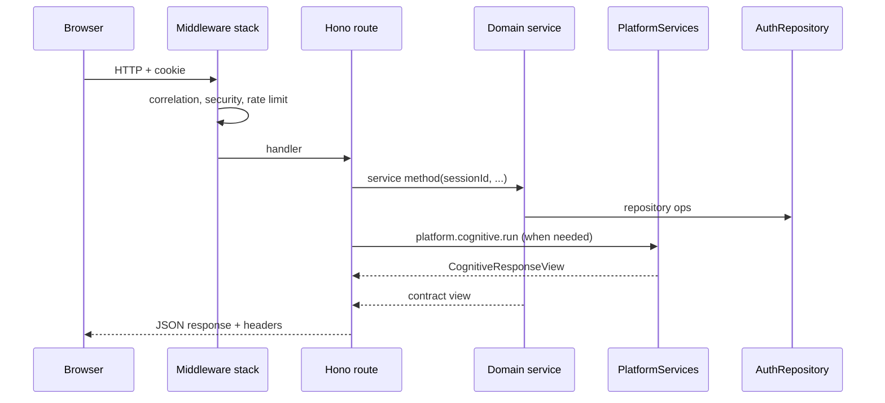

# API and Runtime

**Domain:** `apps/api`, Hono HTTP server, middleware stack, correlation IDs, route wiring.

**Primary surfaces:** `apps/api/src/app.ts`, `server.ts`, middleware modules.

---

## Why this domain exists

The API is the **sole runtime entry** for domain and platform services. Browser clients never call cognitive or platform packages directly. Hono provides lightweight, type-friendly routing with middleware composition for security, tracing, and observability.

This domain answers: *How do HTTP requests become authorized service calls with trace context and structured responses?*

---

## How it works (detailed)

### Bootstrap

`server.ts` starts HTTP listener on port 3001 (configurable).

`createApiApp(deps?)` (`apps/api/src/app.ts`) — ~100 routes:

1. Resolve `AuthRepository` via `createAuthRepository()` or inject test repo
2. Instantiate domain services (identity, workspace, settings, automation, intelligence, etc.)
3. Call `createPlatformServices()` with optional Redis/job overrides
4. Wire `IntelligenceCognitiveProvider` → `platform.cognitive.run`
5. Register Hono routes and middleware
6. Return Hono app instance

### Middleware order

Per Project Brain Ch 07:

1. **Correlation / trace** — `correlationIdMiddleware`
2. **Security headers** — production profile
3. **Timing** — `requestTimingMiddleware`
4. **Security audit** — `securityAuditMiddleware`
5. **Rate limit** — 120/min/IP (skipped in vitest)
6. **CORS**
7. **Route handler**

### Correlation headers

| Header | Purpose |
|--------|---------|
| `x-correlation-id` | End-to-end request correlation |
| `x-trace-id` | Trace context (partial M4) |
| `x-request-id` | Per-request identifier |

`runWithTraceContext` hooks exist; full distributed sink deferred (B2-P2-07).

Forwarded to cognitive `correlationId` on analyze paths.

### Authentication

Session via httpOnly cookie:

```typescript
function sessionIdFrom(c) {
  return getCookie(c, SESSION_COOKIE_NAME);
}
```

`setSessionCookie` on login/signup — `secure: true` in production.

`cognitiveScope(repo, sessionId, workspaceId)` validates session + org/workspace isolation before platform calls.

### Authorization pattern

Routes extract `sessionId` from cookie, pass to service methods. Services enforce `requireWorkspaceAccess` + `ROLE_RANK`.

Web route guards mirror API checks — defense in depth.

Module read access: `canAccessModuleRead(role, moduleSegment)`.

### Key route groups

| Prefix | Service |
|--------|---------|
| `/api/auth/*` | IdentityService |
| `/api/workspaces/:id/*` | Workspace, Intelligence, Research, Automation, Operations |
| `/api/settings/*` | SettingsService, SecurityService |
| `/api/administration/*` | AdministrationService |
| `/api/legal/*` | LegalService |
| `/api/health/*` | Liveness/readiness |
| `/api/ops/*` | Operational status, degradation |

### Research analyze path

```
POST /api/workspaces/:id/research/sessions/:sid/analyze
  → sessionIdFrom cookie
  → intelligence.analyzeFromResearch(sessionId, workspaceId, sid, correlationId)
    → platform.cognitive.run(scope, input)
  → JSON ResearchAnalysisResultView
```

### Command Center path

```
GET /api/workspaces/:id/command-center/dashboard
  → gather status, feed, recommendations, goals, automation, ops
  → buildCommandCenterDashboard(...)
```

### Health endpoints

| Endpoint | Purpose |
|----------|---------|
| `GET /api/health/live` | Liveness — process up |
| `GET /api/health/ready` | Postgres probe when configured |

### Test injection

`CreateApiAppDeps` allows:

- `repo` + `persistenceMode` override
- `redisClient` for integration tests
- `jobService` + `jobQueueLabel` for async tests

`app.test.ts` exercises route integration without full stack.

---

## Why alternatives were rejected

| Alternative | Rejection |
|-------------|-----------|
| Express | Hono lighter, modern middleware |
| GraphQL M4 | REST + contracts sufficient for beta |
| BFF per module | Single API simplifies auth |
| Domain logic in route handlers | Services own logic — routes thin |
| JWT in Authorization header only | httpOnly cookie + server session |

---

## How it integrates with other domains

| Domain | Integration |
|--------|-------------|
| All auth services | Injected at bootstrap |
| Platform | `createPlatformServices` singleton per app |
| Config | `validateApiEnvironment()` |
| Performance | `OperationalMetricsCollector` |
| Web | Vite proxy `/api` → API in dev |

---

## How it evolves

| Phase | Change |
|-------|--------|
| M4 | Monolith Hono app |
| M5 | OpenAPI spec generation from contracts |
| P1 | Full distributed tracing export |
| P2 | API versioning prefix `/api/v2` |

---

## Common mistakes

1. **Skipping sessionId check on new routes** — auth bypass |
2. **Calling platform from route without cognitiveScope** — tenant leak risk |
3. **Returning raw Error stacks in production** — `toStructuredError` |
4. **Duplicate domain logic in app.ts** — belongs in services |
5. **Rate limit in vitest** — disabled via env detection — don't assume always on |

---

## Implementation examples (real file paths)

| Path | Role |
|------|------|
| `apps/api/src/app.ts` | Main app factory, routes |
| `apps/api/src/server.ts` | HTTP bootstrap |
| `apps/api/src/middleware/correlation-id.ts` | Correlation middleware |
| `apps/api/src/middleware/rate-limit.ts` | Rate limiting |
| `apps/api/src/middleware/security-headers.ts` | Security headers |
| `apps/api/src/middleware/security-audit.ts` | Audit middleware |
| `apps/api/src/infrastructure/dependency-probes.ts` | Degradation probes |
| `apps/api/src/app.test.ts` | Integration tests |
| `Dockerfile.api` | Production container |

---

## Architectural diagram



---

## Dependencies

| Package | Usage |
|---------|-------|
| `hono` | HTTP framework |
| `@conquest/auth` | Domain services |
| `@conquest/platform` | Platform composition |
| `@conquest/config` | Env validation, constants |
| `@conquest/contracts` | Request/response schemas |
| `@conquest/gis` | `canAccessModuleRead` |
| `@conquest/performance` | Ops metrics |

---

## Operational considerations

- Production: `NODE_ENV=production` enables secure cookies + security headers
- `pnpm dev` runs api + web in parallel
- Migrations on startup when `DATABASE_URL` set
- Rate limit 120/min/IP — tune for production load balancers
- CORS configured for web origin
- Email via `createEmailProvider()` — console/resend/smtp

---

## Future expansion

- Webhook endpoints for integrations
- SSE/WebSocket for real-time ops
- API key auth for service accounts
- Request body size limits per route class
- Automated OpenAPI + client generation

---

*See also: [platform-infrastructure](./platform-infrastructure.md), [identity-and-tenancy](./identity-and-tenancy.md), [presentation-and-gis](./presentation-and-gis.md)*
