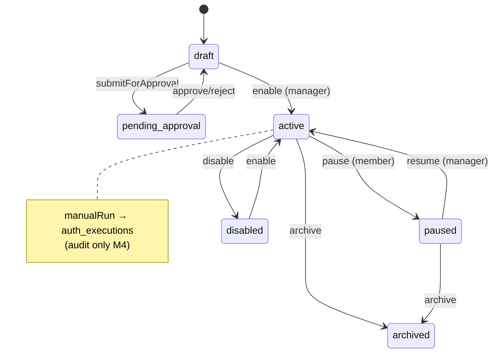

# Automation

**Domain:** Workflow CRUD, approvals, execution log, manual run (audit-only), M5 execution deferral.

**Primary surfaces:** `AutomationService`, `auth_workflows`, `auth_executions` tables.

---

## Why this domain exists

Automation (UXMD AUT-*) closes the loop from intelligence to action. Users define workflows with triggers, schedules, conditions, and actions. The domain answers: *What should happen automatically when conditions are met?*

M4 implements the **definition and governance** layer. Autonomous execution is explicitly deferred per Build-2 governance and ADR-0009 learning boundary. Manual run records audit trails without side effects.

---

## How it works (detailed)

### Workflow lifecycle

`AutomationService` (`services/auth/src/automation-service.ts`) manages:

| Status | Meaning |
|--------|---------|
| `draft` | Editable, not enabled |
| `pending_approval` | Submitted, awaiting manager |
| `active` | Enabled and runnable |
| `paused` | Temporarily suspended |
| `disabled` | Manager disabled |
| `archived` | Soft deleted |

### CRUD operations

- `createWorkflow` — validates trigger/schedule via `validateWorkflowTriggerSchedule`, requires ≥1 action
- `updateWorkflow` — blocked if archived
- `archiveWorkflow` — manager only
- `enableWorkflow` / `disableWorkflow` — manager only; enable checks approval + org policies
- `pauseWorkflow` / `resumeWorkflow` — member pause, manager resume

### Trigger and schedule validation

Contracts enforce:

- `validateTrigger` — event triggers require `eventName`
- `validateSchedule` — cron-like schedule structure
- `validateWorkflowTriggerSchedule` — combined consistency

Trigger types: `manual`, `schedule`, `event`.

### Approval workflow

```
create (submitForApproval: true) → pending_approval
  → approveWorkflow → draft (manager can then enable)
  → rejectWorkflow → draft
```

`listApprovals` returns pending items for Automation approvals screen.

### manualRun — audit-only (M4)

`manualRun` is the critical M4 behavior:

```typescript
const ENGINE_MESSAGE =
  "Workflow validated and recorded — autonomous execution remains deferred per Build-2 governance.";
```

Flow:

1. Permission check — member or manager per `automationPolicies.executionPermission`
2. `assertAutomationAllowed` — rejects if `emergencyDisabled`
3. Workflow must be enabled or active/paused
4. `recordExecution` writes `auth_executions` with status `succeeded`
5. Steps: Validate → Record manual run → Triggered by {actor}
6. **No external side effects** — no API calls, no cognitive invocation

This satisfies UXMD execution log UI without violating M5 BAR gate.

### Org automation policies

From `repo.getAutomationPolicies(orgId)`:

- `emergencyDisabled` — kill switch for all automation
- `executionPermission` — `member` | `manager` for manual run

Configured via Settings → Automation policies.

### Execution records

`ExecutionRecord` persisted to `auth_executions`:

- `workflowId`, `workspaceId`, `orgId`
- `status`, `startedAt`, `completedAt`, `message`
- `steps[]` with timestamps
- `triggeredBy`, `triggerType`

---

## Why alternatives were rejected

| Alternative | Rejection |
|-------------|-----------|
| Fake execution (random success) | Misleading; audit-only is honest |
| Full execution in M4 | Blocked by BAR; B-28 learning boundary |
| Workflows without approval | Governance requires manager approval path |
| Automation as nav intelligence item | ADR-0005 — seven primary nav items only |
| Direct job enqueue from manualRun | Deferred to M5 execution engine |

---

## How it integrates with other domains

| Domain | Integration |
|--------|-------------|
| Settings | Automation policies, AI controls |
| Command Center | Execution zone — pending approvals, active workflows |
| Intelligence | Future — approved recommendations trigger workflows (M5) |
| Jobs | M5 — workflow steps enqueue job types |
| Audit | `auth_domain_audit_events` for policy changes |
| Identity | Role-based enable/run permissions |

---

## How it evolves

| Phase | Capability |
|-------|------------|
| M4 | CRUD, approval, audit-only manual run |
| M5 (BAR) | Real execution via JobService + execution engine |
| M5 | `executionReady: true` in DecisionEngine |
| P1 | Scheduled trigger firing via cron worker |
| P2 | Event bus integration for event triggers |

`ENGINE_MESSAGE` will change when M5 BAR authorizes autonomous execution.

---

## Common mistakes

1. **Expecting manualRun to execute actions** — audit only M4
2. **Enabling workflow without approval** — throws if `pending_approval`
3. **Ignoring `emergencyDisabled`** — org kill switch must be checked
4. **Member enabling workflows** — requires manager role
5. **Adding execution logic without BAR** — governance violation |

---

## Implementation examples (real file paths)

| Path | Role |
|------|------|
| `services/auth/src/automation-service.ts` | Full workflow service |
| `services/auth/src/automation-service.test.ts` | Workflow tests |
| `packages/contracts/src/automation/` | Schemas, validation helpers |
| `packages/database/src/auth-schema.ts` | `auth_workflows`, `auth_executions` |
| `apps/api/src/app.ts` | Automation API routes |
| `apps/web/src/features/automation/` | AUT-* screens |

---

## Architectural diagram



---

## Dependencies

| Package | Usage |
|---------|-------|
| `@conquest/contracts` | Workflow schemas, `validateWorkflowTriggerSchedule` |
| `@conquest/gis` | `ROLE_RANK` |
| `@conquest/auth` | `AuthRepository` |
| `@conquest/database` | Workflow/execution tables |

---

## Operational considerations

- `nextRunAt` in summary is placeholder (+24h) when schedule enabled — not real scheduler M4
- Success rate calculated from execution history
- Archived workflows immutable
- Workflow JSON `definition` includes actions array — schema validated at create/update
- Emergency disable is org-wide immediate effect

---

## Future expansion

- Step executor registry (HTTP, cognitive, notification actions)
- Workflow versioning and rollback
- Dry-run mode with simulated steps
- Integration with external iPaaS (Zapier-class)
- Compliance hold on high-risk workflow categories

---

*See also: [jobs-and-async](./jobs-and-async.md), [settings-and-administration](./settings-and-administration.md), [cognitive-pipeline](./cognitive-pipeline.md)*
