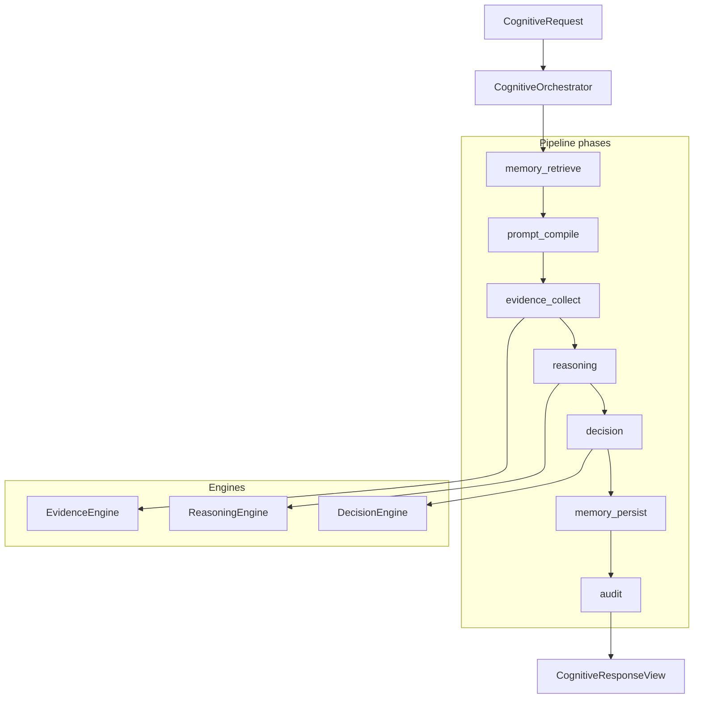

# Cognitive Pipeline

**Domain:** `CognitiveOrchestrator`, Evidence/Reasoning/Decision engines, verification gate, async queue.

**Primary surfaces:** `services/cognitive/`, `platform.cognitive.run()`, legacy `PipelineRunner` (not on API path).

---

## Why this domain exists

Conquest is a cognitive operating system. The pipeline transforms structured requests into evidence-backed recommendations through coordinated phases. This domain is the **runtime expression** of CCIS stages 4–7 (reasoning through verification) in Build-1/2 scope.

It answers: *Given an objective and workspace context, what evidence supports what recommendation, and is it verified before persistence?*

---

## How it works (detailed)

### Entry point

```typescript
platform.cognitive.run(scope: TenantScope, input: CognitiveRequest): Promise<CognitiveResponseView>
```

Wired in `createPlatformServices` → returned as `platform.cognitive`.

`CognitiveRequest` requires `workspaceId`, `objective`, optional `constraints`, `context`, `correlationId`, `async`.

### CognitiveOrchestrator pipeline

`CognitiveOrchestrator` (`services/cognitive/src/cognitive-orchestrator.ts`) coordinates — **contains no business logic**:

| Phase | Action |
|-------|--------|
| Cache check | `cache.getWorkspace` keyed by org+workspace+objective |
| Async branch | If `input.async`, enqueue `ai_request` job, return `queued` |
| `memory_retrieve` | `CognitiveMemoryManager.retrieve` — workspace segment |
| `prompt_compile` | `PromptRegistry.render` template `cognitive.reasoning` |
| `evidence_collect` | `EvidenceEngine.collect` — memory + objective sources |
| `reasoning` | `ReasoningEngine.reason` — recommendation + confidence |
| `decision` | `DecisionEngine.evaluate` — ranked candidates |
| `memory_persist` | Store reasoning summary + decision record |
| `provider_route` | Registry lookup (stub providers M4) |
| `audit` | `AiAuditService.record` |
| `telemetry` | Metrics recorder, lifecycle phases |

### EvidenceEngine

`services/cognitive/src/evidence-engine.ts`:

- Collects evidence portfolio per workspace
- Assigns `evidenceClass`, `reliability`, `confidenceWeight`
- In-memory portfolio keyed by workspace (deterministic M4)

### ReasoningEngine

`services/cognitive/src/reasoning-engine.ts`:

- Consumes evidence IDs from portfolio
- Produces `recommendation` string and `confidence` score
- Deterministic logic — no LLM call in engine itself M4

### DecisionEngine

`services/cognitive/src/decision-engine.ts`:

- Ranks candidates by evidence score (70%) + priority weight (30%)
- **`executionReady: false`** hardcoded — M5 BAR required to enable
- `approvalRequired` for high/critical priority
- Status: `proposed`

### Verification gate

Verification is implicit in pipeline structure:

- Schema validation at entry (`CognitiveRequestSchema`)
- Evidence must attach to reasoning
- Decision evaluates before response
- Failed pipeline → `lifecycle: failed`, audit record with `success: false`
- Failures throw — never return unverified output to caller

Explicit VerificationEngine service deferred; orchestrator enforces ordering per B-26 governance tests (open).

### Async completion

When `async: true`:

1. Job enqueued with payload `{ kind: "cognitive.run", requestId, scope, input }`
2. `JobService` handler calls `cognitive.completeQueued`
3. Same `executePipeline` path runs in worker context

### Legacy PipelineRunner

`services/orchestrator/src/pipeline-runner.ts` — **not on API path**. Historical ten-phase runner superseded by `CognitiveOrchestrator` for Build-1 API. Do not wire to routes.

### Deterministic behavior (M4)

| Reason | Detail |
|--------|--------|
| Testability | Vitest without API keys |
| Governance | B-28 learning boundary |
| Safety | No surprise provider behavior in CI |
| Stubs | AI gateway stub providers |

Structure is production-real; LLM is swappable instrument.

---

## Why alternatives were rejected

| Alternative | Rejection |
|-------------|-----------|
| LLM-in-orchestrator | Engines own domain logic; gateway owns providers |
| Skipping decision phase | CCIS requires explicit decision artifact |
| `executionReady: true` in M4 | BAR gate — autonomous execution forbidden |
| Web → cognitive direct | Forbidden dependency (ENG-12) |
| PipelineRunner on API | Superseded by CognitiveOrchestrator |
| Raw OpenAI in api/web | Must use ai-gateway |

---

## How it integrates with other domains

| Domain | Integration |
|--------|-------------|
| Intelligence | Consumer via `cognitiveProvider.analyze` |
| Memory | Retrieve before reasoning; persist after |
| AI Gateway | Provider route phase (stubs M4) |
| AI Audit | Every run logged |
| Jobs | Async `ai_request` handler |
| Cache | Response caching 300s TTL |
| Prompt management | Template resolution |
| Prompt security | Input screening (via render path) |

---

## How it evolves

| Phase | Change |
|-------|--------|
| M4 | Deterministic engines, stub gateway |
| M5 | SDK adapters in gateway, `executionReady` BAR |
| P1 | Full ten-phase PipelineRunner merge or retirement ADR |
| P2 | HUE injection between evidence and reasoning |

B-25 (stage order), B-26 (VRF bypass), B-27 (provider boundary), B-28 (learning isolation) gate M5.

---

## Common mistakes

1. **Importing cognitive from apps/web** — forbidden |
2. **Business logic in orchestrator** — coordination only |
3. **Direct memory platform writes** — use CognitiveMemoryManager |
4. **Expecting LLM output M4** — deterministic engines |
5. **Using PipelineRunner for new features** — use CognitiveOrchestrator |

---

## Implementation examples (real file paths)

| Path | Role |
|------|------|
| `services/cognitive/src/cognitive-orchestrator.ts` | Main orchestrator |
| `services/cognitive/src/evidence-engine.ts` | Evidence collection |
| `services/cognitive/src/reasoning-engine.ts` | Reasoning |
| `services/cognitive/src/decision-engine.ts` | Decision evaluation |
| `services/platform/src/index.ts` | Composition + job handler |
| `services/orchestrator/src/pipeline-runner.ts` | Legacy (not API) |
| `docs/architecture/cognitive-pipeline.md` | Normative ten-phase spec |

---

## Architectural diagram



---

## Dependencies

| Package | Usage |
|---------|-------|
| `@conquest/contracts` | `CognitiveRequest`, response views |
| `@conquest/core` | `TenantScope`, `SERVICE_NAMES` |
| `@conquest/memory-service` | `CognitiveMemoryManager` |
| `@conquest/ai-gateway` | Provider routing |
| `@conquest/ai-audit` | Audit records |
| `@conquest/jobs` | Async queue |
| `@conquest/cache` | Response cache |
| `@conquest/prompt-management` | Templates |

---

## Operational considerations

- Lifecycle map in-memory — lost on process restart (request IDs ephemeral)
- Cache failures non-fatal — phases `cache_unavailable`, `cache_write_skipped`
- Correlation ID propagates to audit and metrics
- Pipeline timeout not enforced orchestrator-level — job timeout applies async
- `confidence` returned to Intelligence for priority classification

---

## Future expansion

- Explicit VerificationEngine with reroute upstream
- Reflection phase internal records (never user-visible)
- Provider selection from AI controls settings
- Streaming cognitive responses
- Multi-objective batch reasoning

---

*See also: [ai-gateway-and-audit](./ai-gateway-and-audit.md), [memory-system](./memory-system.md), [jobs-and-async](./jobs-and-async.md), [intelligence](./intelligence.md)*
