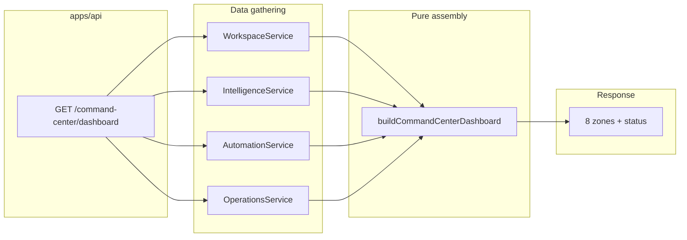

# Command Center

**Domain:** Home dashboard synthesis — workspace status, intelligence zones, honest empty states.

**Primary surfaces:** `WorkspaceService`, `buildCommandCenterDashboard`, Command Center API routes.

---

## Why this domain exists

Per UXMD and ADR-0002, **Command Center is home**. It is not a generic admin dashboard. Its job is to synthesize intelligence into **decision-ready awareness** — alerts, recommendations, risks, opportunities, goals, and execution status in one GIS-compliant view.

Command Center does not generate intelligence. It **aggregates** outputs from Intelligence, Automation, Workspace, and Operations domains without fabricating data. This honesty principle led to removal of `ensureSeed` mock data (M1).

---

## How it works (detailed)

### WorkspaceService status

`WorkspaceService.getCommandCenterStatus` (`services/auth/src/workspace-service.ts`) returns workspace operational state:

| Field source | Meaning |
|--------------|---------|
| `getWorkspaceStatus` | `dataSourceConnected`, `initializationInProgress`, warning/degraded counts |
| Workspace record | Name, type, primary goal |
| State derivation | `initializing` → `active` → `dormant` based on status flags |

Status maps to `CommandCenterStatusResponse` via `toCommandCenterStatusResponse` contract helper.

### Dashboard assembly

`buildCommandCenterDashboard` (`services/auth/src/command-center-integration.ts`) is a **pure function** — no I/O, no side effects. The API route gathers inputs then calls it:

```typescript
// Conceptual flow in apps/api/src/app.ts
const status = await workspace.getCommandCenterStatus(sessionId, workspaceId);
const feed = await intelligence.getFeed(sessionId, workspaceId);
const recommendations = await intelligence.listRecommendations(sessionId, workspaceId);
const goals = await workspace.listGoals(sessionId, workspaceId);
const automation = await automation.listWorkflows(sessionId, workspaceId);
const ops = await operations.getDashboard(sessionId, workspaceId);
const dashboard = buildCommandCenterDashboard({ ... });
```

### Eight dashboard zones

| Zone ID | Label | Data source |
|---------|-------|-------------|
| `alerts` | Alerts | Intelligence feed filtered `category === "alert"` |
| `recommendations` | Recommendations | Top 5 advisories with detail links |
| `executive-summary` | Executive summary | Primary goal + insight feed items |
| `risks` | Risks | Feed filtered `category === "risk"` |
| `opportunities` | Opportunities | Feed filtered `category === "opportunity"` |
| `goals-kpis` | Goals & KPIs | `WorkspaceGoalView` list |
| `execution` | Execution | Pending workflow approvals + enabled workflow count |
| `activity` | Activity | Latest 5 feed items |

Each zone returns `items[]` or `emptyMessage` when no data exists. Empty messages are explicit and actionable (e.g., "Run research analysis to generate evidence-based recommendations.").

### Behavioral states

| State | Condition |
|-------|-----------|
| Dormant | No intelligence feed items, workspace not connected |
| Active | Intelligence exists or workspace `dataSourceConnected` |

Command Center **never** shows fabricated recommendations. Pre-cognitive workspaces see honest empty zones.

### Integration with intelligence

Recommendations link via `advisoryDetailRoute(workspaceId, rec.id)`. Feed items link via `intelligenceFeedRoute(workspaceId)`. Confidence scores propagate to zone items for GIS display.

`cognitiveRequestCount` and `platformHealthy` surface platform telemetry for operator awareness.

---

## Why alternatives were rejected

| Alternative | Rejection |
|-------------|-----------|
| Intelligence as home nav | ADR-0002 — Command Center synthesizes; Intelligence is a module |
| Server-side zone logic in WorkspaceService | Separation: workspace owns status; integration module owns assembly |
| Hardcoded demo cards | Removed with `ensureSeed`; violates trust |
| Client-side aggregation only | Single API endpoint ensures consistent authorization |
| Charts/KPI widgets without data | UXMD requires honest empty states, not placeholder charts |

---

## How it integrates with other domains

| Domain | Role |
|--------|------|
| Intelligence | Feed items, recommendations, confidence |
| Research | Indirect — analyze creates feed via Intelligence |
| Automation | Pending approvals, enabled workflow counts |
| Workspace | Status, goals, primary goal text |
| Operations | `platformHealthy` flag |
| Presentation | `CommandCenterScreen` renders zones per GIS |
| GIS | Seven-item nav; Command Center is `/app/w/:id/command-center` |

---

## How it evolves

| Phase | Enhancement |
|-------|-------------|
| M4 | Static zone assembly from service data |
| M5 | Real-time zone refresh via websocket or polling |
| P1 | Personalized zone ordering per HUE communication strategy |
| P2 | Executive summary generated by cognitive pipeline summary phase |

Zone definitions (`ZONE_DEFS`) are frozen constants — adding zones requires UXMD amendment.

---

## Common mistakes

1. **Adding intelligence generation to Command Center** — it only aggregates
2. **Reintroducing seed data for demos** — use research analyze flow instead
3. **Skipping workspace access check on dashboard route** — same auth as other modules
4. **Treating workspace status as intelligence** — status is operational, not cognitive
5. **Hardcoding zone content in React** — all items must come from API assembly

---

## Implementation examples (real file paths)

| Path | Role |
|------|------|
| `services/auth/src/command-center-integration.ts` | `buildCommandCenterDashboard`, `ZONE_DEFS` |
| `services/auth/src/workspace-service.ts` | `getCommandCenterStatus`, goals, settings |
| `services/auth/src/command-center-integration.test.ts` | Zone assembly unit tests |
| `apps/api/src/app.ts` | `GET .../command-center/dashboard` route |
| `apps/web/src/features/command-center/` | Command Center screens |
| `packages/contracts/src/command-center/` | View types |
| `packages/gis/src/navigation.ts` | Module path parsing |

---

## Architectural diagram



---

## Dependencies

| Dependency | Purpose |
|------------|---------|
| `@conquest/contracts` | `CommandCenterDashboardView`, route helpers |
| `@conquest/auth` | Workspace, Intelligence, Automation services |
| `@conquest/gis` | Navigation constants |
| Intelligence feed persistence | Via `AuthRepository` scoped documents |

---

## Operational considerations

- Dashboard endpoint is read-only — safe to cache briefly at CDN edge (not implemented M4)
- Large feed lists truncated to 5 items per zone server-side — full lists in Intelligence module
- `lastRefreshedAt` is server timestamp at assembly time
- Telemetry: `logScreenEvent` on Command Center screen in web app
- Performance: N+1 avoided — single gather phase per request

---

## Future expansion

- Zone-level refresh subscriptions
- Drill-down from zone item to source research session
- HUE-adapted executive summary depth (technical vs executive audience)
- Workspace comparison view for multi-workspace orgs
- Integration with Strategy Center placeholder (post-M5)

---

*See also: [intelligence](./intelligence.md), [workspace in identity-and-tenancy](./identity-and-tenancy.md), [presentation-and-gis](./presentation-and-gis.md)*
