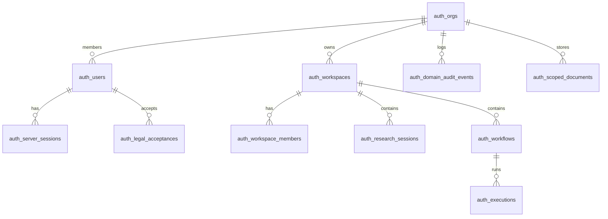

# Data Persistence

**Domain:** Drizzle schema, 15 Postgres tables, migrations, `AuthRepository` pattern.

**Primary surfaces:** `packages/database/`, `DrizzleAuthRepository`, `AsyncMemoryAuthRepository`.

---

## Why this domain exists

Domain data belongs in Postgres via Drizzle — not scattered files, not Netlify Blobs for structured data. The repository abstraction allows identical domain behavior in production (Postgres) and CI (memory) without branching logic in services.

This domain answers: *What persists, where, under which tenant key, and how do services access it uniformly?*

---

## How it works (detailed)

### Philosophy (Project Brain Ch 10)

- **Domain data** in Postgres via Drizzle
- **Repository abstraction** — `AuthRepository` interface
- **Scoped documents** — JSON settings in `auth_scoped_documents`
- **Audit** — append-oriented `auth_domain_audit_events`

### Fifteen tables

Schema source: `packages/database/src/auth-schema.ts`  
Migration: `packages/database/drizzle/0000_initial.sql`

| Table | Owns |
|-------|------|
| `auth_orgs` | Tenant root |
| `auth_users` | Identity, email unique |
| `auth_server_sessions` | Cookie sessions |
| `auth_workspaces` | Workspace context |
| `auth_workspace_members` | Membership + role |
| `auth_scoped_documents` | Settings JSON blobs |
| `auth_tokens` | Verify/reset/MFA tokens |
| `auth_team_invites` | Workspace invites |
| `auth_org_invites` | Org invites |
| `auth_workflows` | Automation definitions |
| `auth_executions` | Run audit records |
| `auth_research_sessions` | Research sessions |
| `auth_domain_audit_events` | Audit trail |
| `auth_legal_acceptances` | Legal versioning |
| `auth_email_deliveries` | Email delivery audit |

### Entity relationships

```
auth_orgs
 ├── auth_users
 ├── auth_workspaces → auth_workspace_members
 ├── auth_workflows → auth_executions
 ├── auth_research_sessions
 ├── auth_domain_audit_events
 └── auth_scoped_documents (feature flags, prefs, intelligence feed JSON)
auth_users → auth_server_sessions, auth_legal_acceptances
```

### Intelligence data (M4)

No dedicated `auth_intelligence_items` table. Feed and advisories persist via repository methods into `auth_scoped_documents` keyed by workspace — consolidated storage per Project Brain Ch 10 §4.

### AuthRepository interface

`services/auth/src/auth-repository.ts` defines ~80 methods covering:

- Identity, sessions, orgs, users
- Workspaces, members, invites
- Workflows, executions
- Research sessions, sources
- Intelligence feed, advisories
- Settings, preferences, policies
- Feature flags, audit events
- Legal, email deliveries

### DrizzleAuthRepository

`services/auth/src/drizzle-repository.ts` — maps interface to SQL via Drizzle ORM.

- Uses `ConquestDatabase` from `createDb(connectionString)`
- JSON columns for complex nested records
- Indexes per schema comments

### AsyncMemoryAuthRepository

`services/auth/src/async-memory-repository.ts` — Map-based implementation.

- Async API matches Drizzle (uniform `await`)
- Contract tests enforce parity: `auth-repository.contract.test.ts`

### Repository mode resolution

```typescript
// create-repository.ts
if (MEMORY_REPO=true || forceMemory) → memory
else if (DATABASE_URL) → postgres + runMigrations
else → memory
```

Migrations auto-run on API startup when Postgres configured.

### Lifecycle rules

| Data | Retention |
|------|-----------|
| Sessions | Revocable; sliding TTL |
| Audit | Append; partition at scale (P2) |
| Legal acceptance | Immutable version record |
| Research sessions | Until deleted |
| Tokens | Short-lived; single use |

---

## Why alternatives were rejected

| Alternative | Rejection |
|-------------|-----------|
| ORM per service | Single auth domain schema M4 |
| Netlify Blobs for user data | Structured relational data needs Postgres |
| Services with raw SQL | Repository encapsulation |
| Separate DB per workspace | Org is tenant boundary |
| Skipping migrations in dev | Auto-migrate on startup |

---

## How it integrates with other domains

| Domain | Integration |
|--------|-------------|
| All auth services | Single `AuthRepository` injection |
| API | `createAuthRepository()` at bootstrap |
| Identity | Sessions, users tables |
| Intelligence | Scoped documents for feed |
| Automation | Workflows + executions tables |
| Memory platform | Separate in-memory M4 — not auth tables |

---

## How it evolves

| Phase | Change |
|-------|--------|
| M4 | 15 tables, scoped doc consolidation |
| M5 | Dedicated intelligence tables at scale |
| P1 | Postgres RLS per org_id |
| P2 | Audit table partitioning |

---

## Common mistakes

1. **Adding tables without migration** — Drizzle migration required |
2. **Bypassing repository in new service** — breaks MEMORY_REPO CI |
3. **Storing intelligence only in memory repo** — production needs Postgres |
4. **Confusing scoped_documents scopes** — document_type discipline |
5. **Cascade delete surprises** — org delete cascades users/workspaces |

---

## Implementation examples (real file paths)

| Path | Role |
|------|------|
| `packages/database/src/auth-schema.ts` | Table definitions |
| `packages/database/drizzle/0000_initial.sql` | Initial migration |
| `packages/database/src/index.ts` | `createDb`, `runMigrations` |
| `services/auth/src/drizzle-repository.ts` | Postgres impl |
| `services/auth/src/async-memory-repository.ts` | Memory impl |
| `services/auth/src/create-repository.ts` | Mode selection |
| `services/auth/src/auth-repository.contract.test.ts` | Parity tests |
| `docs/project-brain/10-data-architecture.md` | Normative data doc |

---

## Architectural diagram



---

## Dependencies

| Package | Usage |
|---------|-------|
| `drizzle-orm` | ORM |
| `postgres` | Driver |
| `@conquest/database` | Schema + client export |

---

## Operational considerations

| Mode | DATABASE_URL | MEMORY_REPO |
|------|--------------|-------------|
| CI tests | Optional | `true` |
| Local dev | Optional | unset → Postgres if URL |
| Production | Required | must be false/unset |

- `docker-compose.yml` — local Postgres + Redis
- Backup utilities in `@conquest/database`
- `closeAuthRepository()` on graceful shutdown
- `isPostgresReachable` for readiness probes

---

## Future expansion

- Read replicas for analytics queries
- Encrypted columns for sensitive settings
- Event sourcing overlay for audit
- Multi-tenant shard routing
- Data export pipeline for privacy requests

---

*See also: [identity-and-tenancy](./identity-and-tenancy.md), [intelligence](./intelligence.md), [memory-system](./memory-system.md)*
