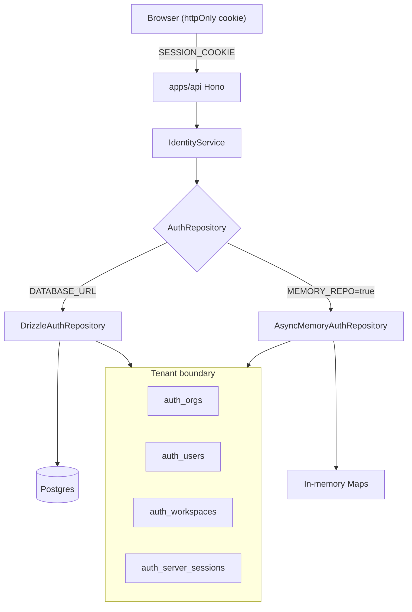

# Identity and Tenancy

**Domain:** Authentication, sessions, organization/workspace hierarchy, tenant isolation, repository selection.

**Primary surfaces:** `IdentityService`, `AuthRepository`, `DrizzleAuthRepository`, `AsyncMemoryAuthRepository`, `createAuthRepository`.

---

## Why this domain exists

Conquest is a multi-tenant cognitive operating system. Every downstream domain — intelligence, research, automation, memory — must know **who** is acting and **which tenant boundary** applies. Identity and tenancy is the root of all authorization and data scoping.

Without a single identity layer:

- Workspace routes could leak cross-org data
- Cognitive pipelines could write memory to the wrong tenant
- CI could not run without live Postgres

This domain answers: *Who am I helping right now, and under which org/workspace contract?*

---

## How it works (detailed)

### IdentityService

`IdentityService` (`services/auth/src/identity-service.ts`) owns the full auth lifecycle:

| Operation | Behavior |
|-----------|----------|
| `signUp` | Creates org + owner user, stores verification token, issues session cookie |
| `login` | Validates password, selects active workspace if onboarding complete, records audit |
| `getSession` | Loads session, applies sliding TTL refresh when near expiry |
| `logout` | Revokes session server-side |
| `completeOnboarding` | Creates default workspace, marks onboarding complete |

Sessions are **server-side** records in `auth_server_sessions` (Postgres) or in-memory maps (CI). The browser holds only an httpOnly cookie (`SESSION_COOKIE_NAME`).

Session fields include: `userId`, `orgId`, `activeWorkspaceId`, `authStrength` (`password` | `mfa`), `deviceId`, `expiresAt`, `revoked`.

Sliding refresh: when `expiresAt - now < SLIDING_REFRESH_MS`, expiry extends by `SESSION_TTL_MS`.

### Organization and workspace model

```
Org (tenant root)
 ├── Users (roles: viewer → owner)
 ├── Workspaces (context, not nav)
 │    └── Workspace members
 └── Org-scoped settings (automation policies, feature flags, research sources)
```

`assertOrgAccess` from `@conquest/core` enforces that session `orgId` matches resource `orgId` on every workspace-scoped call.

### Tenant isolation

Isolation is enforced at three layers:

1. **Session binding** — `session.orgId` set at login from user's org
2. **Service checks** — every domain service calls `requireWorkspaceAccess` → `assertOrgAccess`
3. **API helper** — `cognitiveScope()` in `apps/api/src/app.ts` rejects `session.orgId !== ws.orgId`

Future: Postgres RLS (P1) as defense-in-depth.

### DrizzleAuthRepository vs MEMORY_REPO

`createAuthRepository` (`services/auth/src/create-repository.ts`) selects persistence mode:

| Condition | Mode | Implementation |
|-----------|------|----------------|
| `MEMORY_REPO=true` or `forceMemory` | `memory` | `AsyncMemoryAuthRepository` |
| `DATABASE_URL` set | `postgres` | `DrizzleAuthRepository` + auto migrations |
| Neither | `memory` | Fallback for local dev without DB |

**DrizzleAuthRepository** maps `AuthRepository` interface to 15 Postgres tables via Drizzle ORM. Intelligence feed, advisories, feature flags, and preferences live in `auth_scoped_documents` JSON payloads where no dedicated table exists.

**AsyncMemoryAuthRepository** mirrors the same interface with in-process Maps. Used in Vitest, Playwright CI, and contract tests. Behavior must match Postgres implementation (enforced by `auth-repository.contract.test.ts`).

`MEMORY_REPO=true` is **required** in CI when no database is provisioned. Production must never set it.

---

## Why alternatives were rejected

| Alternative | Rejection |
|-------------|-----------|
| JWT-only stateless auth | Revocation and MFA step-up require server session store |
| Workspace as top-level tenant | Org is billing/legal boundary; workspace is operational context (ADR-0003) |
| Direct Drizzle in domain services | Violates repository abstraction; blocks CI memory mode |
| Client-side tenant ID trust | All tenant scope derived from server session, never request body alone |
| Separate auth microservice (M4) | Monolith composition root in `apps/api` sufficient for closed beta |

---

## How it integrates with other domains

| Domain | Integration |
|--------|-------------|
| Settings | `SettingsService` reads/writes user prefs via same `AuthRepository` |
| Workspace | `WorkspaceService` lists workspaces for `session.orgId` |
| Intelligence / Research | `requireWorkspaceAccess` pattern shared |
| Cognitive | `TenantScope { orgId, workspaceId }` from session + workspace |
| Notifications | `NotificationService` uses org/user from identity events |
| API | Cookie middleware extracts `sessionId`, passes to all services |

---

## How it evolves

| Phase | Change |
|-------|--------|
| M4 (today) | Password + optional MFA enrollment, email verification |
| M5 | Stronger session device binding, OAuth providers |
| P1 | Postgres RLS policies per `org_id` |
| P2 | Cross-org federation (enterprise SSO) |

Memory evolution and HUE do **not** store permanent user labels in identity — roles are org-scoped, not personality profiles.

---

## Common mistakes

1. **Trusting `workspaceId` from request body without session check** — always `requireWorkspaceAccess`
2. **Using MEMORY_REPO in production** — data loss on restart
3. **Confusing research session with auth session** — different concepts entirely
4. **Skipping `assertOrgAccess` on cross-resource joins** — research session has `orgId` field
5. **Creating users without org** — every user belongs to exactly one org in M4

---

## Implementation examples (real file paths)

| Path | Role |
|------|------|
| `services/auth/src/identity-service.ts` | Signup, login, session lifecycle |
| `services/auth/src/create-repository.ts` | Repository mode resolution |
| `services/auth/src/drizzle-repository.ts` | Postgres implementation |
| `services/auth/src/async-memory-repository.ts` | In-memory CI implementation |
| `services/auth/src/auth-repository.ts` | Interface contract |
| `services/auth/src/session-config.ts` | TTL constants |
| `services/auth/src/password.ts` | bcrypt hash/verify |
| `packages/database/src/auth-schema.ts` | Drizzle table definitions |
| `apps/api/src/app.ts` | `cognitiveScope`, cookie handling |
| `apps/web/src/auth/route-access.ts` | Client route guards |

---

## Architectural diagram



---

## Dependencies

| Package / service | Usage |
|-------------------|-------|
| `@conquest/contracts` | `SignUpInputSchema`, `LoginInputSchema`, view types |
| `@conquest/core` | `assertOrgAccess`, `SERVICE_NAMES` |
| `@conquest/database` | Drizzle client, migrations |
| `@conquest/service-shared` | `ApplicationServiceBase` |
| `@conquest/gis` | `ROLE_RANK` (consumed by sibling services) |

---

## Operational considerations

| Concern | Detail |
|---------|--------|
| Migrations | Auto-run on API startup when Postgres configured |
| Session expiry | Sliding window; revoked sessions return null immediately |
| Health | `GET /api/health/ready` probes Postgres via `isPostgresReachable` |
| Secrets | `DATABASE_URL` env only; never committed |
| Graceful shutdown | `closeAuthRepository()` clears shared DB client |
| Rate limit | Login/signup subject to 120/min/IP API rate limit |

---

## Future expansion

- OAuth2/OIDC identity providers with org-level IdP configuration
- Hardware security key MFA (WebAuthn)
- Session listing and remote revocation UI (partially in SecurityService)
- Org-level data residency flags affecting repository region
- Service accounts for automation execution (M5 BAR scope)

---

*See also: [data-persistence](./data-persistence.md), [api-and-runtime](./api-and-runtime.md), [settings-and-administration](./settings-and-administration.md)*
