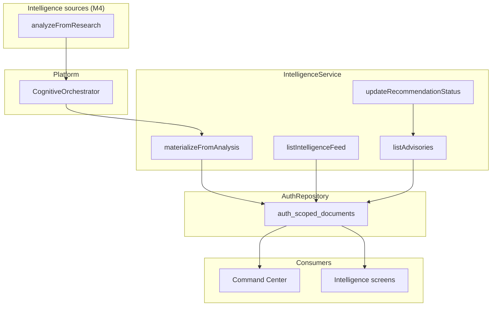

# Intelligence

**Domain:** Intelligence feed, advisory recommendations, status workflow, cognitive materialization.

**Primary surfaces:** `IntelligenceService`, feed/advisory repository methods, Intelligence API routes.

---

## Why this domain exists

The Intelligence module (UXMD INT-*) is where evidence-based recommendations live after cognitive analysis. It answers: *What should we pay attention to, and what actions are proposed with what confidence?*

This domain separates **signals** (feed items: opportunity, risk, insight, alert) from **decisions** (advisory recommendations requiring approval workflow). Command Center consumes both; Intelligence is the system of record.

---

## How it works (detailed)

### IntelligenceService structure

`IntelligenceService` (`services/auth/src/intelligence-service.ts`) provides:

| Endpoint area | Methods |
|---------------|---------|
| Home | `getHome` — counts by category, last updated |
| Feed | `getFeed` — filter by category, search |
| Recommendations | `listRecommendations`, `getRecommendation` |
| Status workflow | `updateRecommendationStatus` |
| Specialized lists | `listOpportunities`, `listRisks` |
| Timeline | `getTimeline` — merged feed + advisory events |
| Research bridge | `analyzeFromResearch` |

### Feed vs advisories

| Artifact | Storage | Purpose |
|----------|---------|---------|
| `IntelligenceFeedItemRecord` | `repo.saveIntelligenceFeed` | Categorized signals with confidence |
| `AdvisoryRecommendationRecord` | `repo.saveAdvisories` | Actionable recommendations with approval |

Feed categories: `recommendation`, `opportunity`, `risk`, `insight`, `alert`.

Both persist via `AuthRepository` — consolidated in `auth_scoped_documents` (no dedicated `auth_intelligence_items` table in M4 schema).

### Status workflow

Advisory statuses flow through manager actions:

```
pending → approved | rejected | deferred (via UpdateAdvisoryStatusSchema)
```

`updateRecommendationStatus` requires `ROLE_RANK >= manager`. Approval sets `approvedBy`, `approvedAt`.

`approvalRequired: true` on all pipeline-generated advisories M4.

### analyzeFromResearch and materialization

When cognitive analysis completes, `materializeFromAnalysis`:

1. Creates advisory with priority from confidence thresholds (≥0.85 high, ≥0.7 medium, else low)
2. Maps evidence items to feed items via `classifyEvidence` keyword heuristics
3. Falls back to single insight item if no evidence items
4. Emits `intelligence_materialized` telemetry event

### ensureSeed removal

**Historical:** `IntelligenceService.ensureSeed` injected mock feed data for demo impressiveness.

**M1 removal rationale** (Project Brain Ch 16, 18):

- Destroyed user trust when mock data presented as real intelligence
- Bypassed cognitive pipeline governance (B-25–B-28)
- Conflicted with honest empty states in Command Center

**Today:** Empty feed is correct pre-analyze state. Only `analyzeFromResearch` → `platform.cognitive.run` creates recommendations.

Grep confirms zero `ensureSeed` in codebase — only historical docs reference it.

### Cognitive provider injection

`IntelligenceService` accepts optional `IntelligenceCognitiveProvider`. API wires:

```typescript
const cognitiveProvider: IntelligenceCognitiveProvider = {
  async analyze(scope, input) {
    const response = await platform.cognitive.run(scope, { ... });
    return { requestId, correlationId, recommendationSummary, ... };
  },
};
const intelligence = new IntelligenceService(repo, cognitiveProvider);
```

Without provider, `analyzeFromResearch` throws "Cognitive analysis is not available".

---

## Why alternatives were rejected

| Alternative | Rejection |
|-------------|-----------|
| `ensureSeed` mock data | Removed — trust destruction |
| Dedicated intelligence tables (M4) | Scoped documents sufficient for beta scale |
| Intelligence generating without verification | All items trace to cognitive pipeline output |
| Auto-approve recommendations | Manager approval required per governance |
| Client-side feed filtering only | Server-side filter + search for consistency |

---

## How it integrates with other domains

| Domain | Integration |
|--------|-------------|
| Research | Analyze trigger entry point |
| Cognitive pipeline | Source of evidence, reasoning, decision IDs |
| Command Center | Feed + recommendations in dashboard zones |
| Automation | Approved recommendations may trigger workflows (M5) |
| Settings | AI controls, memory controls affect pipeline inputs |
| Administration | `intelligence_feed` feature flag |

---

## How it evolves

| Phase | Change |
|-------|--------|
| M4 | Deterministic pipeline materialization |
| M5 | LLM-enriched summaries via AI gateway |
| P1 | Dedicated intelligence tables at scale |
| P2 | Recommendation outcome tracking → memory evolution |

Status transitions will connect to automation execution when `executionReady: true` (M5 BAR).

---

## Common mistakes

1. **Re-adding seed data** — use research analyze demo path
2. **Creating feed items outside materializeFromAnalysis** — breaks audit trail
3. **Treating feed items as approved actions** — only advisories have workflow
4. **Member role updating status** — requires manager
5. **Expecting intelligence without cognitive provider wired** — analyze fails by design

---

## Implementation examples (real file paths)

| Path | Role |
|------|------|
| `services/auth/src/intelligence-service.ts` | Full service implementation |
| `services/auth/src/intelligence-service.test.ts` | Unit tests |
| `apps/api/src/app.ts` | Intelligence routes, cognitive provider wiring |
| `apps/web/src/features/intelligence/` | INT-* screens |
| `packages/contracts/src/intelligence/` | Feed query schema, view types |
| `docs/build-2/m1-integration-batch-report.md` | ensureSeed removal record |

---

## Architectural diagram



---

## Dependencies

| Package | Usage |
|---------|-------|
| `@conquest/contracts` | Intelligence views, `UpdateAdvisoryStatusSchema` |
| `@conquest/core` | `TenantScope`, `assertOrgAccess` |
| `@conquest/gis` | `ROLE_RANK`, `advisoryDetailRoute` |
| `@conquest/platform` | Cognitive orchestrator (injected) |

---

## Operational considerations

- Feed search is case-insensitive substring on title + summary
- Timeline merges feed + advisories — may show duplicates conceptually
- `getHome` summary text changes based on advisory count
- Large feed lists unbounded in repository — UI paginates (future)
- Correlation IDs link intelligence items to ai-audit records

---

## Future expansion

- Recommendation versioning and supersession
- Evidence drill-down to source documents
- Intelligence categories from ML classifier vs keyword heuristics
- Feed item acknowledgment workflow (`status: acknowledged`)
- Export intelligence reports (PDF/CSV)

---

*See also: [research](./research.md), [cognitive-pipeline](./cognitive-pipeline.md), [command-center](./command-center.md)*
