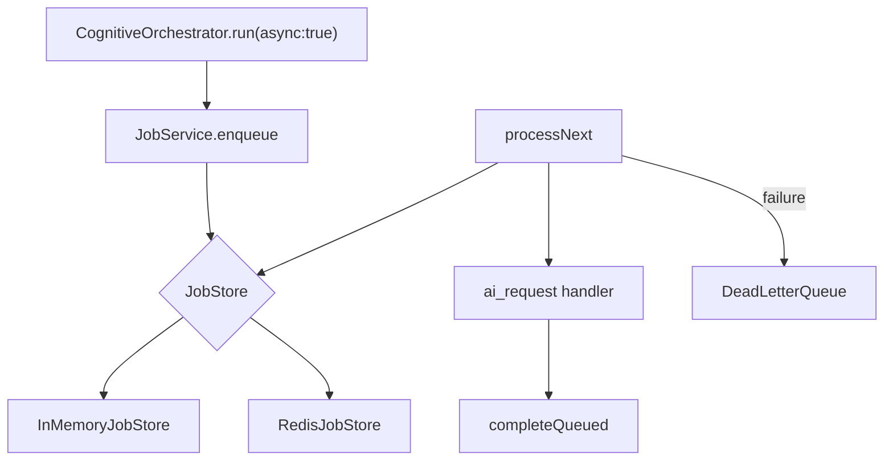

# Jobs and Async

**Domain:** `JobService`, Redis queue, dead-letter queue, in-memory fallback, cognitive async path.

**Primary surfaces:** `services/jobs/`, `RedisJobStore`, `InMemoryJobStore`, `RedisDeadLetterQueue`.

---

## Why this domain exists

Cognitive analysis can exceed HTTP timeout budgets. The job framework decouples **enqueue** from **execution** — enabling async cognitive runs, future workflow execution (M5), and retry/DLQ governance.

This domain answers: *How does Conquest run long-running work reliably with progress, timeout, and failure isolation?*

---

## How it works (detailed)

### JobService

`JobService` (`services/jobs/src/job-service.ts`) extends `InfrastructureServiceBase`:

| Capability | Method |
|------------|--------|
| Enqueue | `enqueue(EnqueueJobInput)` |
| Process | `processNext(now?)` |
| Cancel | `cancel(id)` — not while running |
| Progress | `reportProgress(id, 0-100)` |
| Metrics | `getMetrics()` → `JobQueueMetrics` |
| Handler registration | `registerHandler({ type, handle })` |

### Job types

M4 primary type: `ai_request`

Payload for cognitive async:

```typescript
{
  kind: "cognitive.run",
  requestId: string,
  scope: TenantScope,
  input: CognitiveRequest
}
```

Handler registered in `createPlatformServices` calls `cognitive.completeQueued`.

### Execution flow

1. `cognitive.run({ async: true })` enqueues job, returns `lifecycle: "queued"`
2. Worker loop calls `jobService.processNext()`
3. Handler invokes `completeQueued` → full pipeline
4. Progress reported at 25% and 100%

### Retry and timeout

- `withTimeout` wrapper enforces `JOB_CONSTANTS` timeout per execution
- Failed jobs retry per store policy
- Exhausted retries → dead-letter queue

### Job stores

| Store | When |
|-------|------|
| `InMemoryJobStore` | Default, no Redis |
| `RedisJobStore` | `REDIS_URL` + factory wiring |

`createJobService` (`create-job-service.ts`) selects store based on Redis availability.

### Dead-letter queue

| Implementation | When |
|----------------|------|
| `InMemoryDeadLetterQueue` | Default |
| `RedisDeadLetterQueue` | Redis mode |

`deadLetterSize` async for Redis mode. Operations dashboard flags unhealthy when `deadLetter >= 100`.

### Queue labels

`queueLabel: "redis" | "in-memory"` exposed via `PlatformServices.jobQueueLabel` for ops transparency.

### Worker health

`lastWorkerBeat` updated on processing — included in metrics for ops (partial M4).

---

## Why alternatives were rejected

| Alternative | Rejection |
|-------------|-----------|
| Fire-and-forget Promise | No retry, DLQ, or progress |
| External queue only (SQS) | Redis sufficient M4; Netlify constraints |
| Sync-only cognitive | Timeout risk on long analysis |
| Jobs in domain services | Platform infrastructure concern |
| No DLQ | Failed jobs must be inspectable |

---

## How it integrates with other domains

| Domain | Integration |
|--------|-------------|
| Cognitive | Async run + `completeQueued` |
| Platform | Single JobService instance |
| Operations | Queue metrics in dashboard |
| Automation | M5 workflow step execution |
| API | Optional Redis client injection in tests |

---

## How it evolves

| Phase | Change |
|-------|--------|
| M4 | `ai_request` cognitive async |
| M5 | `workflow_step` job type |
| P1 | Dedicated worker process / Netlify background functions |
| P2 | Priority queues per org tier |

---

## Common mistakes

1. **Not calling processNext in dev** — async jobs stall without worker loop |
2. **Canceling running jobs** — throws by design |
3. **Duplicate handler registration** — overwrites by type |
4. **Assuming Redis without REDIS_URL** — silent in-memory fallback |
5. **Ignoring DLQ growth** — ops heuristic alerts at 100 |

---

## Implementation examples (real file paths)

| Path | Role |
|------|------|
| `services/jobs/src/job-service.ts` | Core service |
| `services/jobs/src/job-store.ts` | In-memory store |
| `services/jobs/src/redis-job-store.ts` | Redis store |
| `services/jobs/src/redis-job-client.ts` | Redis client |
| `services/jobs/src/dead-letter-queue.ts` | In-memory DLQ |
| `services/jobs/src/redis-dead-letter-queue.ts` | Redis DLQ |
| `services/jobs/src/create-job-service.ts` | Factory |
| `services/platform/src/index.ts` | Handler registration |

---

## Architectural diagram



---

## Dependencies

| Package | Usage |
|---------|-------|
| `@conquest/config` | `JOB_CONSTANTS` |
| `@conquest/core` | `TenantScope`, service names |
| `@conquest/service-shared` | `InfrastructureServiceBase` |
| `@conquest/cache` | `RedisLikeClient` type |

---

## Operational considerations

- In-memory jobs lost on process restart
- Redis jobs survive restart — preferred production
- `docker-compose.yml` provides local Redis
- Job timeout errors surface as failed status + DLQ
- Metrics: queued, running, completed, failed, deadLetter counts

---

## Future expansion

- Scheduled jobs (cron) for workflow triggers
- Job priority and fair queuing per tenant
- Admin UI for DLQ replay
- Job payload encryption for sensitive objectives
- Horizontal worker scaling

---

*See also: [cognitive-pipeline](./cognitive-pipeline.md), [platform-infrastructure](./platform-infrastructure.md), [operations](./operations.md)*
