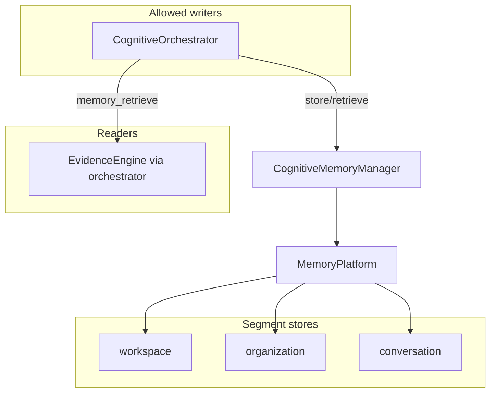

# Memory System

**Domain:** `CognitiveMemoryManager`, `MemoryPlatform`, memory governance, sole-write facade.

**Primary surfaces:** `services/memory/`, ADR-0008 Memory Manager sole write.

---

## Why this domain exists

Memory in Conquest is **compression, not storage** — patterns, goals, verified knowledge, not raw conversation dumps. ADR-0008 mandates that **CognitiveMemoryManager is the sole write facade** for cognitive memory. Engines and domain services must not write directly to memory stores.

This domain answers: *What should we retain from cognitive operations, scoped to tenant, and how do we retrieve it for future reasoning?*

---

## How it works (detailed)

### MemoryPlatform

`MemoryPlatform` (`services/memory/src/memory-platform/memory-platform.ts`) provides segment stores:

| Segment kind | Store |
|--------------|-------|
| `workspace` | Workspace-scoped entries |
| `organization` | Org-scoped knowledge |
| `conversation` | Conversation summaries |

Each store implements `put`, `list`, `get`, `delete` with `TenantScope` isolation.

### CognitiveMemoryManager

`CognitiveMemoryManager` (`services/memory/src/cognitive-memory/cognitive-memory-manager.ts`) extends `MemoryServiceBase`:

**Public API:**

| Method | Purpose |
|--------|---------|
| `store` | Generic segment store with schema validation |
| `retrieve` | Query by segment, optional text filter |
| `storeReasoningSummary` | Post-reasoning persistence |
| `storeDecisionRecord` | Post-decision persistence |
| `fingerprint` | SHA-256 hash for dedup keys |

### Segment mapping

```typescript
SEGMENT_TO_KIND = {
  workspace, research, recommendation_history, decision_history → "workspace"
  conversation_summary → "conversation"
  organization_knowledge → "organization"
}
```

Keys namespaced: `${segment}/${key}`.

### Pipeline integration

Cognitive orchestrator phases:

1. **memory_retrieve** — `retrieve(scope, { segment: "workspace", query: objective, limit: 10 })`
2. **memory_persist** — after reasoning + decision:
   - `storeReasoningSummary(scope, workspaceId, reasoningId, recommendation)`
   - `storeDecisionRecord(scope, workspaceId, decisionId, summary)`

Retrieved memories feed evidence engine as `workspace.memory` source.

### Schema validation

`MemoryStoreSchema` and `MemoryRetrieveSchema` from `@conquest/contracts` validate all inputs at manager boundary.

### Settings memory controls

`SettingsService` exposes memory controls (admin):

- Retention preferences
- Segment enablement

Wiring to manager enforcement expands M5.

---

## Why alternatives were rejected

| Alternative | Rejection |
|-------------|-----------|
| Engines writing memory directly | ADR-0008 sole write violation |
| Raw chat log storage | Memory is compression — AGENTS.md First Law |
| Global memory without tenant scope | Tenant isolation mandatory |
| External vector DB only M4 | In-platform store sufficient beta |
| Domain services calling MemoryPlatform | Must go through CognitiveMemoryManager |

---

## How it integrates with other domains

| Domain | Integration |
|--------|-------------|
| Cognitive pipeline | Retrieve + persist phases |
| Evidence engine | Memory excerpts as evidence sources |
| Settings | Memory controls (admin) |
| Platform | `cognitiveMemory` in PlatformServices |
| Intelligence | Indirect — reasoning summaries inform future analyze |

---

## How it evolves

| Phase | Change |
|-------|--------|
| M4 | In-memory platform store |
| M5 | Postgres or vector backing store |
| P1 | Memory evolution phase (CCIS stage 10) automated |
| P2 | Cross-workspace org knowledge graph |

Reflection phase produces optimization records → memory evolution (not user-visible).

---

## Common mistakes

1. **Bypassing CognitiveMemoryManager** — ADR violation |
2. **Storing raw user messages** — compression principle |
3. **Missing tenant scope on retrieve** — cross-tenant leak |
4. **Unbounded list without limit** — default limit 50 |
5. **Confusing auth session with memory segment** — unrelated concepts |

---

## Implementation examples (real file paths)

| Path | Role |
|------|------|
| `services/memory/src/cognitive-memory/cognitive-memory-manager.ts` | Sole write facade |
| `services/memory/src/memory-platform/memory-platform.ts` | Segment stores |
| `services/memory/src/memory-platform/types.ts` | `MemoryEntry` types |
| `services/cognitive/src/cognitive-orchestrator.ts` | Retrieve/persist calls |
| `services/platform/src/index.ts` | Composition |
| `packages/contracts/src/memory/` | Store/retrieve schemas |

---

## Architectural diagram



---

## Dependencies

| Package | Usage |
|---------|-------|
| `@conquest/contracts` | Memory schemas, views |
| `@conquest/core` | `TenantScope`, `SERVICE_NAMES` |
| `@conquest/service-shared` | `MemoryServiceBase` |

---

## Operational considerations

- In-memory store resets on process restart M4
- No automatic eviction M4 — retention policies future
- Fingerprint used for dedup keys — 16 hex chars
- Retrieve text filter is substring match on summary/key
- Memory metrics not yet in ops dashboard

---

## Future expansion

- Vector embeddings for semantic retrieve
- Memory confidence decay over time
- User-visible memory inspector (Settings)
- GDPR deletion propagation
- Federated memory across Conquest instances

---

*See also: [cognitive-pipeline](./cognitive-pipeline.md), [settings-and-administration](./settings-and-administration.md), [data-persistence](./data-persistence.md)*
