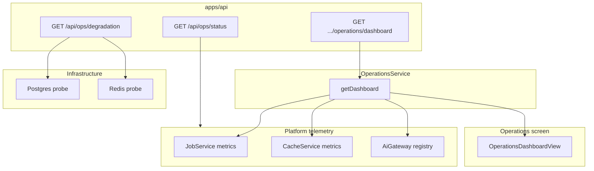

# Operations

**Domain:** Platform telemetry dashboard, queue/cache/AI provider status, degradation probes.

**Primary surfaces:** `OperationsService`, `GET /api/ops/*`, `probeDependencies`, platform health.

---

## Why this domain exists

Operations (UXMD Operations module) gives workspace members **visibility into platform health** — not application logs, but the intelligence infrastructure: job queues, cache hit rates, AI provider availability, audit volume.

This domain answers: *Is the cognitive platform healthy enough to trust recommendations?* Command Center surfaces `platformHealthy`; Operations provides the detail.

---

## How it works (detailed)

### OperationsService

`OperationsService` (`services/auth/src/operations-service.ts`) exposes `getDashboard`:

```typescript
OperationsDashboardView {
  workspaceId,
  systemHealthy,      // all services.healthy
  services[],         // api, auth, cache, jobs
  queue,              // QueueMonitorView
  cache,              // CacheStatusView
  aiProviders[],      // AiProviderStatusSummaryView
  auditEventCount,
  lastCheckedAt
}
```

### Telemetry provider injection

Constructor accepts optional `OperationsTelemetryProvider`:

| Method | Source (production) |
|--------|---------------------|
| `getQueueMetrics` | `JobService.getMetrics()` via platform |
| `getCacheStatus` | `CacheService` metrics |
| `listAiProviderStatus` | `AiGateway` registry status |

Without provider, defaults apply:

```typescript
DEFAULT_QUEUE = { queued: 0, running: 0, completed: 0, failed: 0, deadLetter: 0 }
DEFAULT_CACHE = { provider: "in-memory", healthy: true, hits: 0, misses: 0 }
```

API wires platform metrics into OperationsService at bootstrap.

### Service health heuristics

| Service | Healthy when |
|---------|--------------|
| `api` | Always true if responding |
| `auth` | Always true M4 |
| `cache` | `cache.healthy === true` |
| `jobs` | `queue.deadLetter < 100` |

`systemHealthy` is conjunction of all service flags.

### Degradation probes

Separate from OperationsService dashboard — infrastructure endpoints:

| Endpoint | Implementation |
|----------|----------------|
| `GET /api/ops/status` | `buildOperationalStatus` — queue, cache, DB mode |
| `GET /api/ops/degradation` | `probeDependencies` — Postgres, Redis reachability |

`probeDependencies` (`apps/api/src/infrastructure/dependency-probes.ts`) checks:

- Postgres via `isPostgresReachable` (`services/auth/src/postgres-probe.ts`)
- Redis via `PING` when `REDIS_URL` set

`getPlatformHealthReport` (`services/platform/src/platform-health.ts`) aggregates cognitive metrics snapshot.

### Audit event count

Dashboard includes `auditEventCount` from `repo.listAuditEvents(orgId, { limit: 10_000 })` — org-scoped volume indicator, not full export.

---

## Why alternatives were rejected

| Alternative | Rejection |
|-------------|-----------|
| Embedding ops in each module | Centralized platform view per UXMD |
| Raw Prometheus in user UI | GIS-facing summaries only; raw metrics internal |
| Workspace-agnostic ops only | Dashboard is workspace-scoped for nav consistency |
| Polling external APM for M4 | Built-in telemetry sufficient for closed beta |
| Ops module as intelligence nav item | ADR-0005 seven-item nav |

---

## How it integrates with other domains

| Domain | Integration |
|--------|-------------|
| Platform | Job, cache, AI gateway metrics |
| Command Center | `platformHealthy` flag |
| Jobs | Queue depth, DLQ size |
| AI Gateway | Provider status list |
| Identity | Member access to workspace ops |
| API | Health endpoints separate from workspace dashboard |

---

## How it evolves

| Phase | Enhancement |
|-------|-------------|
| M4 | Static dashboard, basic probes |
| M5 | Real-time metrics streaming |
| P1 | Distributed tracing sink (B2-P2-07) |
| P2 | SLO dashboards, alerting integrations |

`runWithTraceContext` hooks exist; full distributed sink deferred.

---

## Common mistakes

1. **Confusing `/api/health/*` with ops dashboard** — health is liveness/readiness; ops is telemetry |
2. **Expecting per-workspace queue isolation M4** — queue is platform-global |
3. **Treating deadLetter < 100 as hard SLA** — heuristic only |
4. **Skipping telemetry provider wiring in tests** — defaults mask integration issues |
5. **Exposing raw stack traces in ops UI** — GIS error states only |

---

## Implementation examples (real file paths)

| Path | Role |
|------|------|
| `services/auth/src/operations-service.ts` | Dashboard assembly |
| `services/platform/src/platform-health.ts` | Platform health report |
| `apps/api/src/operational-status.ts` | Ops status builder |
| `apps/api/src/infrastructure/dependency-probes.ts` | Degradation probes |
| `services/auth/src/postgres-probe.ts` | Postgres connectivity |
| `apps/api/src/app.ts` | `/api/ops/*` routes |
| `apps/web/src/features/operations/` | Operations screens |

---

## Architectural diagram



---

## Dependencies

| Package | Usage |
|---------|-------|
| `@conquest/contracts` | `OperationsDashboardView`, queue/cache views |
| `@conquest/platform` | Metrics collectors |
| `@conquest/auth` | Audit event access |
| `@conquest/performance` | `OperationalMetricsCollector` |

---

## Operational considerations

- Dashboard is point-in-time — `lastCheckedAt` ISO timestamp
- DLQ threshold 100 is arbitrary safety heuristic — tune in production
- AI provider status shows stub availability M4
- Rate limiting applies to ops endpoints (120/min/IP)
- Member role sufficient for dashboard read

---

## Future expansion

- Per-org resource quotas in dashboard
- Cognitive pipeline phase timing breakdown
- Cost telemetry from ai-audit aggregation
- Incident banner integration
- Export ops snapshot for support tickets

---

*See also: [platform-infrastructure](./platform-infrastructure.md), [jobs-and-async](./jobs-and-async.md), [ai-gateway-and-audit](./ai-gateway-and-audit.md)*
