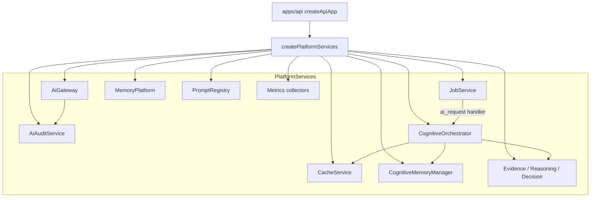

# Platform Infrastructure

**Domain:** `createPlatformServices`, cache, Redis, service composition root.

**Primary surfaces:** `services/platform/src/index.ts`, `cache-provider-factory.ts`, `redis-client.ts`.

---

## Why this domain exists

Domain services (`services/auth`) must not import cognitive, AI, job, and cache implementations directly — that creates a tangled graph and violates ENG-12 package boundaries. `createPlatformServices` is the **composition root** that wires Phase 8–11 platform capabilities for `apps/api`.

This domain answers: *How are cache, jobs, cognitive, gateway, memory, prompts, and metrics assembled into one injectable `PlatformServices` object?*

---

## How it works (detailed)

### createPlatformServices

`services/platform/src/index.ts` exports:

```typescript
export interface PlatformServices {
  cache: CacheService;
  cacheLabel: string;           // "redis" | "in-memory"
  jobs: JobService;
  jobQueueLabel: string;        // "redis" | "in-memory"
  aiGateway: AiGateway;
  aiProvider: AiProviderOrchestrator;
  aiAudit: AiAuditService;
  memory: MemoryPlatform;
  cognitiveMemory: CognitiveMemoryManager;
  metrics: PlatformMetricsCollector;
  cognitiveMetrics: CognitiveMetricsCollector;
  prompts: PromptRegistry;
  evidence: EvidenceEngine;
  reasoning: ReasoningEngine;
  decision: DecisionEngine;
  cognitive: CognitiveOrchestrator;
}
```

### Construction order

1. **Cache** — `createCacheProvider(options)` → `CacheService`
2. **Jobs** — `options.jobService ?? new JobService()`
3. **AI Audit** — `new AiAuditService()`
4. **Metrics** — platform + cognitive collectors
5. **Memory** — `MemoryPlatform` + `CognitiveMemoryManager`
6. **Prompts** — `PromptRegistry` with `ensureDefaults()`
7. **Engines** — Evidence, Reasoning (depends evidence), Decision (depends evidence)
8. **AI Gateway** — with telemetry + cost hooks wired to metrics/audit
9. **Cognitive Orchestrator** — all deps injected
10. **Job handler** — registers `ai_request` → `cognitive.completeQueued`
11. **Metrics hydration** — cache metrics, queue metrics async

### Cache provider factory

`createCacheProvider` (`services/platform/src/cache-provider-factory.ts`):

| Condition | Provider |
|-----------|----------|
| `redisClient` passed | Redis cache via `@conquest/cache` |
| `REDIS_URL` env | Creates Redis client |
| Neither | In-memory cache provider |

`cacheLabel` exposed for ops dashboard display.

### Redis client

`createRedisClient` (`services/platform/src/redis-client.ts`) — shared connection for cache and optionally jobs.

API bootstrap:

```typescript
const platform = deps?.redisClient
  ? createPlatformServices({ redisClient: deps.redisClient, ... })
  : createPlatformServices({ ... });
```

### AI Gateway hooks at composition

Telemetry hook records AI latency to `PlatformMetricsCollector`.

Cost hook writes classified records to `AiAuditService` on completion events.

### Platform health

`getPlatformHealthReport` and `getCognitiveMetricsSnapshot` (`platform-health.ts`) aggregate service states for ops endpoints.

---

## Why alternatives were rejected

| Alternative | Rejection |
|-------------|-----------|
| Domain services importing cognitive directly | Breaks boundary; untestable web graph |
| Multiple composition roots | Single factory ensures consistent wiring |
| Lazy singleton globals | Explicit injection via `createApiApp` |
| Platform as microservice M4 | Monolith sufficient for closed beta |
| Cache optional silent no-op | Explicit label + ops visibility |

---

## How it integrates with other domains

| Domain | Integration |
|--------|-------------|
| API | `createApiApp` calls `createPlatformServices` once |
| Cognitive | Orchestrator returned as `platform.cognitive` |
| Intelligence | API cognitive provider calls `platform.cognitive.run` |
| Operations | Metrics from platform collectors |
| Jobs | Shared JobService instance |
| Auth | Separate — domain never imports platform reverse |

**Forbidden:** `apps/web → platform`, `services/auth → cognitive` (types only where needed).

---

## How it evolves

| Phase | Change |
|-------|--------|
| M4 | Monolith composition |
| M5 | Optional platform service extraction behind RPC |
| P1 | DI container for test overrides |
| P2 | Multi-region cache replication config |

---

## Common mistakes

1. **Creating multiple PlatformServices per request** — single instance per process |
2. **Bypassing factory in tests without injecting jobService** — breaks async cognitive tests |
3. **Assuming Redis always available** — in-memory fallback must work |
4. **Importing platform from web** — forbidden |
5. **Registering job handlers outside factory** — handler registered in factory only |

---

## Implementation examples (real file paths)

| Path | Role |
|------|------|
| `services/platform/src/index.ts` | `createPlatformServices` |
| `services/platform/src/cache-provider-factory.ts` | Cache selection |
| `services/platform/src/redis-client.ts` | Redis connection |
| `services/platform/src/platform-health.ts` | Health aggregation |
| `services/platform/src/platform.test.ts` | Composition tests |
| `apps/api/src/app.ts` | Platform instantiation |
| `packages/cache/` | Cache provider implementations |

---

## Architectural diagram



---

## Dependencies

| Package | Role |
|---------|------|
| `@conquest/cache` | CacheService |
| `@conquest/jobs` | JobService |
| `@conquest/ai-gateway` | Gateway + orchestrator |
| `@conquest/ai-audit` | Audit service |
| `@conquest/memory-service` | Memory platform |
| `@conquest/cognitive` | Engines + orchestrator |
| `@conquest/prompt-management` | Registry |
| `@conquest/performance` | Metrics |

---

## Operational considerations

- `jobQueueLabel` and `cacheLabel` should appear in ops status
- Redis connection failure should fall back gracefully at factory level
- `prompts.ensureDefaults()` runs every cold start — idempotent
- Queue metrics loaded async — ops may show 0 briefly on startup
- Kill switches from `@conquest/config` affect gateway at runtime

---

## Future expansion

- Environment-specific platform profiles (dev/staging/prod)
- Feature-flagged engine variants
- Platform services health self-check endpoint
- Circuit breaker registry at composition root
- Plugin architecture for third-party engines

---

*See also: [cognitive-pipeline](./cognitive-pipeline.md), [jobs-and-async](./jobs-and-async.md), [api-and-runtime](./api-and-runtime.md)*
