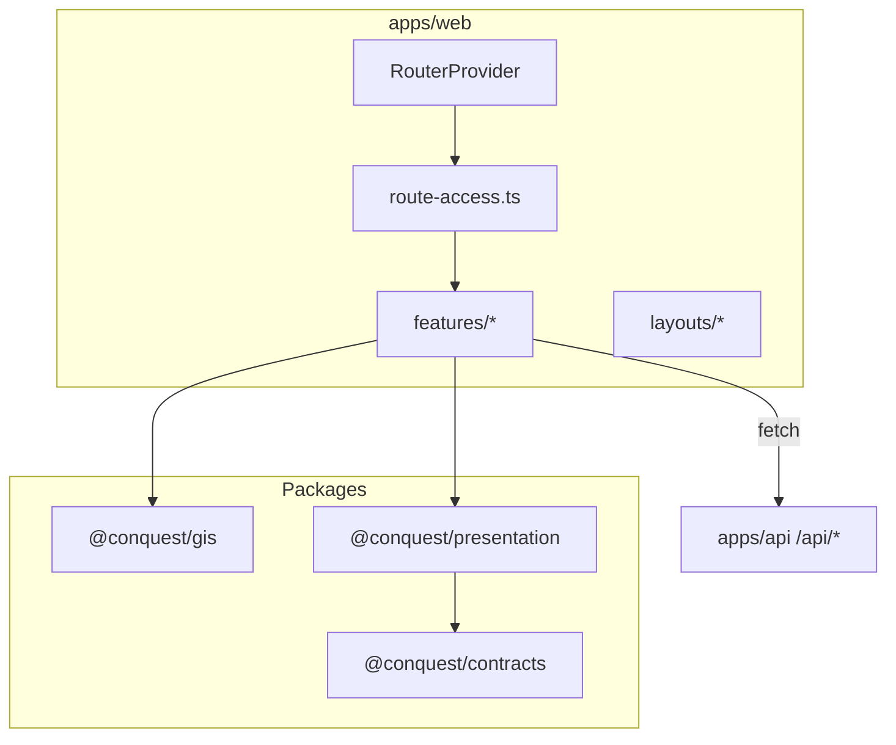

# Presentation and GIS

**Domain:** `apps/web`, `@conquest/presentation`, GIS tokens, route guards, UXMD screen implementation.

**Primary surfaces:** React app shell, `route-access.ts`, `@conquest/gis`, `@conquest/presentation`.

---

## Why this domain exists

Presentation is **rendering only** — no intelligence, no orchestration. Per SDD-I L10 and UXMD, the web app is a Digital Command Center that inherits Global Interaction Standards (GIS) on every screen. Business logic stays in domain services; the web layer fetches structured views and renders GIS-bound components.

This domain answers: *How does the user experience express intelligence without embedding cognitive machinery in the UI?*

---

## How it works (detailed)

### apps/web structure

| Area | Purpose |
|------|---------|
| `src/main.tsx` | React root, `AuthProvider`, `ErrorBoundary` |
| `src/App.tsx` | `RouterProvider` only |
| `src/routes/index.tsx` | Full route tree + layouts |
| `src/auth/` | Session client, guards, `route-access.ts` |
| `src/features/` | Feature screens per UXMD module |
| `src/layouts/` | `RootLayout`, `WorkspaceLayout`, `SettingsLayout` |
| `vite.config.ts` | Dev server, `/api` proxy, workspace aliases |

### Seven-item primary navigation

Per ADR-0005 + `@conquest/gis`:

1. Command Center (`command-center`)
2. Intelligence (`intelligence`)
3. Research (`research`)
4. Automation (`automation`)
5. Strategy Center (`strategy`) — placeholder
6. Operations (`operations`)
7. Settings (`settings`)

Workspace is **context**: `/app/w/:workspaceId/:module` — not nav item #8.

`parseWorkspaceModulePath` and `canAccessModuleRead` enforce module access by role.

### Route guards

`route-access.ts` (`apps/web/src/auth/route-access.ts`) resolves access without side effects:

| Guard | Checks |
|-------|--------|
| `resolveGuestAccess` | Login/signup — redirect if authenticated |
| `resolveVerifyEmailAccess` | Email verification gate |
| `resolveOnboardingAccess` | Onboarding flow |
| `resolveAppShellAccess` | Auth + verified + onboarding + workspace |
| `resolveWorkspaceRouteAccess` | UUID validity, role, module access |

Access reasons: `loading`, `allow`, `unauthenticated`, `unverified`, `onboarding_incomplete`, `no_workspace`, `invalid_workspace`, `forbidden_role`, etc.

Session restored via `fetchSession` on guard evaluation — httpOnly cookie to API.

### @conquest/presentation

`packages/presentation/` — shared GIS-bound React components:

- Depends only on `@conquest/contracts` + `@conquest/gis`
- **No business logic** — props in, JSX out
- Peer dependency on React 18

Presentation components consume contract view types — never raw API shapes.

### @conquest/gis

`packages/gis/` exports:

- Design tokens (colors, spacing, radii, timing, opacity, sizing)
- Navigation constants and route parsers
- `ROLE_RANK` for role comparison
- Module path utilities

**Rule:** No scattered visual constants in feature code — centralize in GIS (ENG-23 accessibility gate).

### GIS inheritance

UXMD-III GIS applies to all screens unless documented override:

- Keyboard navigation
- Screen reader labels
- Reduced motion
- Focus management
- Contrast compliance

### Feature screens

Each module under `apps/web/src/features/`:

- Fetches from `/api/*` endpoints
- Calls `logScreenEvent` for telemetry (UXMD screen IDs)
- Uses presentation components + GIS tokens
- Honest empty/loading/error states per GIS

### Forbidden patterns

Per `.cursor/rules/conquest-design.mdc`:

- Generic sidebar + cards + charts substituting for UXMD screens
- Intelligence machinery as navigation items
- Implementation without GIS accessibility gate

`apps/gateway/public/preview.*` is pipeline demo only — **not** the UXMD application.

---

## Why alternatives were rejected

| Alternative | Rejection |
|-------------|-----------|
| Business logic in React hooks | SDD layering — services own logic |
| web → platform/cognitive imports | ENG-12 forbidden dependency |
| Per-feature color constants | GIS centralization required |
| Workspace as 8th nav item | ADR-0003 workspace is context |
| Archived pre-UXMD design docs | UXMD I–III supreme for UI |

---

## How it integrates with other domains

| Domain | Integration |
|--------|-------------|
| API | All data via `/api` fetch |
| Contracts | View types for props |
| GIS | Tokens, nav, role ranks |
| Identity | Session client, guards |
| All product modules | Feature folders mirror UXMD |

---

## How it evolves

| Phase | Change |
|-------|--------|
| M4 | Full module screens except Strategy placeholder |
| M5 | Strategy Center implementation |
| P1 | Server components evaluation (if framework migration) |
| P2 | HUE-adaptive presentation density |

---

## Common mistakes

1. **Importing @conquest/auth services in web** — types only where exported |
2. **Skipping route guard on new routes** — security hole |
3. **Hardcoded `/app/w/` paths** — use GIS route helpers from contracts |
4. **Inline styles with raw hex** — use GIS tokens |
5. **Treating preview gateway as product UI** — demo only |

---

## Implementation examples (real file paths)

| Path | Role |
|------|------|
| `apps/web/src/routes/index.tsx` | Route tree |
| `apps/web/src/auth/route-access.ts` | Access resolution |
| `apps/web/src/auth/AuthProvider.tsx` | Session context |
| `apps/web/src/layouts/WorkspaceLayout.tsx` | Seven-item nav shell |
| `packages/gis/src/` | Tokens, navigation |
| `packages/presentation/src/` | Shared components |
| `apps/web/src/features/command-center/` | Command Center screen |
| `docs/uxmd/volume-i-user-experience-master-document.md` | UX authority |

---

## Architectural diagram

---

## Dependencies

| Package | Allowed |
|---------|---------|
| `@conquest/contracts` | Yes — view types |
| `@conquest/gis` | Yes — tokens, nav |
| `@conquest/presentation` | Yes — components |
| `@conquest/auth` | Types only |
| `@conquest/platform` | **Forbidden** |
| `@conquest/cognitive` | **Forbidden** |

---

## Operational considerations

- Vite dev proxies `/api` to `:3001`
- Boot splash in `index.html` before JS loads
- `ErrorBoundary` catches render failures — GIS error state
- E2E: Playwright in `e2e/` with webServer config
- Device ID in `localStorage` on login for session binding

---

## Future expansion

- Storybook for presentation package
- Visual regression CI for GIS compliance
- Module-level code splitting per nav item
- Offline shell for read-only views
- Document X operational detail screens

---

*See also: [command-center](./command-center.md), [api-and-runtime](./api-and-runtime.md), [identity-and-tenancy](./identity-and-tenancy.md)*
