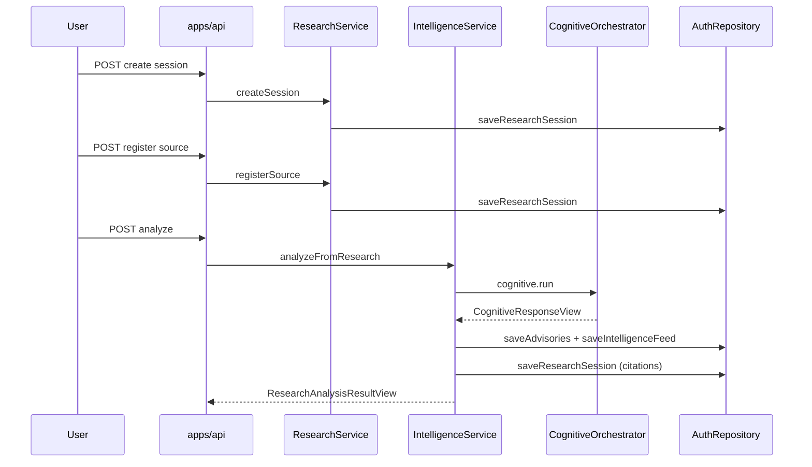

# Research

**Domain:** Structured research sessions, evidence sources, cognitive analyze trigger.

**Primary surfaces:** `ResearchService`, `IntelligenceService.analyzeFromResearch`, research API routes.

---

## Why this domain exists

Conquest is not a prompt box. Research provides a **structured path** from human intent (title, objective) through evidence collection (sources) to machine reasoning (cognitive analyze). This domain answers UXMD Research screens (RSH-*) and bridges human investigation to the intelligence pipeline.

Research sessions are workspace-scoped containers. They do not run AI themselves — they prepare inputs and delegate analysis to Intelligence + Cognitive domains.

---

## How it works (detailed)

### ResearchService operations

`ResearchService` (`services/auth/src/research-service.ts`) manages session CRUD:

| Method | Behavior |
|--------|----------|
| `listSessions` | Workspace-scoped list, sorted by `updatedAt` desc |
| `getSession` | Detail with sources, citations, notes |
| `createSession` | Title required; status `active`; empty sources |
| `registerSource` | Adds source to session + org source registry |
| `listOrgSources` | Org-level source catalog with defaults |

### Session record shape

```typescript
ResearchSessionRecord {
  id, workspaceId, orgId,
  title, status,           // "active"
  sources: ResearchSourceRecord[],
  citations: CitationRecord[],  // populated after analyze
  notes: string,            // recommendation summary after analyze
  createdAt, updatedAt
}
```

### Org source defaults

`ensureOrgSources` seeds two trusted sources when org catalog is empty:

- `src-internal` — Internal knowledge base
- `src-uploads` — Workspace uploads

Users attach sources to sessions via `registerSource`. Sources are org-scoped and reusable across sessions.

### Analyze trigger (cognitive bridge)

Analyze is **not** in ResearchService. The API route chains:

```
POST /api/workspaces/:id/research/sessions/:sid/analyze
  → IntelligenceService.analyzeFromResearch(sessionId, workspaceId, researchSessionId)
    → cognitiveProvider.analyze(TenantScope, { objective, constraints })
      → platform.cognitive.run()
    → materializeFromAnalysis() → advisories + feed items
    → update research session citations + notes
    → update workspace status (dataSourceConnected: true)
```

`objective` is synthesized: `Research session "{title}": synthesize evidence and recommend next actions`.

`constraints` are built from attached sources: `Source: {name} ({type})`.

### Post-analyze persistence

After cognitive completion:

1. New `AdvisoryRecommendationRecord` created with `status: "pending"`
2. Feed items created per evidence item (classified by keyword heuristics)
3. Research session `citations` populated from `evidenceItems`
4. Research session `notes` set to `recommendationSummary`
5. Workspace status updated — transitions Command Center from dormant

### Authorization

All methods require `ROLE_RANK >= member`. `assertOrgAccess` validates research `orgId` matches workspace org.

---

## Why alternatives were rejected

| Alternative | Rejection |
|-------------|-----------|
| ResearchService calling cognitive directly | Violates domain boundaries; Intelligence owns materialization |
| Inline LLM in research routes | Forbidden — must go through platform.cognitive |
| Per-session source isolation only | Org source registry enables reuse and trust flags |
| Auto-analyze on source add | User must explicitly trigger analyze (intentional action) |
| Separate research DB tables for citations | Consolidated in research session JSON via repository |

---

## How it integrates with other domains

| Domain | Integration |
|--------|-------------|
| Intelligence | `analyzeFromResearch`, feed/advisory materialization |
| Cognitive pipeline | `platform.cognitive.run` via API cognitive provider |
| Command Center | Feed items appear in zones after analyze |
| Identity | Session + workspace access checks |
| Memory | Cognitive pipeline retrieves workspace memory during analyze |
| Contracts | `CreateResearchSessionSchema`, `RegisterResearchSourceSchema` |

---

## How it evolves

| Phase | Capability |
|-------|------------|
| M4 | Manual source registration, deterministic cognitive analyze |
| M5 | File upload sources, web crawl via Firecrawl integration |
| P1 | Source trust scoring from verification engine |
| P2 | Collaborative research sessions (multi-user) |

Async analyze (`cognitive.run({ async: true })`) supported at platform level; research route uses sync path M4.

---

## Common mistakes

1. **Calling `platform.cognitive` from ResearchService** — use Intelligence bridge
2. **Expecting analyze without sources** — works but produces minimal evidence
3. **Confusing auth sessionId with researchSessionId** — different identifiers
4. **Skipping org access on `findResearchSession`** — cross-tenant leak risk
5. **Assuming research notes are user-editable pre-analyze** — notes overwritten by analyze result

---

## Implementation examples (real file paths)

| Path | Role |
|------|------|
| `services/auth/src/research-service.ts` | Session CRUD, sources |
| `services/auth/src/intelligence-service.ts` | `analyzeFromResearch`, `materializeFromAnalysis` |
| `apps/api/src/app.ts` | Research routes + analyze endpoint |
| `apps/web/src/features/research/` | Research UI screens |
| `packages/contracts/src/research/` | Schemas and view types |
| `services/auth/src/memory-repository.ts` | `ResearchSessionRecord` types |

---

## Architectural diagram



---

## Dependencies

| Package | Usage |
|---------|-------|
| `@conquest/contracts` | Research schemas, `ResearchAnalysisResultView` |
| `@conquest/core` | `assertOrgAccess`, `TenantScope` |
| `@conquest/gis` | `ROLE_RANK` |
| `@conquest/auth` | Repository interface |
| `@conquest/platform` | Cognitive orchestrator (via API wiring) |

---

## Operational considerations

- Research sessions persist until explicitly deleted (delete not exposed M4 UI)
- Analyze is CPU-bound synchronous request — may timeout on slow cognitive path
- Correlation ID forwarded from request header for traceability
- Empty org sources auto-seeded on first list — idempotent
- Research list sorts by `updatedAt` — analyze updates timestamp

---

## Future expansion

- Document upload pipeline with blob storage
- Source provenance and verification status
- Research session templates by workspace type
- Batch analyze across multiple sessions
- Integration with Knowledge module (placeholder)

---

*See also: [intelligence](./intelligence.md), [cognitive-pipeline](./cognitive-pipeline.md), [command-center](./command-center.md)*
