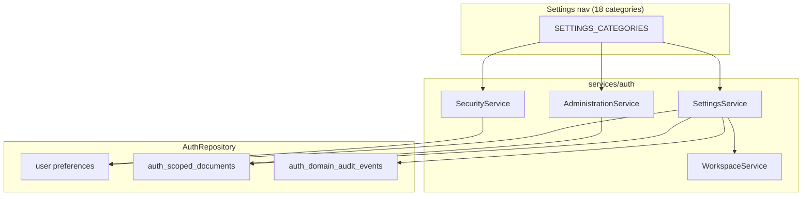

# Settings and Administration

**Domain:** 18 settings screens, org/workspace configuration, feature flags, admin dashboard.

**Primary surfaces:** `SettingsService`, `AdministrationService`, `SETTINGS_CATEGORIES`, SecurityService.

---

## Why this domain exists

Settings is the **control plane** for users and administrators — account, security, team, billing, AI/memory/automation policies, and org administration. Per UXMD, Settings is nav item #7 with 18+ categorized screens.

Administration is a **subset** of Settings (admin role) for feature flags and org-wide security posture — not a separate nav item.

This domain answers: *How is the workspace and organization configured, and who may change what?*

---

## How it works (detailed)

### SETTINGS_CATEGORIES (18 screens)

Defined in `packages/contracts/src/settings/types.ts`:

| ID | Label | Min role | Workspace scoped |
|----|-------|----------|------------------|
| `account` | Account | viewer | No |
| `security` | Security | viewer | No |
| `notifications` | Notifications | viewer | No |
| `privacy` | Privacy | viewer | No |
| `appearance` | Appearance | viewer | No |
| `billing` | Billing | owner | No |
| `integrations` | Integrations | admin | No |
| `workspace` | Workspace | manager | Yes |
| `sources` | Data sources | manager | Yes |
| `goals` | Goals & projects | manager | Yes |
| `team` | Team | manager | Yes |
| `advanced` | Advanced / AI | viewer | No |
| `memory` | Memory controls | admin | No |
| `automation-policies` | Automation policies | admin | No |
| `organization` | Organization | admin | No |
| `administration` | Administration | admin | No |
| `activity` | Activity log | manager | No |

`SettingsService.listCategories` filters by `ROLE_RANK` and `activeWorkspaceId` for workspace-scoped routes. Dynamic route substitution for workspace/team/sources/goals.

### SettingsService domains

`SettingsService` (`services/auth/src/settings-service.ts`) handles:

- **Account** — profile, preferences, theme validation
- **Notifications** — category toggles, quiet hours
- **Privacy** — export/deletion requests (stub fulfillment M4)
- **Organization** — org settings, member invites, role updates
- **Billing** — stub plan view (owner only)
- **Integrations** — stub integration list (admin)
- **Automation policies** — `getAutomationPolicies`, emergency disable
- **AI controls** — model preferences, cost caps (org-scoped JSON)
- **Memory controls** — retention, segment toggles

Workspace-scoped settings delegate to `WorkspaceService` (team, sources, goals).

### SecurityService (companion)

`SecurityService` (`services/auth/src/security-service.ts`) covers:

- Password change, MFA enrollment
- Trusted devices
- Active sessions list/revoke
- Security preferences

Rendered under Settings → Security, separate service for separation of concerns.

### AdministrationService

`AdministrationService` (`services/auth/src/administration-service.ts`) — admin-only:

**`getDashboard`** returns:

- Org name, member/workspace counts
- Feature flags (with `ensureFeatureFlags` defaults)
- Provider status summary (OpenAI, Anthropic, Gemini — configured stubs M4)
- Security posture: MFA enrolled count, active sessions, recent security events

**`updateFeatureFlag`** — toggles org feature flags:

| Default flag | Purpose |
|--------------|---------|
| `intelligence_feed` | Intelligence module signals |
| `research_workspace` | Research sessions |
| `ai_gateway` | Routed AI provider calls |

Flags persist via `repo.saveFeatureFlags(orgId, flags)` in scoped documents.

### Role enforcement pattern

```typescript
if (ROLE_RANK[user.role] < ROLE_RANK.admin) {
  throw new Error("Admin access required");
}
```

GIS `ROLE_RANK`: viewer < member < manager < admin < owner.

---

## Why alternatives were rejected

| Alternative | Rejection |
|-------------|-----------|
| Administration as 8th nav item | ADR-0005 — lives under Settings |
| Per-screen microservices | Monolith services/auth sufficient M4 |
| Client-only role gating | Server enforces on every mutation |
| Hardcoded settings routes in web | `SETTINGS_CATEGORIES` single source |
| Billing/integration live M4 | Stubs honest; external integrations M5+ |

---

## How it integrates with other domains

| Domain | Integration |
|--------|-------------|
| Identity | Session, user, org context |
| Workspace | Team, sources, goals screens |
| Automation | Policies affect `manualRun` permissions |
| Cognitive | AI controls affect gateway policies (future) |
| Memory | Memory controls → `CognitiveMemoryManager` governance |
| Audit | Activity log reads `auth_domain_audit_events` |
| Legal | Legal acceptance via `LegalService` |

---

## How it evolves

| Phase | Change |
|-------|--------|
| M4 | 18 screens, stub billing/integrations |
| M5 | Live Stripe billing, OAuth integrations |
| P1 | Granular RBAC permissions beyond 5 roles |
| P2 | Settings audit diff history |

---

## Common mistakes

1. **Showing workspace settings without activeWorkspaceId** — filtered from categories |
2. **Viewer accessing billing** — owner only |
3. **Skipping feature flag check in modules** — flags exist but not all modules gate M4 |
4. **Confusing SecurityService with IdentityService** — security is credential/MFA |
5. **Hardcoding 18 — count from SETTINGS_CATEGORIES** — source of truth |

---

## Implementation examples (real file paths)

| Path | Role |
|------|------|
| `services/auth/src/settings-service.ts` | Settings CRUD |
| `services/auth/src/settings-extended.test.ts` | Extended settings tests |
| `services/auth/src/administration-service.ts` | Admin dashboard, flags |
| `services/auth/src/security-service.ts` | MFA, sessions, passwords |
| `packages/contracts/src/settings/types.ts` | `SETTINGS_CATEGORIES` |
| `apps/web/src/layouts/SettingsLayout.tsx` | Settings shell |
| `apps/web/src/features/settings/` | SET-* screens |

---

## Architectural diagram



---

## Dependencies

| Package | Usage |
|---------|-------|
| `@conquest/contracts` | Settings schemas, categories |
| `@conquest/gis` | `ROLE_RANK`, route helpers |
| `@conquest/auth` | Repository, notifications |

---

## Operational considerations

- Privacy export/deletion records timestamp only — fulfillment manual M4
- Theme preference validated against `light | dark | system`
- Org member invite emails via NotificationService
- Feature flag defaults seeded once per org idempotently
- Activity log limited query — pagination future

---

## Future expansion

- SSO configuration screen
- API key management for integrations
- Custom role builder
- Settings change approval workflow (enterprise)
- Workspace template library

---

*See also: [identity-and-tenancy](./identity-and-tenancy.md), [automation](./automation.md), [memory-system](./memory-system.md)*
