# Visual Architecture Atlas

**Institutional memory — diagrams for every major layer, boundary, and flow**

This atlas complements the [Engineering Decision Encyclopedia](./03-engineering-decision-encyclopedia.md) with **visual models** and explanatory prose: why each structure exists, how it works today, what was rejected, integration points, evolution paths, common mistakes, and operational notes.

**As-built reference:** [`docs/project-brain/06-repository-architecture.md`](../project-brain/06-repository-architecture.md), [`07-runtime-architecture.md`](../project-brain/07-runtime-architecture.md).

---

## 1. Authority hierarchy

**Why:** Without a single conflict-resolution chain, product, experience, and engineering documents produce contradictory implementations. ADR-0001 freezes `CCIS > AMD > PDD > UXMD > SDD`. ADR-0013 (Authority Bridge) governs conditional PDD-I authority without altering this chain.

**How today:** Agents read Project Brain → institutional memory → frozen architecture. UI work cites UXMD I–III. Code conforms to SDD layers. Build Authorization (BAR) gates implementation scope below the document stack.

**Rejected:** Engineering-first hierarchy (SDD > PDD); flat peer documents; ignoring CCIS for "pragmatic" shortcuts.

**Integration:** `AGENTS.md`, `docs/architecture/ARCHITECTURE-FREEZE.md`, `.cursor/rules/conquest-cios.mdc`, `.cursor/rules/conquest-design.mdc`.

**Evolution:** New document families (e.g., API Design Authority) require ADR-0001 amendment. CCIS v2.0 triggers full chain revalidation.

**Mistakes:** Treating `apps/gateway/public/preview.*` as UXMD application; citing archived pre-UXMD design; letting spike code override GIS.

**Operations:** Class A change control for Accepted ADR and freeze amendments.

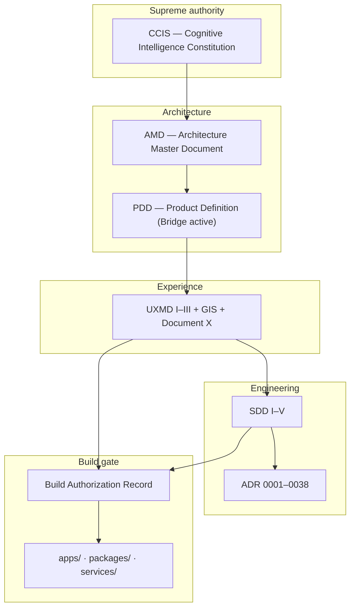

---

## 2. Monorepo package dependency graph

**Why:** Layered architecture (ADR-0014, ADR-0020) requires explicit dependency direction. Presentation must not import cognitive or platform services. API is the composition boundary for domain + platform.

**How today:** `pnpm-workspace.yaml` defines `apps/`, `packages/`, `services/`. `scripts/build.mjs` topological build. Forbidden flows documented in Project Brain Ch. 06 §8.

**Rejected:** `web → cognitive`; `web → platform`; `api → duplicate domain logic`; circular package dependencies.

**Integration:** All `@conquest/*` packages; `apps/api`, `apps/web`.

**Evolution:** New packages must declare single responsibility and fit layer model. Visualization-config deferred consumers in Build-2.

**Mistakes:** Importing `services/cognitive` from `apps/web`; duplicating Zod schemas outside `@conquest/contracts`.

**Operations:** `pnpm build` before `pnpm test:e2e`. CI runs typecheck across workspace.

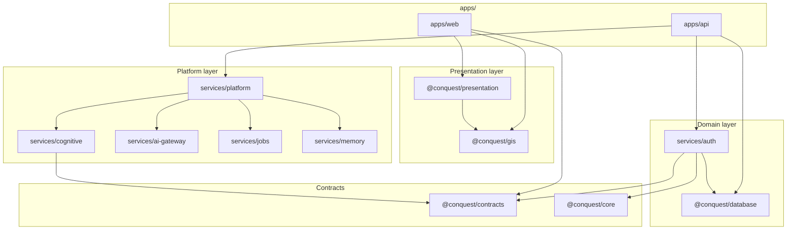

---

## 3. Request lifecycle (browser to database)

**Why:** Enterprise auditability requires traceable request paths with session-validated tenant context (ADR-0016, ADR-0017). Zero-trust zones (ADR-0020) prohibit client → data direct access.

**How today:** Browser loads Vite/React app. `/api` proxied to Hono API `:3001`. Middleware stack: correlation → security headers → timing → audit → rate limit → CORS → handler. Domain services and platform services query Postgres via Drizzle. Redis optional for cache/jobs.

**Rejected:** Client-side DB access; skipping session validation for `orgId`; intelligence API exposed without gateway middleware.

**Integration:** `apps/web`, `apps/api/src/app.ts`, `apps/api/src/server.ts`, `services/auth`, `services/database`.

**Evolution:** Postgres RLS (P1) adds data-layer enforcement. Edge functions would insert new zone per ADR-0020 amendment.

**Mistakes:** Trusting `workspaceId` from JSON without session match; missing correlation headers in downstream calls.

**Operations:** Rate limit 120/min/IP (skipped in vitest). Migrations auto on API startup when `DATABASE_URL` set. `MEMORY_REPO=true` uses in-memory auth repo for CI.

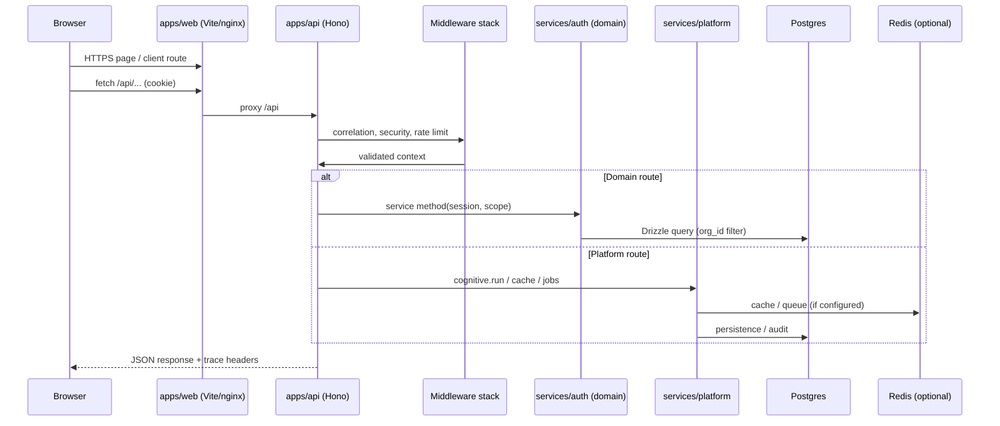

---

## 4. Cognitive pipeline flow

**Why:** CCIS cognitive lifecycle order is frozen (ADR-0007). Verification before release (ADR-0006). Evidence-first reasoning (ADR-0031). Production orchestration uses `CognitiveOrchestrator` — not legacy `PipelineRunner` (ADR-0037).

**How today:** `platform.cognitive.run({ scope, input, async? })` executes: memory → prompt → evidence → reasoning → decision → persistence → audit. Cache hit short-circuits. Async path enqueues `ai_request` job. `executionReady: false` on all decisions (ADR-0038).

**Rejected:** Decide before Verify; narrative-first reasoning; `PipelineRunner` on API path; silent verification skip.

**Integration:** `services/cognitive/`, `services/platform/src/index.ts`, `@conquest/contracts` cognitive schemas.

**Evolution:** Full SDD-IV stage routing with Challenge, Reflection, formal VRF agent. Build-2 may enable conditional execution authorization.

**Mistakes:** Business logic inside orchestrator class; bypassing evidence engine; treating Challenge as VRF.

**Operations:** Graceful cache degradation on outage. Chaos tests in Phase 11C. Cognitive metrics on health endpoint.

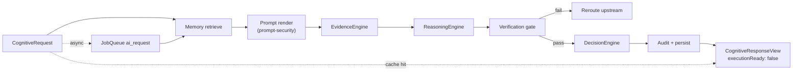

---

## 5. Platform composition (`createPlatformServices`)

**Why:** ADR-0037 requires composable cognitive services wired through a single composition root. ADR-0011 mandates AI abstraction behind gateway. ADR-0038 registers job handler for async cognitive completion.

**How today:** `createPlatformServices()` in `services/platform/src/index.ts` constructs cache, jobs, aiGateway, aiAudit, memory, cognitiveMemory, prompts, evidence, reasoning, decision, aiProvider, cognitive orchestrator, and metrics collectors. Cache provider from env factory (Redis when injected, else in-memory).

**Rejected:** Per-route manual wiring; duplicate platform instances; direct provider SDK in composition root consumers.

**Integration:** `apps/api/src/app.ts` calls `createPlatformServices()` at bootstrap. Tests inject overrides via `PlatformServicesOptions`.

**Evolution:** Additional platform services (execution engine, event bus) register here without changing API route structure.

**Mistakes:** Instantiating `CognitiveOrchestrator` outside platform root; skipping `jobs.registerHandler` for async path.

**Operations:** `cacheLabel` and `jobQueueLabel` exposed for ops status. Platform health aggregated at `/api/health`.

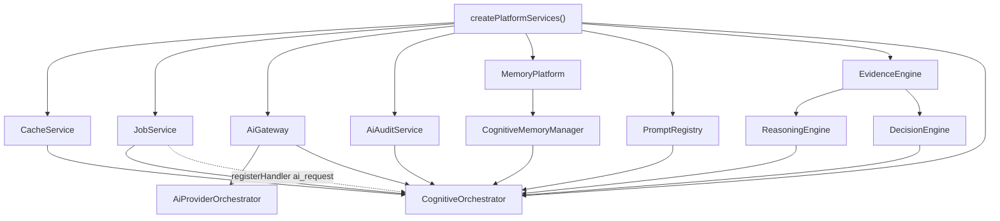

---

## 6. Tenant isolation boundaries

**Why:** ADR-0016 freezes `org_id` as hard tenant boundary. Workspace scopes within org (ADR-0003). Cross-org events forbidden (EP-6). Defense in depth — not RLS alone.

**How today:** Session carries `orgId` and `active_workspace_id`. `TenantScope` on all platform operations. API rejects scope mismatches. Drizzle repositories filter by org. E2E tests verify isolation (Phase 11A).

**Rejected:** Workspace as tenant replacement; optional org filters; client-supplied org authority.

**Integration:** `@conquest/core`, `services/auth`, all `services/*` accepting `TenantScope`, Postgres schema with `org_id` columns.

**Evolution:** Postgres RLS (P1). Org cells for blast-radius reduction. Regional data residency ADR.

**Mistakes:** New table without `org_id`; cross-org job payloads; logging data from wrong tenant in shared buffer.

**Operations:** Penetration test scope per org. Backups org-partitioned (ADR-0021). SEV-1 cross-tenant triggers emergency lock.

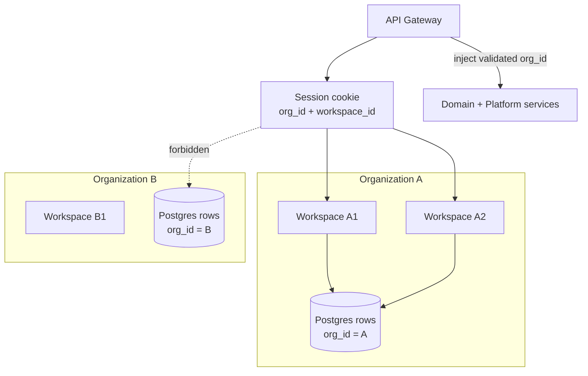

---

## 7. Intelligence data flow (research → feed)

**Why:** Intelligence surfaces in Command Center must trace to governed cognitive pipeline output — not ad-hoc LLM calls (ADR-0011, ADR-0031). Research module builds structured input; orchestrator produces explainable recommendations.

**How today:** `POST /api/workspaces/:id/research/sessions/:sid/analyze` → `ResearchService` builds cognitive input → `platform.cognitive.run()` → evidence → reasoning → decision → results persisted → intelligence feed → Command Center dashboard reads feed.

**Rejected:** Direct provider call from research handler; narrative recommendations without `evidenceRefs`; intelligence API from browser.

**Integration:** `services/auth` research + intelligence services; `services/platform`; `apps/api` research routes; `apps/web` Command Center features.

**Evolution:** Build-2 RTM-INT cognitive integration deepens feed freshness and async analyze paths.

**Mistakes:** Seeding fake recommendations without pipeline audit; skipping persistence before feed read; missing correlation ID on analyze.

**Operations:** Async analyze completes via `ai_request` job handler. Feed shows honest empty state per GIS when no verified intelligence.

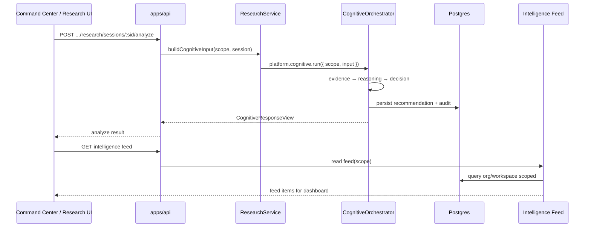

---

## 8. Automation: audit-only today vs future execution

**Why:** ADR-0015 separates Execution Layer from Intelligence. Build-1/Build-2 M4 prohibits autonomous side effects. Automation module is product surface; execution is platform capability requiring VRF pass and authorization.

**How today:** `POST .../automation/workflows/:id/run` → `AutomationService.manualRun` → writes `auth_executions` audit record → returns deferred-execution message. **No external side effects.** Cognitive decisions have `executionReady: false`.

**Rejected:** Workflow run triggering integrations now; intelligence engines executing directly; execute before verify.

**Integration:** `services/auth` automation services; `auth_executions` table; future Execution Layer per SDD III.

**Evolution:** Build-2 M5+ BAR may authorize execution engines with human gates (BH-9), idempotency keys, rollback paths.

**Mistakes:** Implementing Zapier/webhook side effects before BAR; conflating Automation UI with Execution Layer; skipping audit record.

**Operations:** Manual run is audit trail only — ops must not expect external effect. Kill switches (INF-22) for future runaway execution.

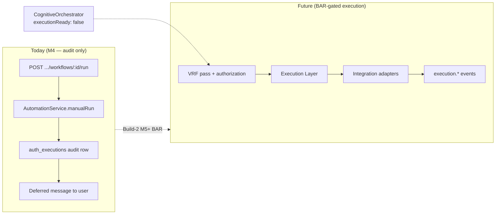

---

## 9. Deployment topology (docker-compose)

**Why:** Local and CI environments need reproducible Postgres + Redis dependencies (ADR-0021, ADR-0022). Production stack defined separately in `docker-compose.prod.yml`.

**How today:** `docker-compose.yml` runs Postgres 16 and Redis 7 with healthchecks. API and web run via `pnpm dev` on host (or containers in prod compose). `DATABASE_URL` and `REDIS_URL` configure persistence and optional cache/jobs.

**Rejected:** Embedded SQLite as production store; hard dependency on Redis without in-memory fallback; single container monolith for prod.

**Integration:** `docker-compose.yml`, `docker-compose.prod.yml`, `apps/api/Dockerfile.api`, Netlify deploy for web.

**Evolution:** Production N+2 Gateway/Auth, queue workers, replicated Postgres per ADR-0022.

**Mistakes:** Committing production credentials to compose files; assuming Redis always available; skipping healthchecks in orchestration.

**Operations:** `pg_isready` and `redis-cli ping` healthchecks. Volume `conquest_pg_data` persists local dev data. Migrations on API startup.

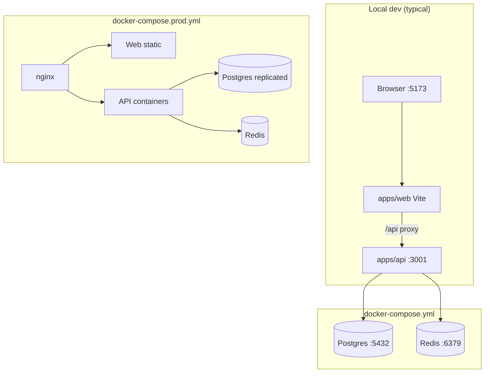

---

## 10. Documentation corpus layers

**Why:** Conquest is documentation-governed (ADR-0001). Institutional memory (Recovery Phase 4) preserves reasoning for cold-start architects and AI agents without chat history.

**How today:** `docs/project-brain/` is supreme engineering memory. `docs/institutional-memory/` is permanent knowledge system. `docs/architecture/` holds frozen law. `docs/build-2/` tracks milestones and blockers. `apps/` is as-built runtime.

**Rejected:** Chat history as authority; spike code as architecture source; archived docs for active UI decisions.

**Integration:** Cross-links between corpora. `AGENTS.md` points agents to Project Brain 01 + 16 + 18, then `ai-agent-onboarding.md`.

**Evolution:** Living Knowledge Graph (doc 10) indexes all concepts. New ADRs update encyclopedia + atlas.

**Mistakes:** Updating only code without institutional memory; treating PROTOTYPE.md spike as production; skipping cross-reference validation.

**Operations:** Build-2 M5 gated on BAR blockers — documentation does not block M5 per Project Brain README.

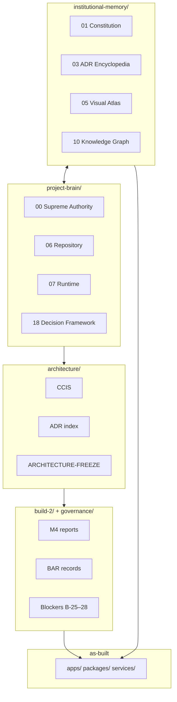

---

## 11. Module navigation map

**Why:** ADR-0005 freezes seven primary nav items. ADR-0014 defines module bounded contexts. Intelligence machinery never appears in navigation (NAV-3). ADR-0036 places intelligence, research, ops, admin as logical modules under Command Center or Settings.

**How today:** `@conquest/gis` exports nav constants and `parseWorkspaceModulePath`. `apps/web` routes organized by module under `/workspaces/:id/:module/...`. Utility paths: Support, Billing, Profile, Workspace selector.

**Rejected:** Eighth nav item for Research/Memory/Models; Intelligence Center label; workspace as nav #8.

**Integration:** `packages/gis/src/nav.ts`, `modules.ts`, `permissions.ts`; `apps/web/src/routes/index.tsx`; `apps/web/src/auth/route-access.ts`.

**Evolution:** Marketplace extensions add capability without nav items. Mobile collapses presentation — not item count.

**Mistakes:** Adding sidebar item for cognitive engines; routing ops to primary nav; breaking seven-item freeze in RootLayout.

**Operations:** Nav changes are Class A freeze violations — escalate before merge.

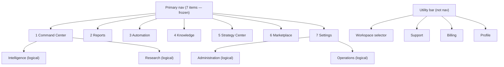

---

## 12. Auth / session flow

**Why:** ADR-0017 mandates server-side sessions with GIS RBAC fail-closed behavior. ADR-0016 requires session-bound `org_id` — never client-only authority.

**How today:** httpOnly cookie session. Postgres `auth_server_sessions` or memory CI store. `fetchSession` on route guard. `RequireGuest` / `RequireAuth` / workspace guards in `apps/web/src/auth/`. Device ID in `localStorage` on login. API validates session before handlers.

**Rejected:** Pure stateless JWT without revocation; client-side session authority; per-module auth; long-lived tokens without rotation.

**Integration:** `services/auth`, `apps/web/src/auth/`, `apps/api` session middleware, `@conquest/gis` `canAccessModuleRead`.

**Evolution:** SSO via Integration IdP. MFA step-up for high-stakes execution. Passkey enterprise support.

**Mistakes:** Storing tokens in localStorage; skipping email verification guard; guest access to intelligence routes.

**Operations:** Mass session revoke on SEV-1. Sliding TTL with refresh rotation. MFA hooks per org policy.

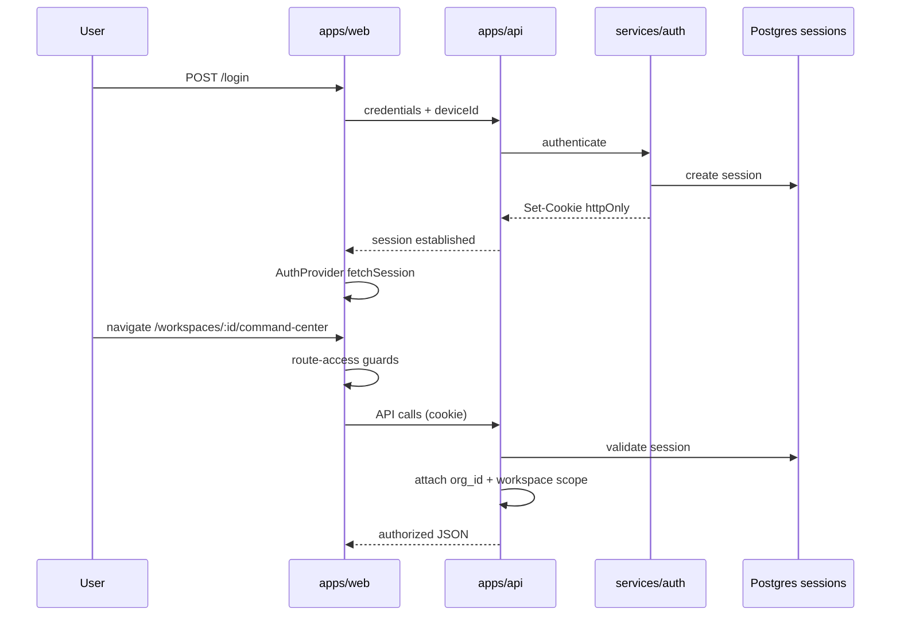

---

## 13. Job queue architecture

**Why:** ADR-0010 event-driven architecture requires async intelligence cycles. ADR-0034 classified failure recovery includes async completion and DLQ. ADR-0038 registers `ai_request` handler on platform composition root.

**How today:** `JobService` in `services/jobs/` with Redis store when `REDIS_URL` set, else in-memory. Cognitive async path enqueues `{ type: 'ai_request', payload: { kind: 'cognitive.run', ... } }`. Handler invokes `CognitiveOrchestrator.completeAsync()`. DLQ for failed jobs. Ops status at `/api/ops/status`.

**Rejected:** Blocking HTTP for long cognitive runs without async option; unbounded retry loops; dropping partial job audit on failure.

**Integration:** `services/jobs/`, `services/platform/src/index.ts`, `services/cognitive/`, Redis in `docker-compose.yml`.

**Evolution:** Horizontal queue workers per ADR-0022. Per-org fairness scheduling on shared workers.

**Mistakes:** Not registering job handler at startup; assuming Redis always present; missing `correlationId` on enqueue.

**Operations:** Queue depth monitored at ops endpoints. Idempotent handlers required (EP-2 at-least-once). Graceful fallback when Redis unavailable.

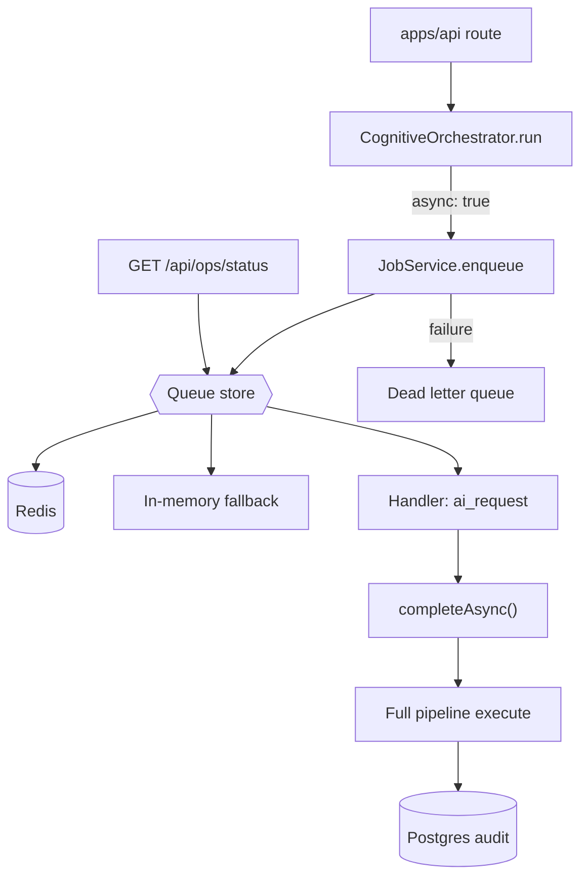

---

## Diagram index

| # | Diagram | Primary ADRs |
|---|---------|--------------|
| 1 | Authority hierarchy | 0001, 0013 |
| 2 | Monorepo dependencies | 0014, 0020 |
| 3 | Request lifecycle | 0016, 0017, 0020 |
| 4 | Cognitive pipeline | 0006, 0007, 0031, 0037 |
| 5 | Platform composition | 0037, 0038, 0011 |
| 6 | Tenant isolation | 0016, 0003 |
| 7 | Research → feed | 0031, 0036, 0011 |
| 8 | Automation audit vs execution | 0015, 0038 |
| 9 | Deployment topology | 0021, 0022 |
| 10 | Documentation corpus | 0001 |
| 11 | Module navigation | 0005, 0014, 0036 |
| 12 | Auth / session | 0017, 0012 |
| 13 | Job queue | 0010, 0034, 0038 |

---

## Maintenance

When architecture changes:

1. Update relevant mermaid diagrams in this atlas
2. Update [Engineering Decision Encyclopedia](./03-engineering-decision-encyclopedia.md) entries
3. Sync [`docs/project-brain/06-repository-architecture.md`](../project-brain/06-repository-architecture.md) and [`07-runtime-architecture.md`](../project-brain/07-runtime-architecture.md)
4. Amend source ADR if decision changed — Class A if Accepted

---

*Institutional Memory — Recovery Phase 4. Visual models reflect Build-2 M4 as-built runtime.*
