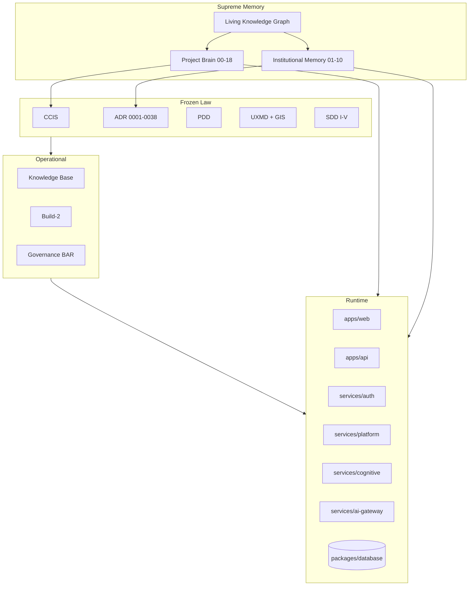
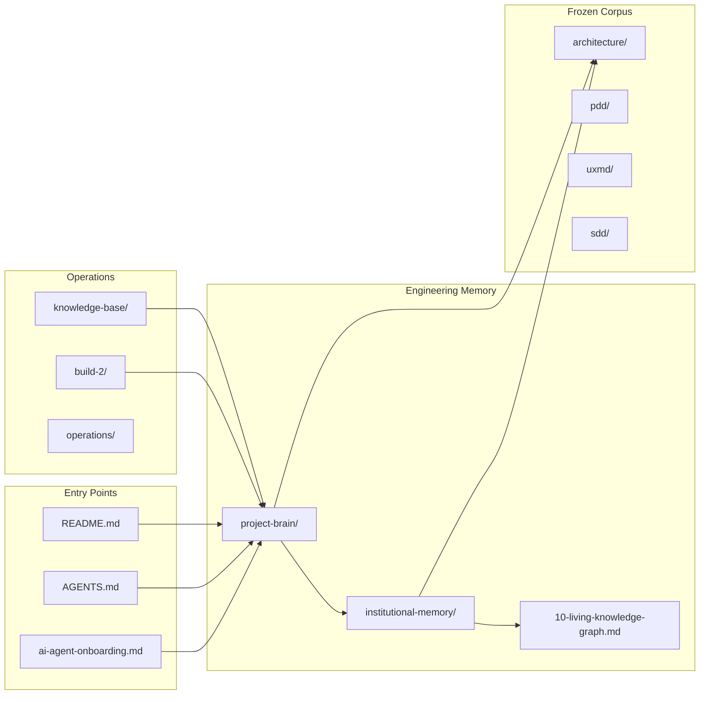

# Living Knowledge Graph

**Institutional Memory Corpus — Document 10**

The master cross-reference index for all Conquest engineering knowledge. Every node links to authoritative documents. **No concept should exist only in chat history.**

---

## 1. Graph purpose

### Why this exists

Documentation without linkage becomes orphan knowledge. Architects rediscover the same decisions, repeat the same mistakes, and drift toward category error. The Living Knowledge Graph is the **navigation layer** that connects:

- Institutional memory (this corpus)
- Project Brain (chapters 00–18)
- Frozen normative law (CCIS, ADR, PDD, UXMD, SDD)
- Operational knowledge base
- Build program state
- Runtime code

### How to use it

1. Start at a **concept node** (e.g., "Tenant isolation")
2. Follow **outbound links** to constitution rules, ADRs, domain encyclopedia, code paths
3. Follow **inbound links** to see what depends on the concept
4. Never implement without visiting at least: Constitution article → ADR → Domain file → Test

---

## 2. Master concept graph



---

## 3. Concept registry (A–Z)

Each row: **Concept** → Primary doc → ADR → Domain → Code → Tests

| Concept | Institutional Memory | Project Brain | ADR | Domain Encyclopedia | Code anchor | Tests |
|---------|---------------------|---------------|-----|---------------------|-------------|-------|
| **AI provider abstraction** | [03 §0011](./03-engineering-decision-encyclopedia.md) | [09](./../project-brain/09-ai-provider-architecture.md) | ADR-0011 | [ai-gateway-and-audit](./04-domain-encyclopedia/ai-gateway-and-audit.md) | `services/ai-gateway/` | `gateway.test.ts` |
| **Architectural judgment** | [18 framework](../project-brain/18-architectural-decision-framework.md) | Ch 18 | — | — | — | continuity test |
| **Automation audit-only** | [08 §execution](./08-failure-encyclopedia.md) | [12](./../project-brain/12-governance-and-execution-boundaries.md) | ADR-0015 | [automation](./04-domain-encyclopedia/automation.md) | `automation-service.ts` | `automation-service.test.ts` |
| **Category error (AI wrapper)** | [02](./02-intelligence-philosophy-manual.md) | [01, 16](./../project-brain/01-philosophy-and-identity.md) | ADR-0037 | — | `cognitive-orchestrator.ts` | cognitive tests |
| **Command Center** | [06 UX §CC](./06-ux-intelligence-bible.md) | [05, 11](./../project-brain/05-product-architecture.md) | ADR-0002 | [command-center](./04-domain-encyclopedia/command-center.md) | `command-center-integration.ts` | CC tests |
| **Constitution (engineering law)** | [01](./01-conquest-constitution.md) | [15](./../project-brain/15-engineering-standards.md) | — | — | — | CI gates |
| **Cognitive pipeline** | [02](./02-intelligence-philosophy-manual.md) | [08](./../project-brain/08-cognitive-architecture.md) | ADR-0026, 0007 | [cognitive-pipeline](./04-domain-encyclopedia/cognitive-pipeline.md) | `cognitive-orchestrator.ts` | `cognitive-orchestrator.test.ts` |
| **Contracts (Zod)** | [01 Art VII](./01-conquest-constitution.md) | [06](./../project-brain/06-repository-architecture.md) | ADR-0014 | — | `packages/contracts/` | contract tests |
| **Drizzle persistence** | [03 §M2](./03-engineering-decision-encyclopedia.md) | [10](./../project-brain/10-data-architecture.md) | — | [data-persistence](./04-domain-encyclopedia/data-persistence.md) | `drizzle-repository.ts` | `auth-repository.contract.test.ts` |
| **Evidence-first reasoning** | [02](./02-intelligence-philosophy-manual.md) | [03](./../project-brain/03-intelligence-model.md) | ADR-0031 | [cognitive-pipeline](./04-domain-encyclopedia/cognitive-pipeline.md) | `evidence-engine.ts` | cognitive tests |
| **Execution separation** | [09 §M5](./09-future-vision-encyclopedia.md) | [12](./../project-brain/12-governance-and-execution-boundaries.md) | ADR-0015 | [automation](./04-domain-encyclopedia/automation.md) | `decision-engine.ts` | phase7-governance |
| **Failure: RouterProvider** | [08](./08-failure-encyclopedia.md) | [16](./../project-brain/16-common-misconceptions.md) | — | [presentation-and-gis](./04-domain-encyclopedia/presentation-and-gis.md) | `RootLayout.tsx` | `App.runtime.test.tsx` |
| **Failure: ensureSeed** | [08](./08-failure-encyclopedia.md) | [16](./../project-brain/16-common-misconceptions.md) | — | [intelligence](./04-domain-encyclopedia/intelligence.md) | (removed) | intelligence tests |
| **GIS / design tokens** | [06](./06-ux-intelligence-bible.md) | [11](./../project-brain/11-ux-architecture.md) | ADR-0012 | [presentation-and-gis](./04-domain-encyclopedia/presentation-and-gis.md) | `packages/gis/` | visual lint |
| **Governance BAR** | [09](./09-future-vision-encyclopedia.md) | [12](./../project-brain/12-governance-and-execution-boundaries.md) | ADR-0025 | — | `docs/governance/` | — |
| **Identity & sessions** | [01 Art IV](./01-conquest-constitution.md) | [07](./../project-brain/07-runtime-architecture.md) | ADR-0017 | [identity-and-tenancy](./04-domain-encyclopedia/identity-and-tenancy.md) | `identity-service.ts` | identity tests |
| **Intelligence feed** | [02 §Intelligence](./02-intelligence-philosophy-manual.md) | [03](./../project-brain/03-intelligence-model.md) | ADR-0036 | [intelligence](./04-domain-encyclopedia/intelligence.md) | `intelligence-service.ts` | intelligence tests |
| **Job queue** | [05 §13](./05-visual-architecture-atlas.md) | [07](./../project-brain/07-runtime-architecture.md) | ADR-0010 | [jobs-and-async](./04-domain-encyclopedia/jobs-and-async.md) | `services/jobs/` | `job-service.test.ts` |
| **Learning boundary** | [02](./02-intelligence-philosophy-manual.md) | [12](./../project-brain/12-governance-and-execution-boundaries.md) | ADR-0009, 0033 | — | — | phase7-governance |
| **Memory governance** | [02](./02-intelligence-philosophy-manual.md) | [08](./../project-brain/08-cognitive-architecture.md) | ADR-0008, 0029 | [memory-system](./04-domain-encyclopedia/memory-system.md) | `cognitive-memory-manager.ts` | memory tests |
| **Platform composition** | [05 §5](./05-visual-architecture-atlas.md) | [04, 07](./../project-brain/04-architectural-philosophy.md) | ADR-0038 | [platform-infrastructure](./04-domain-encyclopedia/platform-infrastructure.md) | `platform/src/index.ts` | `platform.test.ts` |
| **Primary navigation (7)** | [06](./06-ux-intelligence-bible.md) | [05](./../project-brain/05-product-architecture.md) | ADR-0005 | [presentation-and-gis](./04-domain-encyclopedia/presentation-and-gis.md) | `packages/gis/` | e2e routes |
| **Research analyze** | [02 §Research](./02-intelligence-philosophy-manual.md) | [03, 17](./../project-brain/03-intelligence-model.md) | ADR-0031 | [research](./04-domain-encyclopedia/research.md) | `research-service.ts` | research tests |
| **Tenant isolation** | [01 Art IV](./01-conquest-constitution.md) | [07](./../project-brain/07-runtime-architecture.md) | ADR-0016 | [identity-and-tenancy](./04-domain-encyclopedia/identity-and-tenancy.md) | route handlers | tenant tests |
| **Verification gate** | [02](./02-intelligence-philosophy-manual.md) | [08](./../project-brain/08-cognitive-architecture.md) | ADR-0006, 0027 | [cognitive-pipeline](./04-domain-encyclopedia/cognitive-pipeline.md) | orchestrator | cognitive tests |
| **Workspace context** | [06](./06-ux-intelligence-bible.md) | [05](./../project-brain/05-product-architecture.md) | ADR-0003 | [identity-and-tenancy](./04-domain-encyclopedia/identity-and-tenancy.md) | `workspace-service.ts` | workspace tests |

---

## 4. Document layer graph



---

## 5. Subsystem dependency graph

```mermaid
flowchart TB
  WEB[apps/web] -->|fetch /api| API[apps/api]
  API --> AUTH[services/auth domain]
  API --> PLAT[services/platform]
  PLAT --> COG[services/cognitive]
  PLAT --> GW[services/ai-gateway]
  PLAT --> MEM[services/memory]
  PLAT --> JOBS[services/jobs]
  PLAT --> CACHE[@conquest/cache]
  AUTH --> REPO[AuthRepository]
  REPO --> DRIZZLE[DrizzleAuthRepository]
  DRIZZLE --> DB[(Postgres)]
  COG --> GW
  AUTH -->|analyze| PLAT
```

**Integration rule:** Dependencies flow downward. See [01 Constitution Art II](./01-conquest-constitution.md).

---

## 6. Recovery phase knowledge lineage

| Phase | Preserved | Corpus |
|-------|-----------|--------|
| Phase 0 | Audit baseline | build-2 reports |
| Phase 1 | State sync | absorbed into Phase 2 |
| Phase 2 | Fact synchronization | knowledge-base/ (6 masters) |
| Phase 3 | Engineering memory | project-brain/ (00–17) |
| Phase 3b | Judgment framework | project-brain/18 + continuity test |
| **Phase 4** | **Cognitive preservation** | **institutional-memory/ (01–10)** |

---

## 7. Learning paths (linked curricula)

| Path | Documents |
|------|-----------|
| **Cold-start AI (7 days)** | [07-ai-onboarding-curriculum.md](./07-ai-onboarding-curriculum.md) |
| **Architect decisions** | [18](../project-brain/18-architectural-decision-framework.md) → [03](./03-engineering-decision-encyclopedia.md) |
| **UX implementer** | [06](./06-ux-intelligence-bible.md) → UXMD → [presentation-and-gis](./04-domain-encyclopedia/presentation-and-gis.md) |
| **Platform engineer** | [05](./05-visual-architecture-atlas.md) → [platform-infrastructure](./04-domain-encyclopedia/platform-infrastructure.md) |
| **Incident response** | [08](./08-failure-encyclopedia.md) → preview RCA → related ADR |
| **Future planning** | [09](./09-future-vision-encyclopedia.md) → [14](../project-brain/14-future-roadmap.md) |

---

## 8. Bidirectional link maintenance

When adding knowledge:

| Action | Update |
|--------|--------|
| New ADR | [03](./03-engineering-decision-encyclopedia.md) entry + this graph §3 row |
| New domain service | [04-domain-encyclopedia/](./04-domain-encyclopedia/README.md) file + §3 row |
| New failure class | [08](./08-failure-encyclopedia.md) + §3 row |
| New misconception | [16](../project-brain/16-common-misconceptions.md) + [08](./08-failure-encyclopedia.md) |
| Milestone complete | build-2 report + [13](../project-brain/13-development-history.md) |

**Orphan test:** Every row in §3 must resolve to at least one file that exists. Validated in [cross-reference-validation.md](./cross-reference-validation.md).

---

## 9. External boundaries (not in graph nodes)

These are **documented gates**, not missing knowledge:

| External input | Documented at |
|----------------|---------------|
| Legal counsel review | build-2/production-blockers B2-P0-05 |
| Production secrets | ADR-0019, `.env.example` |
| Pixel-perfect UXMD screens | `docs/uxmd/` (by design not duplicated) |

---

*Living Knowledge Graph — navigate institutional memory. Validate: [cross-reference-validation.md](./cross-reference-validation.md)*
