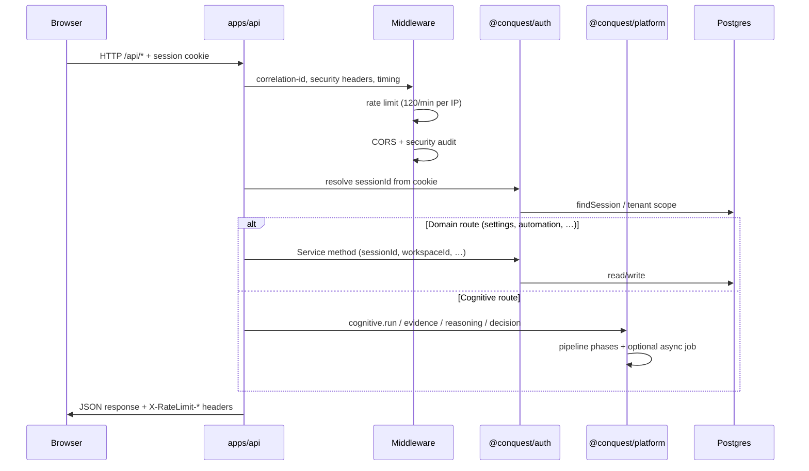

# System Overview

Cross-reference: [product-knowledge](./product-knowledge.md) · [architecture-reference](./architecture-reference.md) · [repository-guide](./repository-guide.md) · [api-reference](./api-reference.md)

## What Conquest is (runtime)

Conquest is an **Adaptive Cognitive Intelligence Operating System (CIOS)** — a monorepo platform that routes user and automation requests through a ten-phase cognitive pipeline, persists organizational context in Postgres, and presents a UXMD-governed Command Center web shell.

It is **not** a chatbot endpoint. Intelligence emerges from orchestrated engines (evidence → reasoning → decision → verification), not from a single LLM call.

## Authority chain

```
CCIS → AMD → PDD → UXMD → Document X → SDD I–V → ADR → RTM → Build Authorization
```

See [adr-index](./adr-index.md) and [`docs/architecture/ARCHITECTURE-FREEZE.md`](../architecture/ARCHITECTURE-FREEZE.md).

## Monorepo layout

```
conquest/
├── apps/
│   ├── api/          # Hono HTTP API — route composition, middleware
│   └── web/          # Vite/React SPA — UXMD shell, routing, screens
├── packages/         # Shared libraries (contracts, GIS, config, cache, …)
├── services/         # Domain + platform services (auth, cognitive, jobs, …)
├── docs/             # Frozen architecture, PDD, SDD, UXMD, governance
├── scripts/          # Build, verify, migrate helpers
├── docker-compose.yml          # Local dev Postgres + Redis
└── docker-compose.prod.yml     # Production stack (api, web, postgres, redis)
```

Detail: [repository-guide](./repository-guide.md) · [package-reference](./package-reference.md)

## Architectural layers (SDD)

| Layer | Responsibility | Primary locations |
|-------|----------------|-------------------|
| **Presentation** | Render-only UI; GIS tokens; no business logic | `apps/web`, `packages/presentation`, `packages/gis` |
| **Application / API** | HTTP, auth cookies, rate limits, route wiring | `apps/api` |
| **Domain services** | Auth, workspace, settings, automation, intelligence, research | `services/auth` |
| **Platform / cognitive** | Evidence, reasoning, decision, cognitive orchestration, AI gateway | `services/platform`, `services/cognitive`, `services/ai-gateway` |
| **Infrastructure** | Postgres, Redis, cache, jobs, email | `packages/database`, `packages/cache`, `services/jobs` |
| **Contracts** | Zod schemas, typed messages between modules | `packages/contracts` |

**Rule:** Structured messages only between services ([ADR-0014](../architecture/adr/0014-module-boundaries.md)). Presentation never calls cognitive engines directly — always via API.

## Request lifecycle (authenticated API)



### Middleware stack (`apps/api/src/app.ts`)

1. `correlationIdMiddleware` — `x-correlation-id` / `x-request-id`
2. `securityHeadersMiddleware` — production HSTS, CSP baseline
3. `requestTimingMiddleware` — `x-response-time-ms`
4. `/api/*`: `securityAuditMiddleware`, `createRateLimitMiddleware`, CORS

Rate limit: **120 requests / 60s** per client IP (`API_CONSTANTS` in `@conquest/config`). Disabled when `NODE_ENV=test` or `VITEST=true`.

### Session model

- Cookie: `SESSION_COOKIE_NAME` (httpOnly, SameSite=Lax, secure in production)
- Repository: `DrizzleAuthRepository` when `DATABASE_URL` set; else `MemoryAuthRepository` / `MEMORY_REPO=true`
- Tenant isolation: `cognitiveScope()` verifies `session.orgId === workspace.orgId` ([ADR-0016](../architecture/adr/0016-tenant-isolation-strategy.md))

## Service interactions

### Composition root

`apps/api/src/server.ts` bootstraps:

1. `validateApiEnvironment()` — profile, ports, secrets, persistence mode
2. `runMigrations(DATABASE_URL)` when Postgres mode
3. `createRedisClient(REDIS_URL)` optional
4. `createJobService({ redisUrl })` — Redis queue or in-memory
5. `createApiApp({ apiEnv, redisClient, jobService })`

`createApiApp` wires:

| Service | Package | Role |
|---------|---------|------|
| Identity, Workspace, Settings, … | `@conquest/auth` | Domain CRUD + notifications |
| Platform stack | `@conquest/platform` | Cache, jobs, cognitive, AI, prompts, evidence |
| Email | `createEmailProvider()` | Resend / SMTP / console |
| Notifications | `NotificationService` | Verify, invite, reset emails + audit |

### Intelligence → Cognitive bridge

`IntelligenceService` accepts an `IntelligenceCognitiveProvider`. The API injects a provider that calls `platform.cognitive.run()` so research analyze and intelligence feeds produce pipeline-backed recommendations (Build-2 M1/M2).

### Command Center

`buildCommandCenterDashboard()` aggregates workspace status, intelligence feed, automation summary, and operations telemetry into dashboard zones ([data-flow-reference](./data-flow-reference.md#command-center-pipeline)).

## Layer boundaries (non-negotiable)

| Forbidden | Approved |
|-----------|----------|
| UI importing `@conquest/cognitive` directly | UI → fetch `/api/*` |
| Engines writing memory without Memory Manager | `CognitiveMemoryManager` sole write path |
| Skipping verification before user-facing conclusions | `CognitiveOrchestrator` verification gate |
| Autonomous code deploy from learning loop | Learning proposals → human approval ([ADR-0009](../architecture/adr/0009-learning-boundary.md)) |
| Generic sidebar dashboard replacing UXMD screens | GIS + UXMD Volume II screen specs |

## Health and operations endpoints

| Endpoint | Auth | Purpose |
|----------|------|---------|
| `GET /api/health` | None | Aggregate service health |
| `GET /api/health/live` | None | Liveness probe |
| `GET /api/health/ready` | None | Readiness (DB, deps) |
| `GET /api/ops/status` | Session | Operational metrics snapshot |
| `GET /api/ops/degradation` | Session | Degradation / dependency state |

See [api-reference](./api-reference.md#health--operations).

## Build status snapshot

| Milestone | Status |
|-----------|--------|
| Build-0 | Complete — frozen corpus, governance CI |
| Build-1 | Authorized — application shell, platform modules |
| Build-2 M1 | Integration batch complete |
| Build-2 M2 | Postgres persistence complete |
| Build-2 M3 | Production hardening (~92% demo readiness) |
| Build-2 M4 | Closed-beta complete (~96%) — email, Redis jobs, Playwright e2e, master KB docs |
| Recovery Phase 2 | Repository knowledge synchronization — single source of truth |

See [product-knowledge](./product-knowledge.md) and [`docs/build-2/`](../build-2/).
