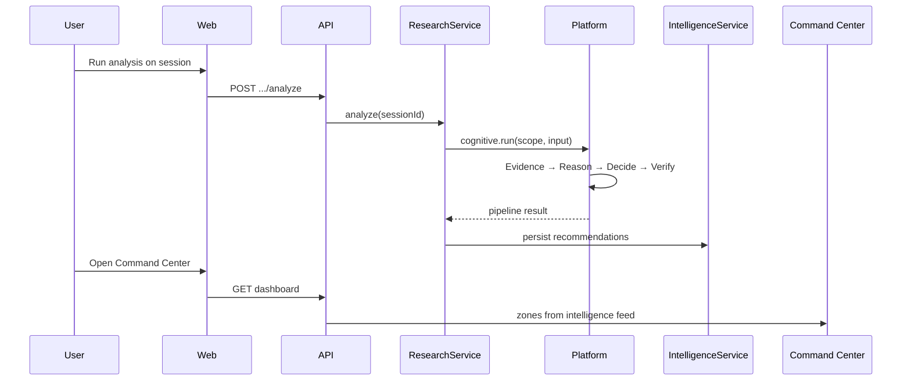

# 03 — Intelligence Model

Every intelligence subsystem, how they cooperate, data flow, ownership, and responsibilities.

---

## 1. Intelligence is a system, not a feature

```
                    ┌──────────────────┐
                    │   User / Event   │
                    └────────┬─────────┘
                             │
         ┌───────────────────┼───────────────────┐
         ▼                   ▼                   ▼
   ┌───────────┐      ┌─────────────┐     ┌─────────────┐
   │ Research  │      │  Workspace  │     │ Automation  │
   │  module   │      │   context   │     │   events    │
   └─────┬─────┘      └──────┬──────┘     └──────┬──────┘
         │                   │                   │
         └───────────────────┼───────────────────┘
                             ▼
              ┌──────────────────────────────┐
              │   Cognitive Orchestrator      │
              │   (platform.cognitive.run)    │
              └──────────────┬───────────────┘
                             │
    ┌────────────┬───────────┼───────────┬────────────┐
    ▼            ▼           ▼           ▼            ▼
 Evidence   Reasoning    Decision   Verification   Memory
 Engine      Engine       Engine       Gate        Manager
    │            │           │           │            │
    └────────────┴───────────┴───────────┴────────────┘
                             │
                             ▼
              ┌──────────────────────────────┐
              │   Intelligence feed / CC    │
              │   (recommendations, alerts)   │
              └──────────────────────────────┘
```

---

## 2. Subsystem catalog

| Subsystem | Package / service | Owns | Does not own |
|-----------|-------------------|------|--------------|
| **Research** | `ResearchService` | Sessions, sources, analyze trigger | Reasoning conclusions |
| **Evidence** | `EvidenceEngine` | Evidence classification, refs | User-facing recommendations |
| **Reasoning** | `ReasoningEngine` | Inference chains | Execution |
| **Decision** | `DecisionEngine` | Recommendations, `executionReady` | Direct provider calls |
| **Verification** | VRF in pipeline | Release gate | Storage |
| **Intelligence** | `IntelligenceService` | Feed, home, recommendation CRUD | Pipeline internals |
| **Memory** | `CognitiveMemoryManager` | Memory lifecycle | Arbitrary DB writes |
| **Automation** | `AutomationService` | Workflows, runs, approvals | Execution engine (M5) |
| **Command Center** | `WorkspaceService` + dashboard builder | Zone synthesis | Cognitive engines |
| **Learning** | Learning boundary (governed) | Proposals | Execution, auto-deploy |

---

## 3. Research

**Purpose:** Structured inquiry — not chat.

| Artifact | Storage |
|----------|---------|
| Research session | `auth_research_sessions` |
| Sources | Scoped documents / session payload |
| Analyze request | API → cognitive pipeline |

**Flow:** User creates session → adds sources → `POST .../analyze` → orchestrator → intelligence items appear.

**Ownership:** `ResearchService` in `services/auth`. Cognitive work delegated to platform.

---

## 4. Evidence

**Purpose:** Classified inputs to reasoning (CCIS §III).

- Hierarchy: verified fact → supported inference → hypothesis → prediction  
- Every recommendation must cite evidence refs where applicable  
- Evidence engine runs **before** reasoning in orchestrator  

**Misconception:** "LLM context window is evidence." **False** — evidence is structured artifacts with lineage.

---

## 5. Reasoning

**Purpose:** Transform evidence into candidate conclusions.

- Deterministic engines in current build (stub AI augments later via gateway)  
- Produces reasoning trace artifacts  
- Does not bypass challenge or verification stages  

---

## 6. Decision support & recommendations

**Purpose:** Actionable proposals with confidence and status.

| Field | Meaning |
|-------|---------|
| `confidence` | Calibrated score — not model logprob alone |
| `status` | proposed / approved / deferred / rejected |
| `evidenceRefs` | Lineage to research/evidence |

**Human approval:** `POST .../recommendations/:id/status` — user decision is authoritative (PDD D7).

---

## 7. Memory

**AMD III lifecycle:** Proposed → Active → Expired → Archived → Deleted

**Rule:** All writes through `CognitiveMemoryManager` (ADR-0008).

**User corrections** override inferred memory (CCIS M3).

---

## 8. Context

**Workspace context:** active workspace ID in session, org boundary, member roles.

**Cognitive scope:** `cognitiveScope()` attaches tenant + workspace to platform runs.

**Not:** Raw chat history as sole context.

---

## 9. Learning

**Boundary:** Learning proposes; governance approves; **never** auto-executes (ADR-0009).

**Future:** Reflection engine, routing improvements — behind ADR-0032, 0033.

---

## 10. Automation boundaries

| Today | M5 (gated) |
|-------|------------|
| CRUD workflows | Execution engine |
| Audit-only manual run | Approve → execute |
| `auth_executions` records | Real side effects |

Automation **consumes** intelligence (recommendations may trigger workflows) but **does not replace** reasoning.

---

## 11. Cooperation example (research → CC)



---

## 12. Ownership matrix (RACI-style)

| Activity | Domain | Platform | Presentation |
|----------|--------|----------|--------------|
| Trigger analyze | A | R | I |
| Run pipeline | I | A/R | — |
| Show feed | A | C | R |
| Approve recommendation | A | I | R |
| Execute workflow | A (future) | R (future) | I |

A = Accountable, R = Responsible, C = Consulted, I = Informed

---

*Next: [04 — Architectural philosophy](./04-architectural-philosophy.md)*
