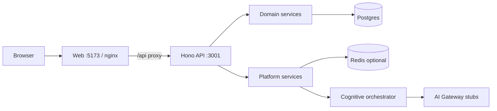

# 07 — Runtime Architecture

How requests flow through production and development.

---

## 1. Topology (M4)

---

## 2. HTTP middleware order (API)

1. Correlation / trace context  
2. Security headers (production profile)  
3. Timing  
4. Security audit  
5. Rate limit (120/min/IP — skipped in vitest)  
6. CORS  
7. Route handler  

**Headers:** `x-correlation-id`, `x-trace-id`, `x-request-id`

---

## 3. Authentication

| Mechanism | Detail |
|-----------|--------|
| Session | httpOnly cookie |
| Store | `auth_server_sessions` (Postgres) or memory CI |
| Lifecycle | Login, logout, revoke, MFA |
| Device | `localStorage` device ID on login |

**Flow:** `fetchSession` on route guard → `RequireGuest` / `RequireAuth` / workspace guards.

---

## 4. Authorization

| Layer | Enforcement |
|-------|-------------|
| Route guards (web) | `route-access.ts`, GIS roles |
| API | Domain service checks `session.orgId`, workspace membership |
| Module | `canAccessModuleRead`, `parseWorkspaceModulePath` |

**Future:** Postgres RLS (P1).

---

## 5. Research → recommendation path

1. `POST /api/workspaces/:id/research/sessions/:sid/analyze`  
2. `ResearchService` builds cognitive input  
3. `platform.cognitive.run({ scope, input, async? })`  
4. Orchestrator: evidence → reasoning → decision → verification  
5. Results persisted → intelligence feed  
6. Command Center dashboard reads feed  

---

## 6. Automation path (today)

1. `POST .../automation/workflows/:id/run`  
2. `AutomationService.manualRun`  
3. Writes `auth_executions` audit record  
4. Returns deferred-execution message — **no side effects**

---

## 7. Persistence

| Store | When |
|-------|------|
| Postgres | `DATABASE_URL` set |
| Memory repo | `MEMORY_REPO=true` (CI) |
| Redis cache | `REDIS_URL` set |
| Redis jobs | `REDIS_URL` set |
| In-memory fallback | No Redis |

Migrations: auto on API startup when Postgres configured.

---

## 8. Email

`NotificationService` → `createEmailProvider()`:

- `console` (dev)  
- `resend` (prod)  
- `smtp` (prod)  

Audit: `auth_email_deliveries`

---

## 9. Health & ops

| Endpoint | Purpose |
|----------|---------|
| `GET /api/health/live` | Liveness |
| `GET /api/health/ready` | DB probe |
| `GET /api/ops/status` | Queue, cache, DB |
| `GET /api/ops/degradation` | Dependency probes |

---

## 10. Tracing (partial)

`runWithTraceContext` hooks exist; full distributed sink deferred (B2-P2-07).

---

*Next: [08 — Cognitive architecture](./08-cognitive-architecture.md)*
