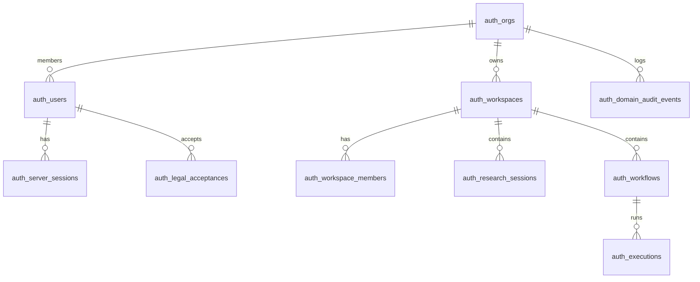

# 10 — Data Architecture

Every Postgres table, relationships, ownership, and lifecycle.

---

## 1. Philosophy

- **Domain data** in Postgres via Drizzle — not Blobs, not scattered files  
- **Repository abstraction** — `AuthRepository` interface; Drizzle + memory implementations  
- **Scoped documents** — settings JSON in `auth_scoped_documents`  
- **Audit** — `auth_domain_audit_events` append-oriented  

---

## 2. Entity relationship (simplified)

---

## 3. Table reference (15 tables)

| Table | Owns | Key columns / notes |
|-------|------|---------------------|
| `auth_orgs` | Tenant root | id, name |
| `auth_users` | Identity | email, password hash, display name |
| `auth_server_sessions` | Sessions | session_id, user_id, expiry |
| `auth_workspaces` | Workspace | org_id, name, type, goal |
| `auth_workspace_members` | Membership | workspace_id, user_id, role |
| `auth_scoped_documents` | Settings blobs | scope, document_type, payload JSON |
| `auth_tokens` | Verify/reset/MFA tokens | type, expiry |
| `auth_team_invites` | Workspace invites | email, role, token |
| `auth_org_invites` | Org invites | email, role |
| `auth_workflows` | Automation definitions | workspace_id, definition JSON |
| `auth_executions` | Run audit | workflow_id, status, message |
| `auth_research_sessions` | Research | workspace_id, title, objective |
| `auth_domain_audit_events` | Audit trail | org_id, action, metadata |
| `auth_legal_acceptances` | Legal versioning | user_id, document, version |
| `auth_email_deliveries` | Email audit | provider, status, correlation |

**Schema source:** `packages/database/src/auth-schema.ts`  
**Migration:** `packages/database/drizzle/0000_initial.sql`

---

## 4. Intelligence data (M4)

Recommendations and intelligence items persist through repository methods — stored in scoped documents or dedicated columns per service implementation. **Not** separate `auth_intelligence_items` table in current schema (consolidated).

---

## 5. Lifecycle rules

| Data | Retention |
|------|-----------|
| Sessions | Revocable; TTL sliding |
| Audit | Append; partition at scale (P2) |
| Legal acceptance | Immutable version record |
| Research sessions | Workspace-scoped until deleted |
| Tokens | Short-lived; single use |

---

## 6. CI vs production

| Mode | `DATABASE_URL` | `MEMORY_REPO` |
|------|----------------|---------------|
| CI tests | Optional | `true` |
| Local dev | Optional | unset → Postgres if URL set |
| Production | Required | must be false / unset |

---

*Next: [11 — UX architecture](./11-ux-architecture.md)*
