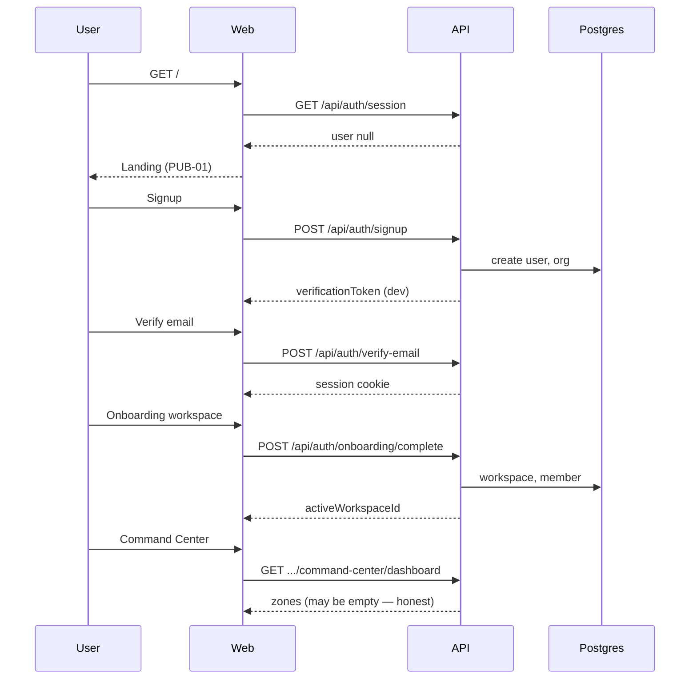
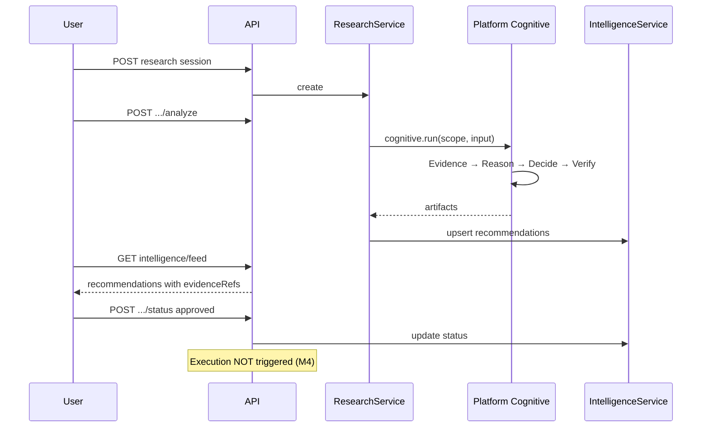
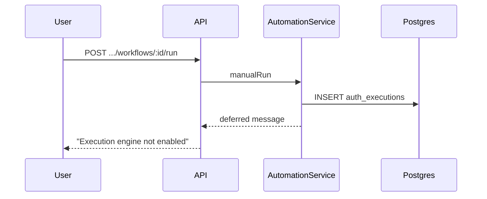
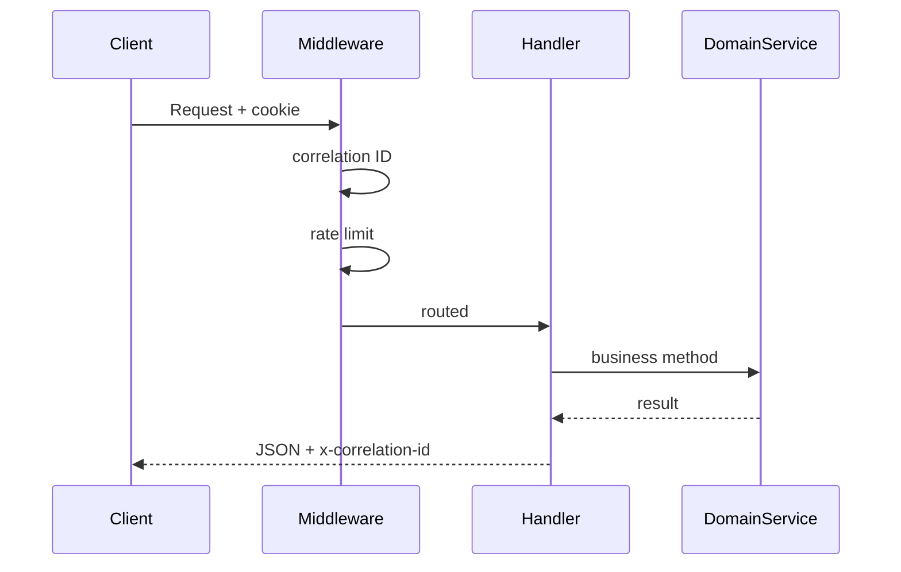

# 17 — Worked Examples and Scenarios

Complete workflows with sequence diagrams.

---

## Example 1: New user closed-beta journey



---

## Example 2: Research → recommendation → approval



---

## Example 3: Automation manual run (audit-only)



---

## Example 4: API request lifecycle



---

## Example 5: Why this is not an AI wrapper (decision flow)

```
User clicks "Analyze"
  → NOT: openai.chat(userText)
  → YES:
      1. Load workspace scope + session
      2. Build structured cognitive input from research session
      3. Orchestrator runs evidence engine on classified inputs
      4. Reasoning engine produces trace
      5. Decision engine proposes recommendation (executionReady: false)
      6. Verification gate evaluates release
      7. Persist recommendation with refs
      8. User must approve before any future execution (M5)
```

---

## Example 6: Tenant isolation check

```
Request: GET /api/workspaces/{workspaceB}/intelligence/feed
Session: user in orgA, workspaceA active

→ WorkspaceService validates workspaceB.orgId === session.orgId
→ If mismatch: 403 Forbidden
→ If role insufficient: 403 via canAccessModuleRead
```

---

*Return to: [Project Brain README](./README.md)*
